# Deepin preview LicheePi 4A 测试报告

## 测试环境

### 系统信息

- 系统版本：Deepin preview 20241227
- 下载链接：https://deepin-community.github.io/sig-deepin-ports/images/riscv/download
- 参考安装文档：https://cdimage.deepin.com/RISC-V/preview-20240517-riscv64/README.md
- 桌面环境: DDE

### 硬件信息

- Lichee Pi 4A (16G RAM + 128GB eMMC)
- 电源适配器
- USB to UART 调试器一个

## 系统安装步骤

### 获取 u-boot

官方压缩包内不附带 u-boot，需要自己获取，地址为：https://cdimage.deepin.com/RISC-V/preview-20240815-riscv64/uboot-th1520-revyos.zip

根据 ram 大小自行选择是否需要 16g 的版本。

如果使用 8GB 版本的 LicheePi 4A，请使用 `light_lpi4a/u-boot-with-spl.bin`

如果使用 16GB 版本的 LicheePi 4A，请使用 `light_lpi4a_16g/u-boot-with-spl.bin`

### 刷写 bootloader

解压安装套件。
刷入 u-boot 与 boot。

```bash
tar -xvf deepin-23-beige-preview-riscv64-th1520-20241227-161022.tar.xz
sudo fastboot flash ram u-boot-with-spl.bin
sudo fastboot reboot
sudo fastboot flash uboot u-boot-with-spl.bin
sudo fastboot flash boot deepin-th1520-riscv64-v23-desktop-installer.boot.ext4
```

### 刷写镜像

将 root 分区刷入 eMMC 中。

```bash
sudo fastboot flash root deepin-th1520-riscv64-v23-desktop-installer.root.ext4
```

### 登录系统

重启系统后可见安装界面。

默认用户名：`root`
密码：`deepin`

从桌面登录需要先添加一个普通用户

### 启动信息

```log
Deepin GNU/Linux 23 deepin-riscv64-th1520 ttyS0

deepin-riscv64-th1520 login: root
Password:
Verification successful
Linux deepin-riscv64-th1520 5.10.113-th1520-revyos-510 #1 SMP PREEMPT Tue Aug 27 10:05:53 UTC 2024 riscv64
Welcome to Deepin 23 GNU/Linux

    * Homepage:https://www.deepin.org/

    * Bugreport:https://bbs.deepin.org/


root@deepin-riscv64-th1520:~# uname -a
Linux deepin-riscv64-th1520 5.10.113-th1520-revyos-510 #1 SMP PREEMPT Tue Aug 27 10:05:53 UTC 2024 riscv64 GNU/Linux
root@deepin-riscv64-th1520:~# cat /etc/os-release 
PRETTY_NAME="Deepin 23"
NAME="Deepin"
VERSION_ID="23"
VERSION="23"
ID=deepin
HOME_URL="https://www.deepin.org/"
BUG_REPORT_URL="https://bbs.deepin.org"
VERSION_CODENAME=beige
root@deepin-riscv64-th1520:~# cat /proc/cpuinfo 
processor       : 0
hart            : 0
isa             : rv64imafdcvsu
mmu             : sv39
cpu-freq        : 1.848Ghz
cpu-icache      : 64KB
cpu-dcache      : 64KB
cpu-l2cache     : 1MB
cpu-tlb         : 1024 4-ways
cpu-cacheline   : 64Bytes
cpu-vector      : 0.7.1

processor       : 1
hart            : 1
isa             : rv64imafdcvsu
mmu             : sv39
cpu-freq        : 1.848Ghz
cpu-icache      : 64KB
cpu-dcache      : 64KB
cpu-l2cache     : 1MB
cpu-tlb         : 1024 4-ways
cpu-cacheline   : 64Bytes
cpu-vector      : 0.7.1

processor       : 2
hart            : 2
isa             : rv64imafdcvsu
mmu             : sv39
cpu-freq        : 1.848Ghz
cpu-icache      : 64KB
cpu-dcache      : 64KB
cpu-l2cache     : 1MB
cpu-tlb         : 1024 4-ways
cpu-cacheline   : 64Bytes
cpu-vector      : 0.7.1

processor       : 3
hart            : 3
isa             : rv64imafdcvsu
mmu             : sv39
cpu-freq        : 1.848Ghz
cpu-icache      : 64KB
cpu-dcache      : 64KB
cpu-l2cache     : 1MB
cpu-tlb         : 1024 4-ways
cpu-cacheline   : 64Bytes
cpu-vector      : 0.7.1
```

登录系统
通过串口或图形界面登录系统。

按照提示完成首次启动向导。几分钟后会自动进入登录界面，使用刚刚设置的用户名和密码登录即可。


## 功能测试

### 桌面环境测试
桌面体验较为流畅。

桌面环境
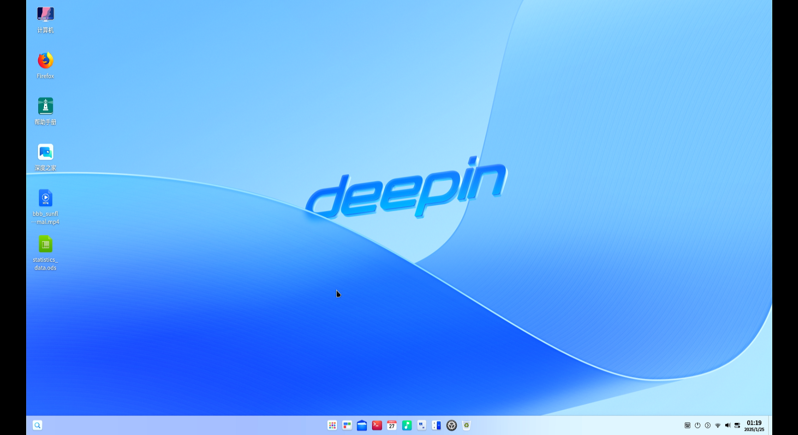

无法加载壁纸
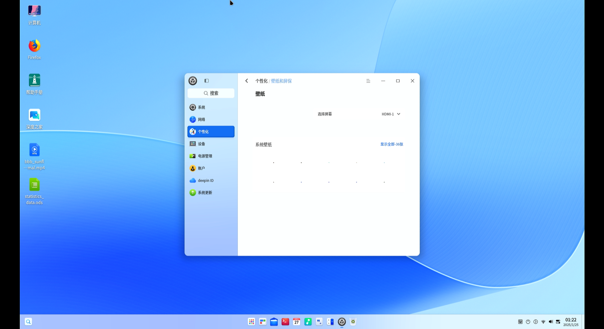

任务活动视图
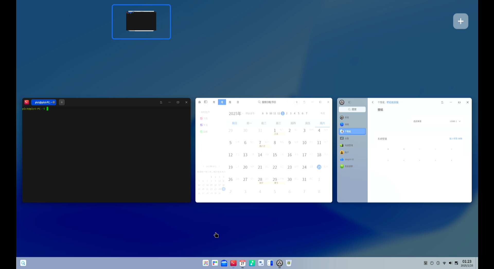

系统设置
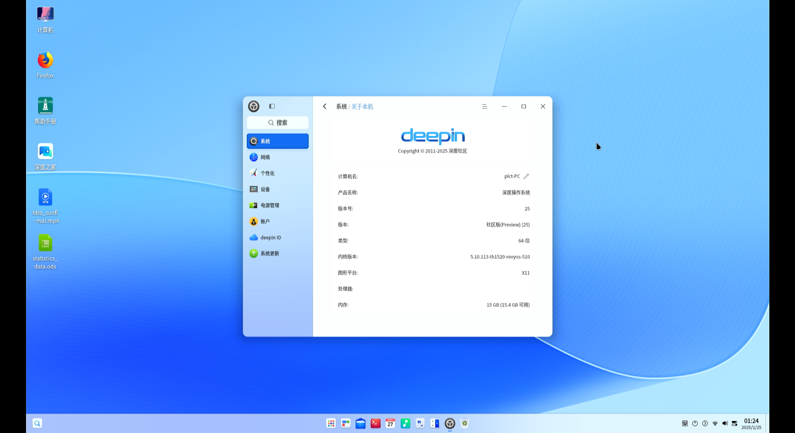

- 软件包管理
注意到有部分源位于内网 IP，部分源因缺少 GPG 签名而无法使用，但不影响整体体验，包管理正常工作。

### 视频播放测试

使用 Big Buck Bunny 1080P 60FPS H264 视频进行测试,HDMI 音频和 3.5mm 耳机孔无音频输出

- MPV
可正常播放，但尝试快进时卡死
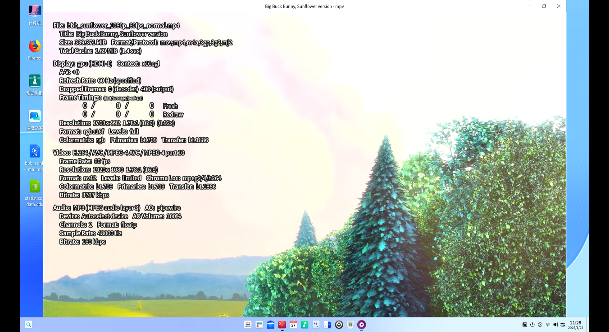

- VLC
无法打开

- Parole
可以正常播放,正常快进,但播放较为卡顿


### 网页浏览

#### Firefox

测试版本为镜像源内 131.0.3

浏览器启动
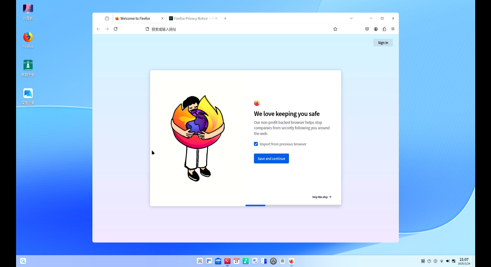

在线视频播放


视频解码
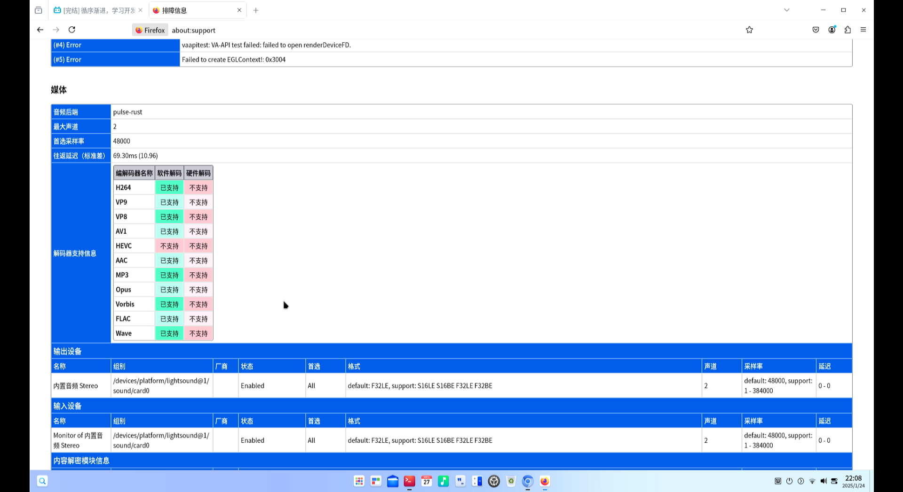

浏览器性能测试:Speedometer 3.0
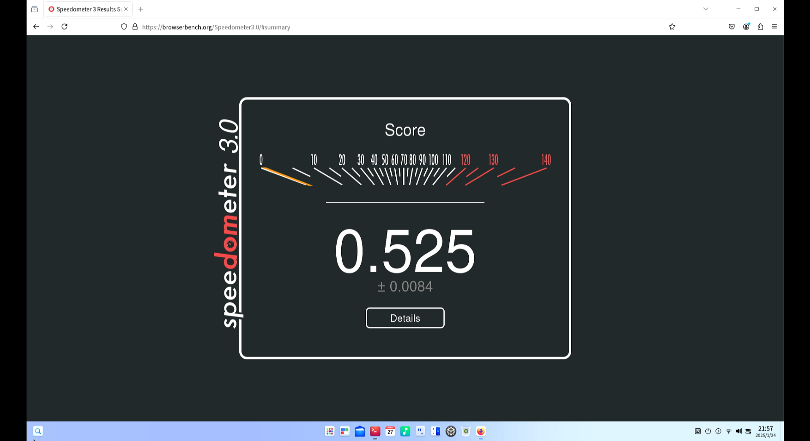

阅读 PDF
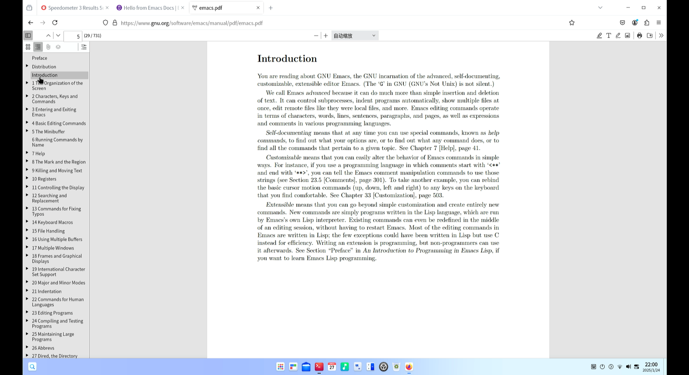

检查网页源码
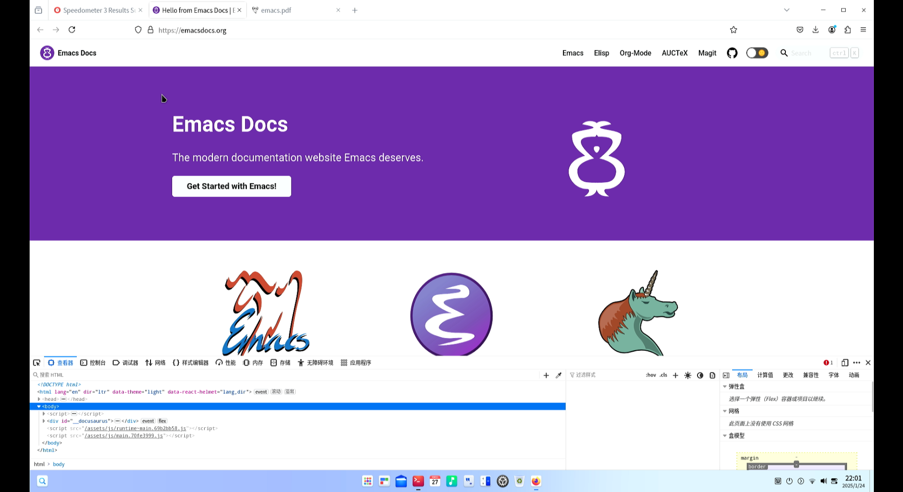

浏览器不稳定，标签页或浏览器有一定概率崩溃
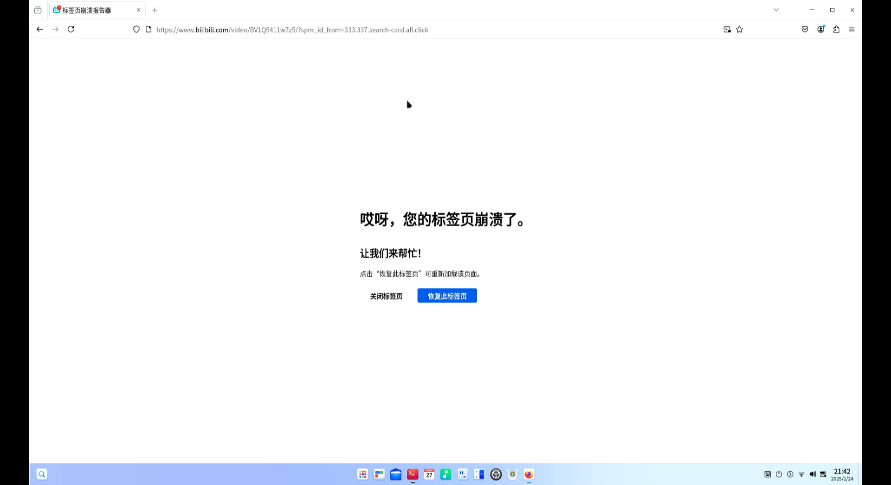

        
#### Chromium

测试版本为镜像源内 121.0.6167.160

在线视频播放


视频解码
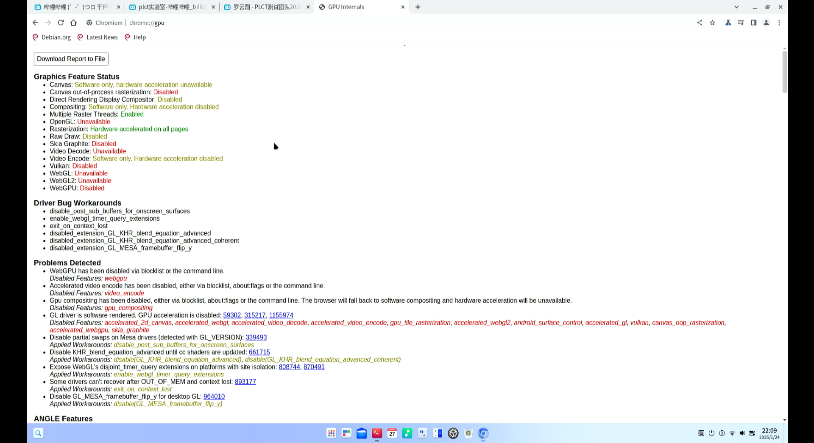

浏览器性能测试:Speedometer 3.0
测试过程中会卡住,无法完成测试


阅读 PDF
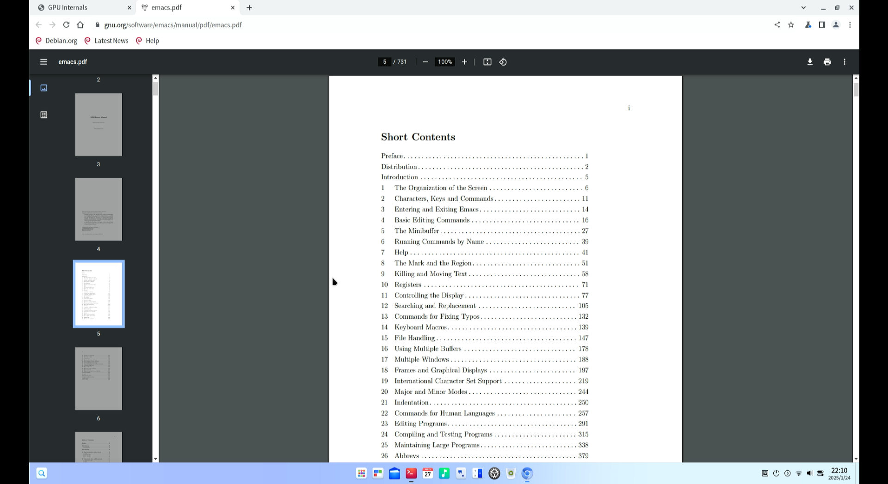

检查网页源码
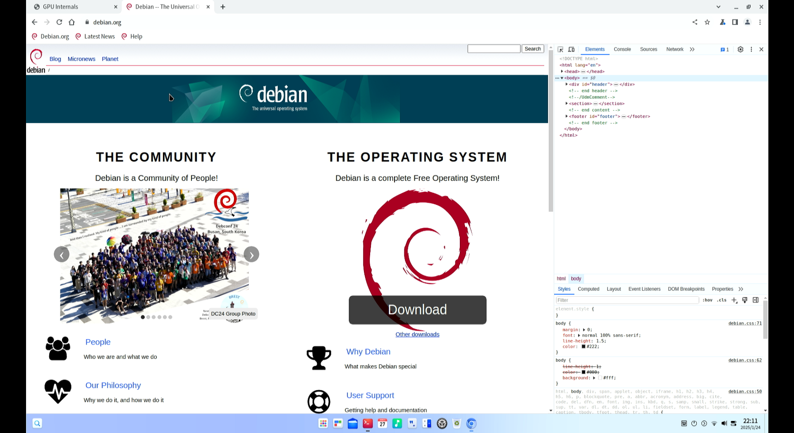

### 办公软件测试

系统预装了 LibreOffice 办公套件。

以 LibreOffice Write 为例，初次启动耗时约 30s。

基本功能正常，LibreOffice 基本可用。


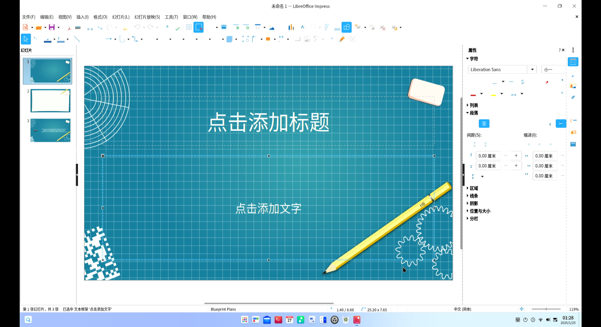


