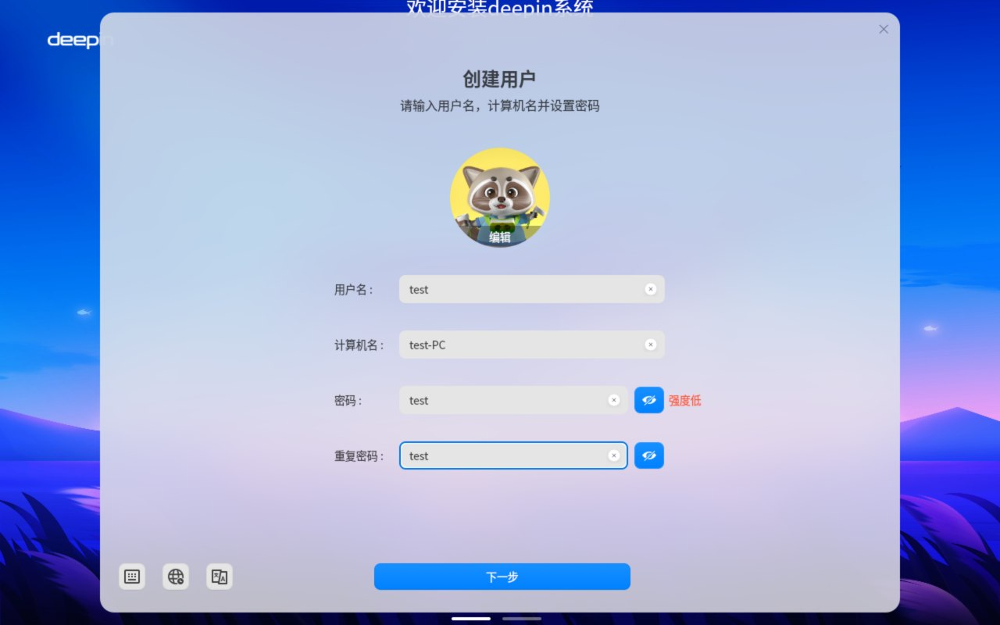

# deepin QEMU 测试报告

## 测试环境

### 系统信息

- 系统版本：deepin 23 beige preview (RISC-V 64)
- 下载链接：https://ci.deepin.com/repo/deepin/deepin-ports/cdimage/20250109/riscv64/deepin-23-beige-preview-riscv64-20250109-210254.iso
- 参考安装文档：https://deepin-community.github.io/sig-deepin-ports/docs/install/riscv/generic
- 桌面环境: DDE (Deepin Desktop Environment)

### 硬件信息

- qemu-system-riscv64

## 系统安装步骤

### 安装 qemu-system-riscv64

```shell
dnf install qemu-system-riscv
```

### 获取系统文件

```shell
wget https://ci.deepin.com/repo/deepin/deepin-ports/cdimage/20250109/riscv64/deepin-23-beige-preview-riscv64-20250109-210254.iso
```

另需从 openEuler 处获取启动固件。

```
wget https://repo.openeuler.org/openEuler-24.03-LTS-SP1/virtual_machine_img/riscv64/RISCV_VIRT_CODE.fd
wget https://repo.openeuler.org/openEuler-24.03-LTS-SP1/virtual_machine_img/riscv64/RISCV_VIRT_VARS.fd
```

### 创建虚拟磁盘

```shell
fallocate -l 80G deepin.img
```

也可使用 qcow2，现象一致。

### 启动配置

使用以下启动脚本启动虚拟机：

```bash
#!/usr/bin/env bash

# The script is created for starting a riscv64 qemu virtual machine with specific parameters.

RESTORE=$(echo -en '\001\033[0m\002')
YELLOW=$(echo -en '\001\033[00;33m\002')

## Configuration
vcpu=8
memory=8
iso="deepin-23-beige-preview-riscv64-20250109-210254.iso"
drive="deepin.img"
fw1="RISCV_VIRT_CODE.fd"
fw2="RISCV_VIRT_VARS.fd"
ssh_port=12055

cmd="qemu-system-riscv64 \
  -machine virt,pflash0=pflash0,pflash1=pflash1,acpi=off \
  -smp "$vcpu" -m "$memory"G \
  -display sdl,gl=on \
  -blockdev node-name=pflash0,driver=file,read-only=on,filename="$fw1" \
  -blockdev node-name=pflash1,driver=file,filename="$fw2" \
  -drive file="$drive",format=raw,id=hd0,if=none \
  -device virtio-scsi-pci,id=scsi \
  -device scsi-cd,drive=cd0 \
  -drive file=$iso,id=cd0,format=raw,readonly=on,if=none \
  -object rng-random,filename=/dev/urandom,id=rng0 \
  -device virtio-gpu-gl \
  -device virtio-rng-device,rng=rng0 \
  -device virtio-blk-device,drive=hd0 \
  -device virtio-net,netdev=deepinnet -netdev user,id=deepinnet,hostfwd=tcp:127.0.0.1:15900-:5900 \
  -device virtio-sound-pci,audiodev=deepinaudio -audiodev alsa,id=deepinaudio \
  -netdev user,id=usernet,hostfwd=tcp::"$ssh_port"-:22 \
  -device qemu-xhci -usb -device usb-kbd -device usb-tablet \
  -serial mon:stdio \
  -serial null"

echo ${YELLOW}:: Starting VM...${RESTORE}
echo ${YELLOW}:: Using following configuration${RESTORE}
echo ""
echo ${YELLOW}vCPU Cores: "$vcpu"${RESTORE}
echo ${YELLOW}Memory: "$memory"G${RESTORE}
echo ${YELLOW}Disk: "$drive"${RESTORE}
echo ${YELLOW}ISO: "$iso"${RESTORE}
echo ${YELLOW}SSH Port: "$ssh_port"${RESTORE}
echo ""
echo ${YELLOW}:: NOTE: Make sure ONLY ONE .qcow2 file is${RESTORE}
echo ${YELLOW}in the current directory${RESTORE}
echo ""
echo ${YELLOW}:: Tip: Try setting DNS manually if QEMU user network doesn\'t work well. ${RESTORE}
echo ${YELLOW}:: HOWTO -\> https://serverfault.com/a/810639 ${RESTORE}
echo ""
echo ${YELLOW}:: Tip: If \'ping\' reports permission error, try reinstalling \'iputils\'. ${RESTORE}
echo ${YELLOW}:: HOWTO -\> \'sudo dnf reinstall iputils\' ${RESTORE}
echo ""

sleep 2

eval $cmd
```

给予执行权限并启动虚拟机：

```shell
./start_vm.sh
```

在 SDL 窗口弹出、TianoCore EDK II 加载时按下 Escape 键进入启动菜单。


选择 Boot Manager。


选择 UEFI QEMU QEMU CD-ROM。


在 LiveCD Grub 中选择 Install Deepin 25。


等待几分钟。Deepin LiveCD 安装器将会启动。


以如上方式分区后等待系统部署完成。


此时，EFI 分区中的启动文件并未被正确初始化。需要将 QEMU 关机后，在宿主机上挂载 deepin.img 进行修补。

```
sudo losetup -fP deepin.img
sudo mkdir -r /mnt/deepin_efi
sudo mkdir -r /mnt/deepin_rootfs
sudo mount -o rw /dev/loop0p1 /mnt/deepin_efi # 可观察到是空的
sudo mount -o rw /dev/loop0p2 /mnt/deepin_rootfs

sudo cp -r /mnt/deepin_rootfs/boot/* /mnt/deepin_efi/
sudo cp -r $deepin_iso_mount_path/EFI/ /mnt/deepin_efi/

sudo umount /mnt/deepin_efi
sudo umount /mnt/deepin_rootfs
sudo losetup -d /dev/loop0
```

### 启动和登录系统


```shell
./start_vm.sh
```

如从硬盘启动回落到了 grub shell，则需要手动寻找 rootfs 所在分区手动引导。

```grub
insmod vfat
insmod ext4
linux (hd0,gpt2)/boot/vmlinuz-6.12.1-riscv64-desktop-rolling root=/dev/vda2
initrd (hd0,gpt2)/boot/initrd.img-6.12.1-riscv64-desktop-rolling
boot
```

此时屏幕先显示 dmesg 启动信息、然后是 deepin 启动动画图标 (有时是镜像倒置的)，接着进入 OOBE 类似物界面。




配置结束后，显示 dde 登录管理器界面。


## 功能测试

### 安装过程

### 浏览器测试

无法测试。

### 办公软件测试

无法测试。

### 视频播放测试

无法测试。

### 桌面环境测试

无法正常进入桌面环境。通过登录管理器输入密码登录后，系统卡在黑色屏幕，鼠标指针可见（由 deepin 转圈加载动画图标变为 deepin 风格正常鼠标图标），在这之后，系统带着整个 QEMU 假死，串口、SDL 窗口均无响应，QEMU 进程占用宿主机 CPU 较高。