# Deepin HiFive Unmatched 测试报告

> [!Warning]
> Deepin 已结束对 HiFive Unmatched 的支持。本次版本的最新版本来自 2022.11.11，可能会有潜在安全问题，不建议用于生产环境。

Deepin 在 Unmatched 上的桌面体验较好，Firefox 和 Chromium 浏览器较老，且后者实际上无法使用；前者基本可以满足使用需求。

由于浏览器默认未启用视频硬件解码，且 CPU 性能不足以支撑视频软解，在线视频播放体验较差。

本地视频播放和在线视频播放情况类似，没有默认开启硬件解码支持，较为卡顿。

办公软件、桌面环境较为流畅，软件包管理可正常使用，能够满足最基本的桌面使用需求。

## 测试环境

### 系统信息

- 系统版本：Deepin
- 下载链接：https://cdimage.deepin.com/RISC-V/Unmatched-image/deepin-sifive.7z
- 参考安装文档：https://cdimage.deepin.com/RISC-V/Unmatched-image/README.txt

### 硬件信息

- HiFive Unmatched Rev A
- microUSB 线缆一条（随 HiFive Unmatched 附赠）
- ATX 电源一个
- PCI-E 显卡一张（本次使用 Radeon R5 230）
- NVME 硬盘

## 安装步骤

### 刷写镜像

**该镜像并不适用于 SD 卡，需要 NVME 硬盘**

使用 `7z` 解压镜像。
使用 `dd` 将镜像写入 microSD 卡。

```bash
7z e deepin-sifive.7z
sudo dd if=deepin-sifive.img of=/dev/your/device bs=1M status=progress
```

## 登录系统

通过图形界面登录系统。

串口/桌面用户信息如下：

默认用户名： `root`
默认密码： `Riscv2022#`

默认用户名： `deepin`
默认密码： `deepin`

```log
Verification successful
Linux deepin-riscv 6.0.0-4-riscv64 #1 SMP Debian 6.0.8-1 (2022-11-11) riscv64
Welcome to Deepin 23 GNU/Linux

    * Homepage:https://www.deepin.org/

    * Bugreport:https://bbs.deepin.org/


Last login: Fri Jan 24 19:09:43 2025
deepin@deepin-riscv:~$ cat /etc/os-release 
PRETTY_NAME="Deepin 23"
NAME="Deepin"
VERSION_ID="23"
VERSION="23"
ID=Deepin
HOME_URL="https://www.deepin.org/"
BUG_REPORT_URL="https://bbs.deepin.org"
VERSION_CODENAME=beige
deepin@deepin-riscv:~$ cat /proc/cpuinfo 
processor       : 0
hart            : 1
isa             : rv64imafdc
mmu             : sv39
uarch           : sifive,bullet0

processor       : 1
hart            : 2
isa             : rv64imafdc
mmu             : sv39
uarch           : sifive,bullet0

processor       : 2
hart            : 3
isa             : rv64imafdc
mmu             : sv39
uarch           : sifive,bullet0

processor       : 3
hart            : 4
isa             : rv64imafdc
mmu             : sv39
uarch           : sifive,bullet0

deepin@deepin-riscv:~$ uname -a
Linux deepin-riscv 6.0.0-4-riscv64 #1 SMP Debian 6.0.8-1 (2022-11-11) riscv64 GNU/Linux
deepin@deepin-riscv:~$ 
```

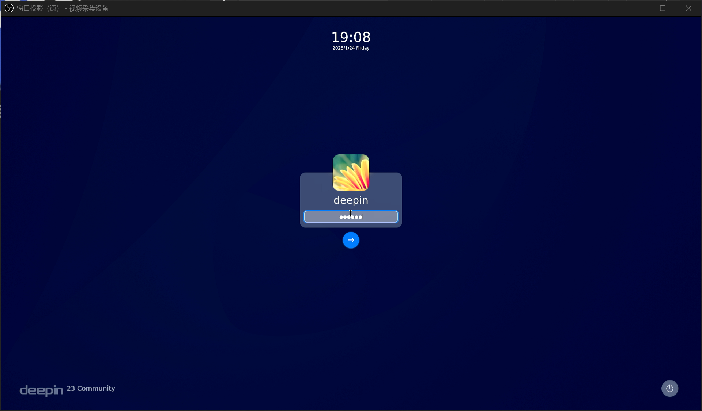

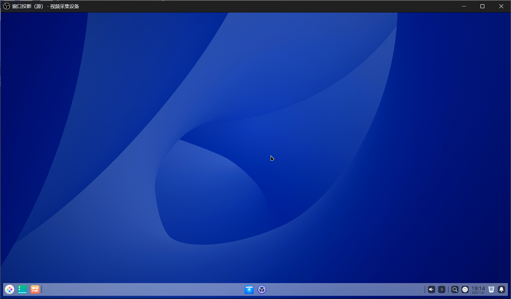

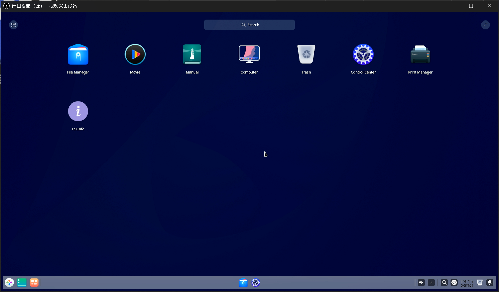

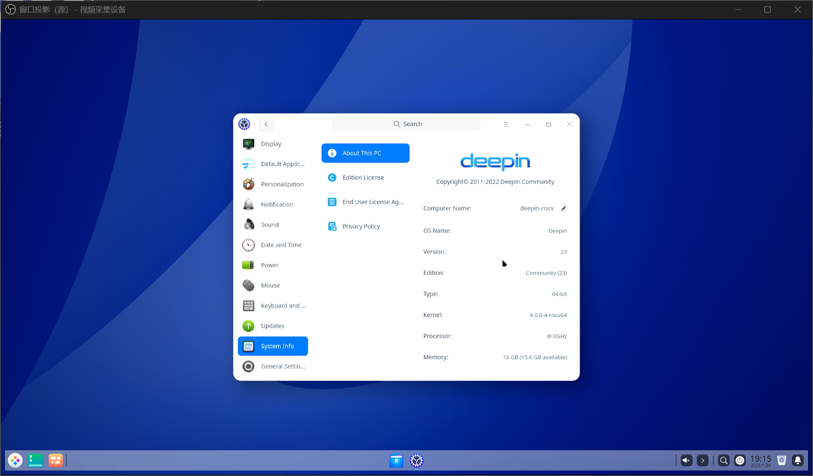

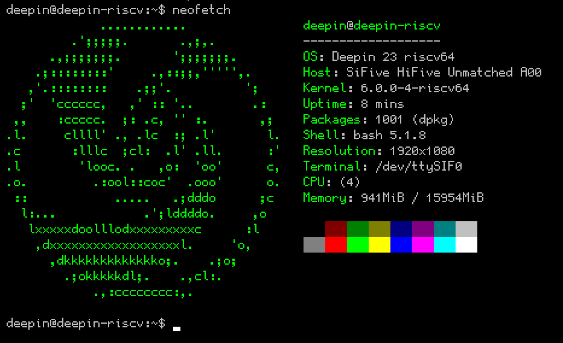

## 软件包管理

系统未预装浏览器，尝试从软件源获取安装成功。

<details>
<summary>点击查看安装日志</summary>

```log
deepin@deepin-riscv:~$ sudo apt install firefox chromium
Reading package lists... Done
Building dependency tree... Done
Reading state information... Done
The following additional packages will be installed:
  chromium-common chromium-sandbox cups-pk-helper fonts-liberation gir1.2-atk-1.0 gir1.2-freedesktop gir1.2-gdkpixbuf-2.0 gir1.2-glib-2.0 gir1.2-gtk-3.0
  gir1.2-harfbuzz-0.0 gir1.2-notify-0.7 gir1.2-packagekitglib-1.0 gir1.2-pango-1.0 gir1.2-polkit-1.0 gir1.2-secret-1 libappstream4 libdbus-glib-1-2
  libgirepository-1.0-1 libjsoncpp25 libnet-dbus-perl libpackagekit-glib2-18 libpangoxft-1.0-0 libstemmer0d libtie-ixhash-perl libu2f-udev libupower-glib3
  libx11-protocol-perl libxml-parser-perl libxml-twig-perl libxml-xpathengine-perl libxxf86dga1 libyaml-0-2 notification-daemon packagekit packagekit-tools
  python3-cairo python3-certifi python3-chardet python3-cups python3-cupshelpers python3-dbus python3-gi python3-idna python3-pkg-resources
  python3-requests python3-six python3-smbc python3-urllib3 system-config-printer system-config-printer-common system-config-printer-udev upower x11-utils
  xdg-utils
Suggested packages:
  chromium-l10n chromium-shell chromium-driver fonts-stix | otf-stix fonts-lmodern libunicode-map8-perl libunicode-string-perl xml-twig-tools appstream
  python-dbus-doc python3-setuptools python3-cryptography python3-openssl python3-socks python-requests-doc gnome-software mesa-utils
The following NEW packages will be installed:
  chromium chromium-common chromium-sandbox cups-pk-helper firefox fonts-liberation gir1.2-atk-1.0 gir1.2-freedesktop gir1.2-gdkpixbuf-2.0 gir1.2-glib-2.0
  gir1.2-gtk-3.0 gir1.2-harfbuzz-0.0 gir1.2-notify-0.7 gir1.2-packagekitglib-1.0 gir1.2-pango-1.0 gir1.2-polkit-1.0 gir1.2-secret-1 libappstream4
  libdbus-glib-1-2 libgirepository-1.0-1 libjsoncpp25 libnet-dbus-perl libpackagekit-glib2-18 libpangoxft-1.0-0 libstemmer0d libtie-ixhash-perl libu2f-udev
  libupower-glib3 libx11-protocol-perl libxml-parser-perl libxml-twig-perl libxml-xpathengine-perl libxxf86dga1 libyaml-0-2 notification-daemon packagekit
  packagekit-tools python3-cairo python3-certifi python3-chardet python3-cups python3-cupshelpers python3-dbus python3-gi python3-idna
  python3-pkg-resources python3-requests python3-six python3-smbc python3-urllib3 system-config-printer system-config-printer-common
  system-config-printer-udev upower x11-utils xdg-utils
0 upgraded, 56 newly installed, 0 to remove and 39 not upgraded.
Need to get 133 MB of archives.
After this operation, 464 MB of additional disk space will be used.
Do you want to continue? [Y/n] 
Get:1 https://mirror.iscas.ac.cn/deepin-riscv/deepin-stage1 beige/main riscv64 libjsoncpp25 riscv64 1.9.5-4 [83.1 kB]
Get:2 https://mirror.iscas.ac.cn/deepin-riscv/deepin-stage1 beige/main riscv64 libxxf86dga1 riscv64 2:1.1.4-1 [11.7 kB]
Get:3 https://mirror.iscas.ac.cn/deepin-riscv/deepin-stage1 beige/main riscv64 x11-utils riscv64 7.7+5 [200 kB]
Get:4 https://mirror.iscas.ac.cn/deepin-riscv/deepin-stage1 beige/main riscv64 xdg-utils all 1.1.3-4.1 [67.4 kB]
Get:5 https://mirror.iscas.ac.cn/deepin-riscv/deepin-stage1 beige/main riscv64 chromium-common riscv64 104.0.5112.101-1+deepin+0u1 [4812 kB]
Get:6 https://mirror.iscas.ac.cn/deepin-riscv/deepin-stage1 beige/main riscv64 chromium riscv64 104.0.5112.101-1+deepin+0u1 [62.8 MB]
Get:7 https://mirror.iscas.ac.cn/deepin-riscv/deepin-stage1 beige/main riscv64 chromium-sandbox riscv64 104.0.5112.101-1+deepin+0u1 [124 kB]                
Get:8 https://mirror.iscas.ac.cn/deepin-riscv/deepin-stage1 beige/main riscv64 libdbus-glib-1-2 riscv64 0.112-2 [69.2 kB]                                   
Get:9 https://mirror.iscas.ac.cn/deepin-riscv/deepin-stage1 beige/main riscv64 firefox riscv64 105.0.1-1+deepin+0u2 [59.1 MB]                               
Get:10 https://mirror.iscas.ac.cn/deepin-riscv/deepin-stage1 beige/main riscv64 fonts-liberation all 1:1.07.4-11 [889 kB]                                   
Get:11 https://mirror.iscas.ac.cn/deepin-riscv/deepin-stage1 beige/main riscv64 libgirepository-1.0-1 riscv64 1.70.0-2 [93.5 kB]                            
Get:12 https://mirror.iscas.ac.cn/deepin-riscv/deepin-stage1 beige/main riscv64 gir1.2-glib-2.0 riscv64 1.70.0-2 [179 kB]                                   
Get:13 https://mirror.iscas.ac.cn/deepin-riscv/deepin-stage1 beige/main riscv64 gir1.2-atk-1.0 riscv64 2.36.0-2 [29.2 kB]                                   
Get:14 https://mirror.iscas.ac.cn/deepin-riscv/deepin-stage1 beige/main riscv64 gir1.2-freedesktop riscv64 1.70.0-2 [37.2 kB]                               
Get:15 https://mirror.iscas.ac.cn/deepin-riscv/deepin-stage1 beige/main riscv64 gir1.2-gdkpixbuf-2.0 riscv64 2.42.9+dfsg-1 [22.8 kB]                        
Get:16 https://mirror.iscas.ac.cn/deepin-riscv/deepin-stage1 beige/main riscv64 gir1.2-harfbuzz-0.0 riscv64 2.7.4-1 [37.6 kB]                               
Get:17 https://mirror.iscas.ac.cn/deepin-riscv/deepin-stage1 beige/main riscv64 libpangoxft-1.0-0 riscv64 1.48.10+ds1-1 [53.3 kB]                           
Get:18 https://mirror.iscas.ac.cn/deepin-riscv/deepin-stage1 beige/main riscv64 gir1.2-pango-1.0 riscv64 1.48.10+ds1-1 [67.2 kB]                            
Get:19 https://mirror.iscas.ac.cn/deepin-riscv/deepin-stage1 beige/main riscv64 gir1.2-gtk-3.0 riscv64 3.24.30-3 [304 kB]                                   
Get:20 https://mirror.iscas.ac.cn/deepin-riscv/deepin-stage1 beige/main riscv64 gir1.2-notify-0.7 riscv64 0.7.9-3 [9630 B]                                  
Get:21 https://mirror.iscas.ac.cn/deepin-riscv/deepin-stage1 beige/main riscv64 libpackagekit-glib2-18 riscv64 1.2.4-1 [119 kB]                             
Get:22 https://mirror.iscas.ac.cn/deepin-riscv/deepin-stage1 beige/main riscv64 gir1.2-packagekitglib-1.0 riscv64 1.2.4-1 [41.0 kB]                         
Get:23 https://mirror.iscas.ac.cn/deepin-riscv/deepin-stage1 beige/main riscv64 gir1.2-polkit-1.0 riscv64 0.105.10.16-1+dde [19.7 kB]                       
Get:24 https://mirror.iscas.ac.cn/deepin-riscv/deepin-stage1 beige/main riscv64 gir1.2-secret-1 riscv64 0.20.4-2 [13.8 kB]                                  
Get:25 https://mirror.iscas.ac.cn/deepin-riscv/deepin-stage1 beige/main riscv64 libstemmer0d riscv64 2.2.0-1 [126 kB]                                       
Get:26 https://mirror.iscas.ac.cn/deepin-riscv/deepin-stage1 beige/main riscv64 libyaml-0-2 riscv64 0.2.2-1 [50.1 kB]                                       
Get:27 https://mirror.iscas.ac.cn/deepin-riscv/deepin-stage1 beige/main riscv64 libappstream4 riscv64 0.14.6-1 [166 kB]                                     
Get:28 https://mirror.iscas.ac.cn/deepin-riscv/deepin-stage1 beige/main riscv64 libxml-parser-perl riscv64 2.46-3 [214 kB]                                  
Get:29 https://mirror.iscas.ac.cn/deepin-riscv/deepin-stage1 beige/main riscv64 libxml-twig-perl all 1:3.52-1 [161 kB]                                      
Get:30 https://mirror.iscas.ac.cn/deepin-riscv/deepin-stage1 beige/main riscv64 libnet-dbus-perl riscv64 1.2.0-1 [179 kB]                                   
Get:31 https://mirror.iscas.ac.cn/deepin-riscv/deepin-stage1 beige/main riscv64 libtie-ixhash-perl all 1.23-2.1 [11.5 kB]                                   
Get:32 https://mirror.iscas.ac.cn/deepin-riscv/deepin-stage1 beige/main riscv64 libu2f-udev all 1.1.10-3 [6262 B]                                           
Get:33 https://mirror.iscas.ac.cn/deepin-riscv/deepin-stage1 beige/main riscv64 libupower-glib3 riscv64 0.99.13-1 [50.9 kB]                                 
Get:34 https://mirror.iscas.ac.cn/deepin-riscv/deepin-stage1 beige/main riscv64 libx11-protocol-perl all 0.56-7.1 [140 kB]                                  
Get:35 https://mirror.iscas.ac.cn/deepin-riscv/deepin-stage1 beige/main riscv64 libxml-xpathengine-perl all 0.14-1 [32.7 kB]                                
Get:36 https://mirror.iscas.ac.cn/deepin-riscv/deepin-stage1 beige/main riscv64 notification-daemon riscv64 3.20.0-4 [59.7 kB]                              
Get:37 https://mirror.iscas.ac.cn/deepin-riscv/deepin-stage1 beige/main riscv64 packagekit riscv64 1.2.4-1 [641 kB]                                         
Get:38 https://mirror.iscas.ac.cn/deepin-riscv/deepin-stage1 beige/main riscv64 packagekit-tools riscv64 1.2.4-1 [41.2 kB]                                  
Get:39 https://mirror.iscas.ac.cn/deepin-riscv/deepin-stage1 beige/main riscv64 python3-cairo riscv64 1.16.2-4 [59.5 kB]                                    
Get:40 https://mirror.iscas.ac.cn/deepin-riscv/deepin-stage1 beige/main riscv64 python3-certifi all 2020.6.20-1 [154 kB]                                    
Get:41 https://mirror.iscas.ac.cn/deepin-riscv/deepin-stage1 beige/main riscv64 python3-pkg-resources all 58.2.0-1 [193 kB]                                 
Get:42 https://mirror.iscas.ac.cn/deepin-riscv/deepin-stage1 beige/main riscv64 python3-chardet all 4.0.0-1 [110 kB]                                        
Get:43 https://mirror.iscas.ac.cn/deepin-riscv/deepin-stage1 beige/main riscv64 python3-cups riscv64 2.0.1-5 [65.9 kB]                                      
Get:44 https://mirror.iscas.ac.cn/deepin-riscv/deepin-stage1 beige/main riscv64 python3-dbus riscv64 1.2.18-3 [107 kB]                                      
Get:45 https://mirror.iscas.ac.cn/deepin-riscv/deepin-stage1 beige/main riscv64 python3-idna all 2.10-1 [47.2 kB]                                           
Get:46 https://mirror.iscas.ac.cn/deepin-riscv/deepin-stage1 beige/main riscv64 python3-six all 1.16.0-2 [14.3 kB]                                          
Get:47 https://mirror.iscas.ac.cn/deepin-riscv/deepin-stage1 beige/main riscv64 python3-urllib3 all 1.26.5-1~exp1 [116 kB]                                  
Get:48 https://mirror.iscas.ac.cn/deepin-riscv/deepin-stage1 beige/main riscv64 python3-requests all 2.25.1+dfsg-2 [70.1 kB]                                
Get:49 https://mirror.iscas.ac.cn/deepin-riscv/deepin-stage1 beige/main riscv64 python3-cupshelpers all 1.5.14-1 [38.2 kB]                                  
Get:50 https://mirror.iscas.ac.cn/deepin-riscv/deepin-stage1 beige/main riscv64 python3-gi riscv64 3.42.0-2 [229 kB]                                        
Get:51 https://mirror.iscas.ac.cn/deepin-riscv/deepin-stage1 beige/main riscv64 python3-smbc riscv64 1.0.23-2 [19.7 kB]                                     
Get:52 https://mirror.iscas.ac.cn/deepin-riscv/deepin-stage1 beige/main riscv64 system-config-printer-common all 1.5.14-1 [791 kB]                          
Get:53 https://mirror.iscas.ac.cn/deepin-riscv/deepin-stage1 beige/main riscv64 system-config-printer all 1.5.14-1 [82.4 kB]                                
Get:54 https://mirror.iscas.ac.cn/deepin-riscv/deepin-stage1 beige/main riscv64 system-config-printer-udev riscv64 1.5.14-1 [26.1 kB]                       
Get:55 https://mirror.iscas.ac.cn/deepin-riscv/deepin-stage1 beige/main riscv64 upower riscv64 0.99.13-1 [109 kB]                                           
Get:56 https://mirror.iscas.ac.cn/deepin-riscv/deepin-stage1 beige/main riscv64 cups-pk-helper riscv64 0.2.6-1 [63.3 kB]                                    
Fetched 133 MB in 1min 31s (1467 kB/s)                                                                                                                      
debconf: unable to initialize frontend: Dialog
debconf: (No usable dialog-like program is installed, so the dialog based frontend cannot be used. at /usr/share/perl5/Debconf/FrontEnd/Dialog.pm line 78, <> line 56.)
debconf: falling back to frontend: Readline
Extracting templates from packages: 100%
Selecting previously unselected package libjsoncpp25:riscv64.
(Reading database ... 193520 files and directories currently installed.)
Preparing to unpack .../00-libjsoncpp25_1.9.5-4_riscv64.deb ...
Unpacking libjsoncpp25:riscv64 (1.9.5-4) ...
Selecting previously unselected package libxxf86dga1:riscv64.
Preparing to unpack .../01-libxxf86dga1_2%3a1.1.4-1_riscv64.deb ...
Unpacking libxxf86dga1:riscv64 (2:1.1.4-1) ...
Selecting previously unselected package x11-utils.
Preparing to unpack .../02-x11-utils_7.7+5_riscv64.deb ...
Unpacking x11-utils (7.7+5) ...
Selecting previously unselected package xdg-utils.
Preparing to unpack .../03-xdg-utils_1.1.3-4.1_all.deb ...
Unpacking xdg-utils (1.1.3-4.1) ...
Selecting previously unselected package chromium-common.
Preparing to unpack .../04-chromium-common_104.0.5112.101-1+deepin+0u1_riscv64.deb ...
Unpacking chromium-common (104.0.5112.101-1+deepin+0u1) ...
Selecting previously unselected package chromium.
Preparing to unpack .../05-chromium_104.0.5112.101-1+deepin+0u1_riscv64.deb ...
Unpacking chromium (104.0.5112.101-1+deepin+0u1) ...
Selecting previously unselected package chromium-sandbox.
Preparing to unpack .../06-chromium-sandbox_104.0.5112.101-1+deepin+0u1_riscv64.deb ...
Unpacking chromium-sandbox (104.0.5112.101-1+deepin+0u1) ...
Selecting previously unselected package libdbus-glib-1-2:riscv64.
Preparing to unpack .../07-libdbus-glib-1-2_0.112-2_riscv64.deb ...
Unpacking libdbus-glib-1-2:riscv64 (0.112-2) ...
Selecting previously unselected package firefox.
Preparing to unpack .../08-firefox_105.0.1-1+deepin+0u2_riscv64.deb ...
Unpacking firefox (105.0.1-1+deepin+0u2) ...
Selecting previously unselected package fonts-liberation.
Preparing to unpack .../09-fonts-liberation_1%3a1.07.4-11_all.deb ...
Unpacking fonts-liberation (1:1.07.4-11) ...
Selecting previously unselected package libgirepository-1.0-1:riscv64.
Preparing to unpack .../10-libgirepository-1.0-1_1.70.0-2_riscv64.deb ...
Unpacking libgirepository-1.0-1:riscv64 (1.70.0-2) ...
Selecting previously unselected package gir1.2-glib-2.0:riscv64.
Preparing to unpack .../11-gir1.2-glib-2.0_1.70.0-2_riscv64.deb ...
Unpacking gir1.2-glib-2.0:riscv64 (1.70.0-2) ...
Selecting previously unselected package gir1.2-atk-1.0:riscv64.
Preparing to unpack .../12-gir1.2-atk-1.0_2.36.0-2_riscv64.deb ...
Unpacking gir1.2-atk-1.0:riscv64 (2.36.0-2) ...
Selecting previously unselected package gir1.2-freedesktop:riscv64.
Preparing to unpack .../13-gir1.2-freedesktop_1.70.0-2_riscv64.deb ...
Unpacking gir1.2-freedesktop:riscv64 (1.70.0-2) ...
Selecting previously unselected package gir1.2-gdkpixbuf-2.0:riscv64.
Preparing to unpack .../14-gir1.2-gdkpixbuf-2.0_2.42.9+dfsg-1_riscv64.deb ...
Unpacking gir1.2-gdkpixbuf-2.0:riscv64 (2.42.9+dfsg-1) ...
Selecting previously unselected package gir1.2-harfbuzz-0.0:riscv64.
Preparing to unpack .../15-gir1.2-harfbuzz-0.0_2.7.4-1_riscv64.deb ...
Unpacking gir1.2-harfbuzz-0.0:riscv64 (2.7.4-1) ...
Selecting previously unselected package libpangoxft-1.0-0:riscv64.
Preparing to unpack .../16-libpangoxft-1.0-0_1.48.10+ds1-1_riscv64.deb ...
Unpacking libpangoxft-1.0-0:riscv64 (1.48.10+ds1-1) ...
Selecting previously unselected package gir1.2-pango-1.0:riscv64.
Preparing to unpack .../17-gir1.2-pango-1.0_1.48.10+ds1-1_riscv64.deb ...
Unpacking gir1.2-pango-1.0:riscv64 (1.48.10+ds1-1) ...
Selecting previously unselected package gir1.2-gtk-3.0:riscv64.
Preparing to unpack .../18-gir1.2-gtk-3.0_3.24.30-3_riscv64.deb ...
Unpacking gir1.2-gtk-3.0:riscv64 (3.24.30-3) ...
Selecting previously unselected package gir1.2-notify-0.7:riscv64.
Preparing to unpack .../19-gir1.2-notify-0.7_0.7.9-3_riscv64.deb ...
Unpacking gir1.2-notify-0.7:riscv64 (0.7.9-3) ...
Selecting previously unselected package libpackagekit-glib2-18:riscv64.
Preparing to unpack .../20-libpackagekit-glib2-18_1.2.4-1_riscv64.deb ...
Unpacking libpackagekit-glib2-18:riscv64 (1.2.4-1) ...
Selecting previously unselected package gir1.2-packagekitglib-1.0.
Preparing to unpack .../21-gir1.2-packagekitglib-1.0_1.2.4-1_riscv64.deb ...
Unpacking gir1.2-packagekitglib-1.0 (1.2.4-1) ...
Selecting previously unselected package gir1.2-polkit-1.0.
Preparing to unpack .../22-gir1.2-polkit-1.0_0.105.10.16-1+dde_riscv64.deb ...
Unpacking gir1.2-polkit-1.0 (0.105.10.16-1+dde) ...
Selecting previously unselected package gir1.2-secret-1:riscv64.
Preparing to unpack .../23-gir1.2-secret-1_0.20.4-2_riscv64.deb ...
Unpacking gir1.2-secret-1:riscv64 (0.20.4-2) ...
Selecting previously unselected package libstemmer0d:riscv64.
Preparing to unpack .../24-libstemmer0d_2.2.0-1_riscv64.deb ...
Unpacking libstemmer0d:riscv64 (2.2.0-1) ...
Selecting previously unselected package libyaml-0-2:riscv64.
Preparing to unpack .../25-libyaml-0-2_0.2.2-1_riscv64.deb ...
Unpacking libyaml-0-2:riscv64 (0.2.2-1) ...
Selecting previously unselected package libappstream4:riscv64.
Preparing to unpack .../26-libappstream4_0.14.6-1_riscv64.deb ...
Unpacking libappstream4:riscv64 (0.14.6-1) ...
Selecting previously unselected package libxml-parser-perl:riscv64.
Preparing to unpack .../27-libxml-parser-perl_2.46-3_riscv64.deb ...
Unpacking libxml-parser-perl:riscv64 (2.46-3) ...
Selecting previously unselected package libxml-twig-perl.
Preparing to unpack .../28-libxml-twig-perl_1%3a3.52-1_all.deb ...
Unpacking libxml-twig-perl (1:3.52-1) ...
Selecting previously unselected package libnet-dbus-perl.
Preparing to unpack .../29-libnet-dbus-perl_1.2.0-1_riscv64.deb ...
Unpacking libnet-dbus-perl (1.2.0-1) ...
Selecting previously unselected package libtie-ixhash-perl.
Preparing to unpack .../30-libtie-ixhash-perl_1.23-2.1_all.deb ...
Unpacking libtie-ixhash-perl (1.23-2.1) ...
Selecting previously unselected package libu2f-udev.
Preparing to unpack .../31-libu2f-udev_1.1.10-3_all.deb ...
Unpacking libu2f-udev (1.1.10-3) ...
Selecting previously unselected package libupower-glib3:riscv64.
Preparing to unpack .../32-libupower-glib3_0.99.13-1_riscv64.deb ...
Unpacking libupower-glib3:riscv64 (0.99.13-1) ...
Selecting previously unselected package libx11-protocol-perl.
Preparing to unpack .../33-libx11-protocol-perl_0.56-7.1_all.deb ...
Unpacking libx11-protocol-perl (0.56-7.1) ...
Selecting previously unselected package libxml-xpathengine-perl.
Preparing to unpack .../34-libxml-xpathengine-perl_0.14-1_all.deb ...
Unpacking libxml-xpathengine-perl (0.14-1) ...
Selecting previously unselected package notification-daemon.
Preparing to unpack .../35-notification-daemon_3.20.0-4_riscv64.deb ...
Unpacking notification-daemon (3.20.0-4) ...
Selecting previously unselected package packagekit.
Preparing to unpack .../36-packagekit_1.2.4-1_riscv64.deb ...
Unpacking packagekit (1.2.4-1) ...
Selecting previously unselected package packagekit-tools.
Preparing to unpack .../37-packagekit-tools_1.2.4-1_riscv64.deb ...
Unpacking packagekit-tools (1.2.4-1) ...
Selecting previously unselected package python3-cairo:riscv64.
Preparing to unpack .../38-python3-cairo_1.16.2-4_riscv64.deb ...
Unpacking python3-cairo:riscv64 (1.16.2-4) ...
Selecting previously unselected package python3-certifi.
Preparing to unpack .../39-python3-certifi_2020.6.20-1_all.deb ...
Unpacking python3-certifi (2020.6.20-1) ...
Selecting previously unselected package python3-pkg-resources.
Preparing to unpack .../40-python3-pkg-resources_58.2.0-1_all.deb ...
Unpacking python3-pkg-resources (58.2.0-1) ...
Selecting previously unselected package python3-chardet.
Preparing to unpack .../41-python3-chardet_4.0.0-1_all.deb ...
Unpacking python3-chardet (4.0.0-1) ...
Selecting previously unselected package python3-cups:riscv64.
Preparing to unpack .../42-python3-cups_2.0.1-5_riscv64.deb ...
Unpacking python3-cups:riscv64 (2.0.1-5) ...
Selecting previously unselected package python3-dbus.
Preparing to unpack .../43-python3-dbus_1.2.18-3_riscv64.deb ...
Unpacking python3-dbus (1.2.18-3) ...
Selecting previously unselected package python3-idna.
Preparing to unpack .../44-python3-idna_2.10-1_all.deb ...
Unpacking python3-idna (2.10-1) ...
Selecting previously unselected package python3-six.
Preparing to unpack .../45-python3-six_1.16.0-2_all.deb ...
Unpacking python3-six (1.16.0-2) ...
Selecting previously unselected package python3-urllib3.
Preparing to unpack .../46-python3-urllib3_1.26.5-1~exp1_all.deb ...
Unpacking python3-urllib3 (1.26.5-1~exp1) ...
Selecting previously unselected package python3-requests.
Preparing to unpack .../47-python3-requests_2.25.1+dfsg-2_all.deb ...
Unpacking python3-requests (2.25.1+dfsg-2) ...
Selecting previously unselected package python3-cupshelpers.
Preparing to unpack .../48-python3-cupshelpers_1.5.14-1_all.deb ...
Unpacking python3-cupshelpers (1.5.14-1) ...
Selecting previously unselected package python3-gi.
Preparing to unpack .../49-python3-gi_3.42.0-2_riscv64.deb ...
Unpacking python3-gi (3.42.0-2) ...
Selecting previously unselected package python3-smbc.
Preparing to unpack .../50-python3-smbc_1.0.23-2_riscv64.deb ...
Unpacking python3-smbc (1.0.23-2) ...
Selecting previously unselected package system-config-printer-common.
Preparing to unpack .../51-system-config-printer-common_1.5.14-1_all.deb ...
Unpacking system-config-printer-common (1.5.14-1) ...
Selecting previously unselected package system-config-printer.
Preparing to unpack .../52-system-config-printer_1.5.14-1_all.deb ...
Unpacking system-config-printer (1.5.14-1) ...
Selecting previously unselected package system-config-printer-udev.
Preparing to unpack .../53-system-config-printer-udev_1.5.14-1_riscv64.deb ...
Unpacking system-config-printer-udev (1.5.14-1) ...
Selecting previously unselected package upower.
Preparing to unpack .../54-upower_0.99.13-1_riscv64.deb ...
Unpacking upower (0.99.13-1) ...
Selecting previously unselected package cups-pk-helper.
Preparing to unpack .../55-cups-pk-helper_0.2.6-1_riscv64.deb ...
Unpacking cups-pk-helper (0.2.6-1) ...
Setting up python3-pkg-resources (58.2.0-1) ...
Setting up python3-smbc (1.0.23-2) ...
Setting up libxml-parser-perl:riscv64 (2.46-3) ...
Setting up python3-dbus (1.2.18-3) ...
Setting up libtie-ixhash-perl (1.23-2.1) ...
Setting up python3-cairo:riscv64 (1.16.2-4) ...
Setting up libpangoxft-1.0-0:riscv64 (1.48.10+ds1-1) ...
Setting up libyaml-0-2:riscv64 (0.2.2-1) ...
Setting up libu2f-udev (1.1.10-3) ...
Setting up libxml-twig-perl (1:3.52-1) ...
Setting up libxxf86dga1:riscv64 (2:1.1.4-1) ...
Setting up libnet-dbus-perl (1.2.0-1) ...
Setting up libpackagekit-glib2-18:riscv64 (1.2.4-1) ...
Setting up chromium-sandbox (104.0.5112.101-1+deepin+0u1) ...
Setting up notification-daemon (3.20.0-4) ...
Setting up python3-six (1.16.0-2) ...
Setting up python3-cups:riscv64 (2.0.1-5) ...
Setting up python3-chardet (4.0.0-1) ...
Setting up python3-certifi (2020.6.20-1) ...
Setting up libdbus-glib-1-2:riscv64 (0.112-2) ...
Setting up libxml-xpathengine-perl (0.14-1) ...
Setting up python3-idna (2.10-1) ...
Setting up libjsoncpp25:riscv64 (1.9.5-4) ...
Setting up python3-urllib3 (1.26.5-1~exp1) ...
Setting up fonts-liberation (1:1.07.4-11) ...
Setting up cups-pk-helper (0.2.6-1) ...
Setting up x11-utils (7.7+5) ...
Setting up libupower-glib3:riscv64 (0.99.13-1) ...
Setting up libgirepository-1.0-1:riscv64 (1.70.0-2) ...
Setting up libstemmer0d:riscv64 (2.2.0-1) ...
Setting up xdg-utils (1.1.3-4.1) ...
update-alternatives: using /usr/bin/xdg-open to provide /usr/bin/open (open) in auto mode
Setting up libx11-protocol-perl (0.56-7.1) ...
Setting up firefox (105.0.1-1+deepin+0u2) ...
update-alternatives: using /usr/bin/firefox to provide /usr/bin/x-www-browser (x-www-browser) in auto mode
update-alternatives: using /usr/bin/firefox to provide /usr/bin/gnome-www-browser (gnome-www-browser) in auto mode
Setting up upower (0.99.13-1) ...
upower.service is a disabled or a static unit, not starting it.
Setting up libappstream4:riscv64 (0.14.6-1) ...
Setting up python3-requests (2.25.1+dfsg-2) ...
Setting up gir1.2-glib-2.0:riscv64 (1.70.0-2) ...
Setting up gir1.2-polkit-1.0 (0.105.10.16-1+dde) ...
Setting up packagekit (1.2.4-1) ...
Created symlink /etc/systemd/user/sockets.target.wants/pk-debconf-helper.socket → /usr/lib/systemd/user/pk-debconf-helper.socket.
Setting up chromium-common (104.0.5112.101-1+deepin+0u1) ...
Setting up chromium (104.0.5112.101-1+deepin+0u1) ...
Setting up packagekit-tools (1.2.4-1) ...
Setting up gir1.2-freedesktop:riscv64 (1.70.0-2) ...
Setting up gir1.2-gdkpixbuf-2.0:riscv64 (2.42.9+dfsg-1) ...
Setting up gir1.2-atk-1.0:riscv64 (2.36.0-2) ...
Setting up gir1.2-harfbuzz-0.0:riscv64 (2.7.4-1) ...
Setting up python3-cupshelpers (1.5.14-1) ...
Setting up gir1.2-packagekitglib-1.0 (1.2.4-1) ...
Setting up gir1.2-pango-1.0:riscv64 (1.48.10+ds1-1) ...
Setting up gir1.2-secret-1:riscv64 (0.20.4-2) ...
Setting up python3-gi (3.42.0-2) ...
Setting up gir1.2-notify-0.7:riscv64 (0.7.9-3) ...
Setting up system-config-printer-udev (1.5.14-1) ...
Setting up gir1.2-gtk-3.0:riscv64 (3.24.30-3) ...
Setting up system-config-printer-common (1.5.14-1) ...
Setting up system-config-printer (1.5.14-1) ...
Processing triggers for fontconfig (2.13.1-4.2) ...
Processing triggers for bamfdaemon (0.5.4-2) ...
Rebuilding /usr/share/applications/bamf-2.index...
Processing triggers for desktop-file-utils (0.26-1) ...
Processing triggers for hicolor-icon-theme (0.17-2) ...
Processing triggers for libc-bin (2.35-1) ...
Processing triggers for man-db (2.9.4-2) ...
Processing triggers for dbus (1.12.20-3) ...
deepin@deepin-riscv:~$
```
</summary>

## 浏览器

### Firefox

系统未预装，软件源内版本为 105，版本较旧。

WebRender GPU 加速已启用：

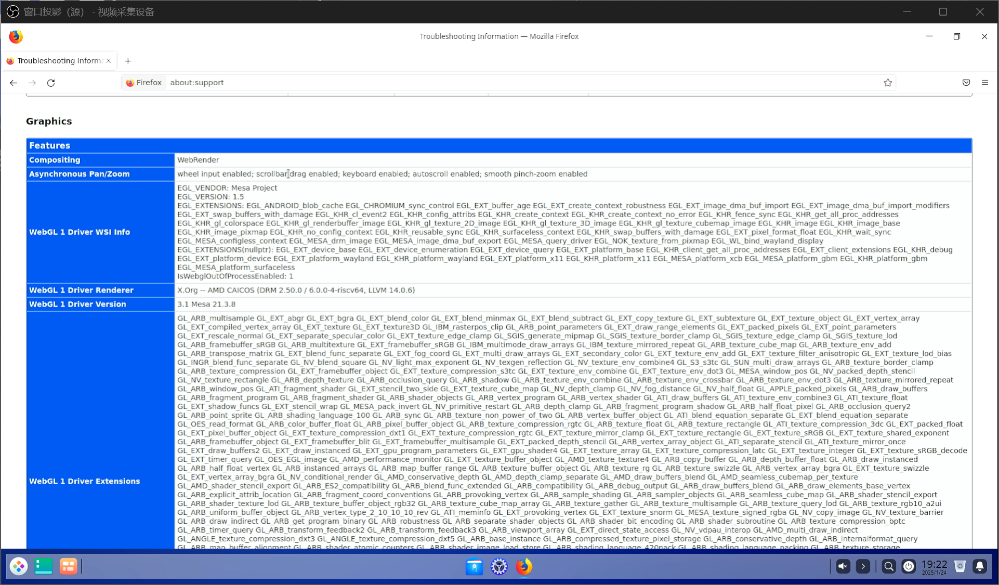

B 站视频 360P 24FPS AV1 软解播放非常卡顿

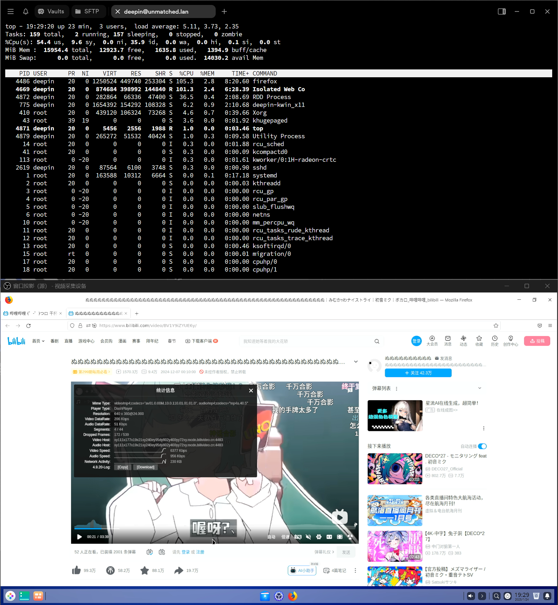

切换至 H264 后稍有缓解，但浏览器体验依然非常卡顿，系统负载 > 5

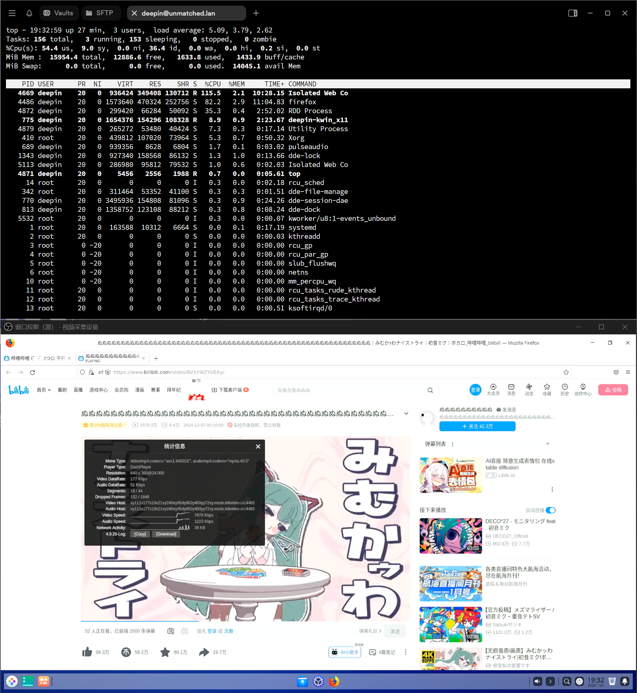

Speedometer 3.0 得分：0.122 ± 0.0048

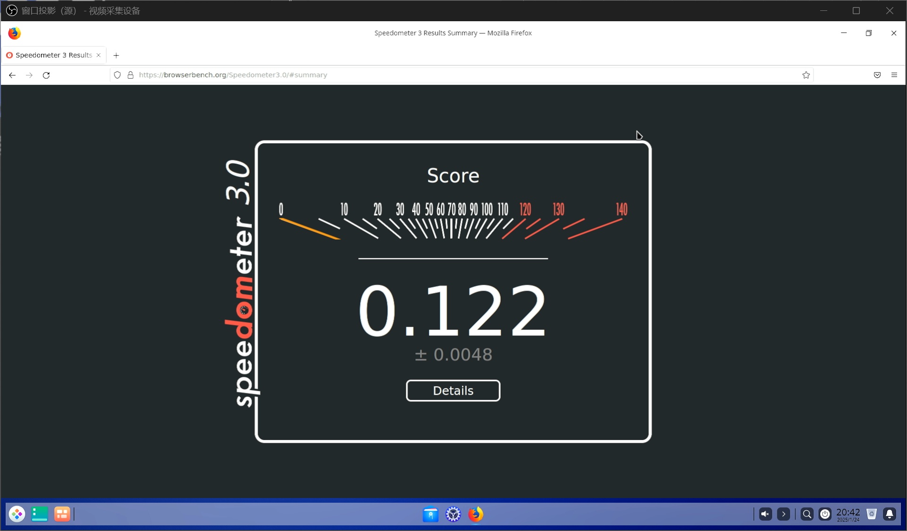

### Chromium

系统未预装，软件源内版本为 104，版本较旧。

Chromium 浏览器实际上不可用：包括 `chrome://` 开头的浏览器内部地址在内，任何网址都无法打开。

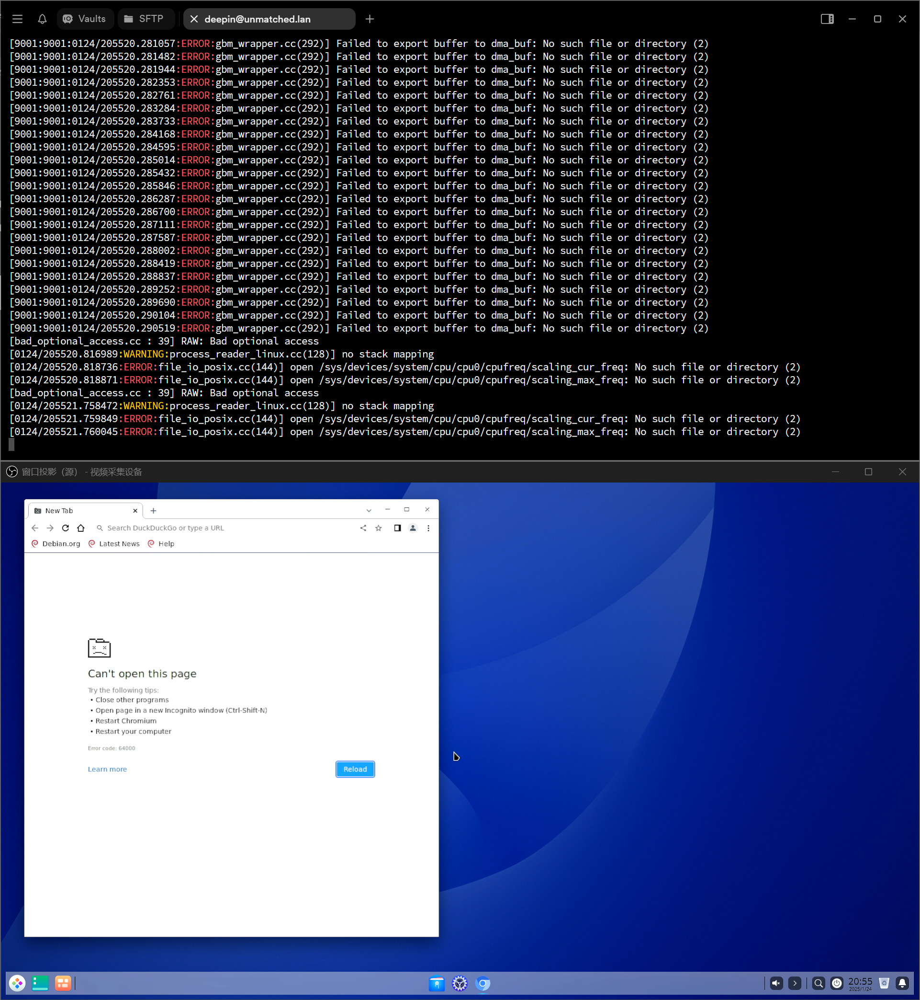

## 视频播放

尝试安装 VLC 失败：

```log
deepin@deepin-riscv:~$ sudo apt install vlc
Reading package lists... Done
Building dependency tree... Done
Reading state information... Done
The following additional packages will be installed:
  fonts-freefont-ttf libaribb24-0 libcddb2 libdvbpsi10 libebml5 libixml10 liblirc-client0 liblzo2-2 libmad0 libmatroska7 libopenmpt-modplug1
  libprotobuf-lite23 libproxy-tools libresid-builder0c2a libsdl-image1.2 libsdl1.2debian libsidplay2 libspatialaudio0 libupnp13 libvlc-bin libvlc5
  libvlccore9 libvncclient1 libxcb-xv0 vlc-bin vlc-data vlc-l10n vlc-plugin-access-extra vlc-plugin-base vlc-plugin-notify vlc-plugin-qt vlc-plugin-samba
  vlc-plugin-skins2 vlc-plugin-video-output vlc-plugin-video-splitter vlc-plugin-visualization
Suggested packages:
  lirc vlc-plugin-fluidsynth vlc-plugin-jack vlc-plugin-pipewire vlc-plugin-svg libdvdcss2
The following NEW packages will be installed:
  fonts-freefont-ttf libaribb24-0 libcddb2 libdvbpsi10 libebml5 libixml10 liblirc-client0 liblzo2-2 libmad0 libmatroska7 libopenmpt-modplug1
  libprotobuf-lite23 libproxy-tools libresid-builder0c2a libsdl-image1.2 libsdl1.2debian libsidplay2 libspatialaudio0 libupnp13 libvlc-bin libvlc5
  libvlccore9 libvncclient1 libxcb-xv0 vlc vlc-bin vlc-data vlc-l10n vlc-plugin-access-extra vlc-plugin-base vlc-plugin-notify vlc-plugin-qt
  vlc-plugin-samba vlc-plugin-skins2 vlc-plugin-video-output vlc-plugin-video-splitter vlc-plugin-visualization
0 upgraded, 37 newly installed, 0 to remove and 39 not upgraded.
Need to get 31.7 kB/17.1 MB of archives.
After this operation, 69.5 MB of additional disk space will be used.
Do you want to continue? [Y/n] 
Err:1 https://mirror.iscas.ac.cn/deepin-riscv/deepin-stage1 beige/main riscv64 libsdl-image1.2 riscv64 1.2.12-12
  404  Not Found [IP: 210.73.43.1 443]
E: Failed to fetch https://mirror.iscas.ac.cn/deepin-riscv/deepin-stage1/pool/main/s/sdl-image1.2/libsdl-image1.2_1.2.12-12_riscv64.deb  404  Not Found [IP: 210.73.43.1 443]
E: Unable to fetch some archives, maybe run apt-get update or try with --fix-missing?
deepin@deepin-riscv:~$ 
```

尝试安装 mpv 成功，播放 Big Buck Bunny 1080P 60FPS H264 片源，VA-API 硬件解码被 mpv 调用，但仍然较为卡顿，有丢帧情况。

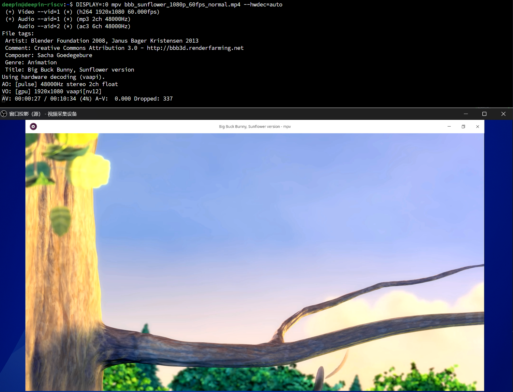

## LibreOffice

从软件源内安装：`sudo apt install -y libreoffice`

版本号 7.4.1.2，版本较旧。

以 LibreOffice Writer 为例：启动耗时约 20s，启动较快。

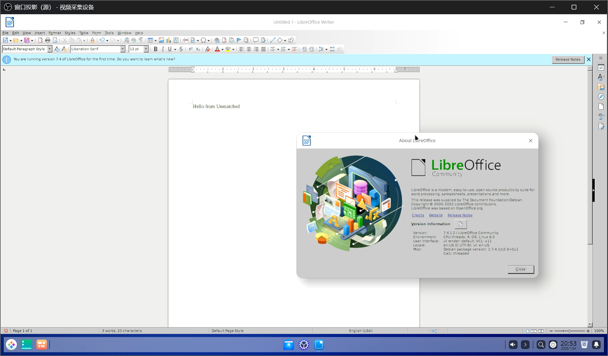

基础功能正常。