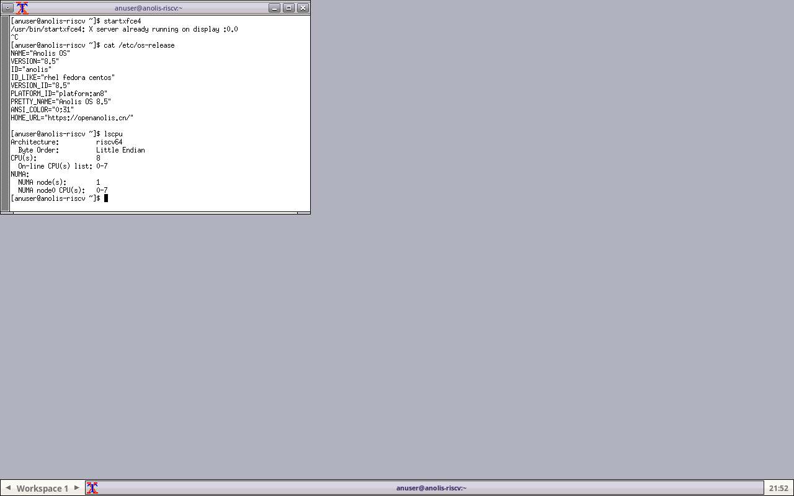
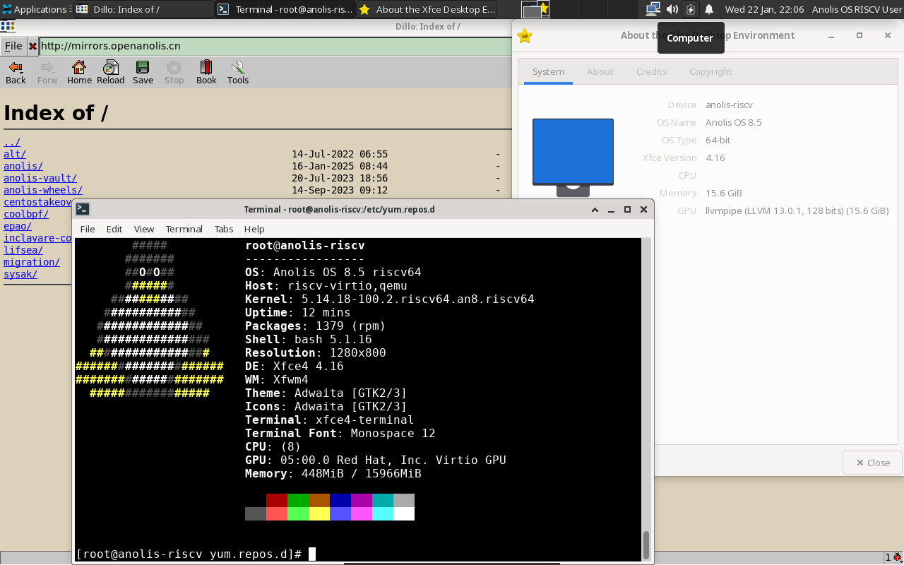
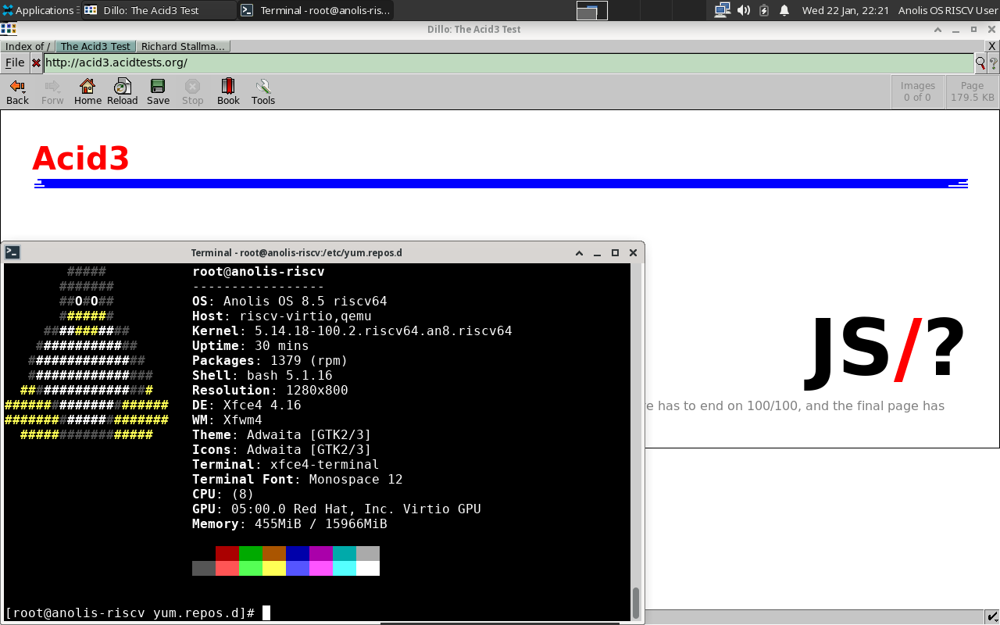
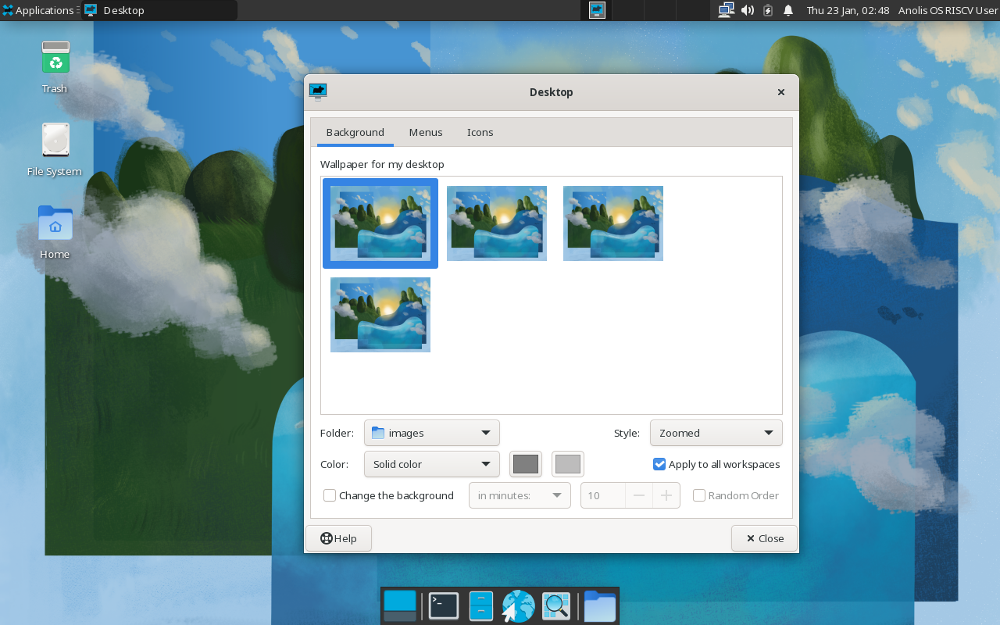
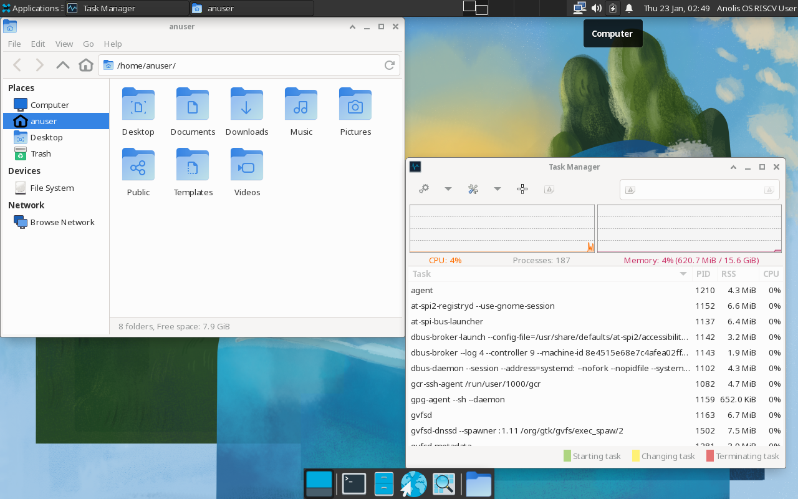
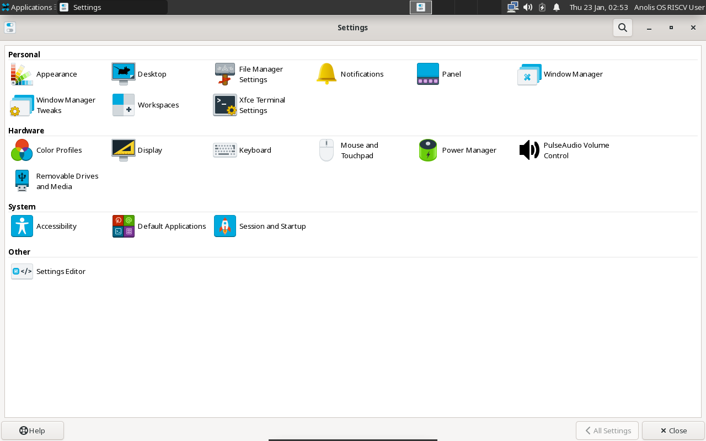

# openAnolis QEMU 测试报告

> [!WARNING]
> openAnolis 系统镜像和软件包来自 2022 年，目前提供 QEMU 版和 Allwinner D1 版；后者在 AWOL Nezha D1 上尝试启动失败。

系统预装了 Fluxbox，Xfce，Awesome 和 i3，默认使用 lightdm + Fluxbox。

本次选择了 Xfce Session 进行测试，桌面环境总体体验流畅。

由于测试时系统默认软件源不可用，无法安装软件；若尝试手动添加镜像源中位于镜像下载页上一级的软件源，可安装部分基础软件包，但其中办公软件、多媒体应用缺失，预装的两个浏览器中，Midori 不可用，Dillo 不支持 JavaScript。

## 测试环境

### 系统信息

- 系统版本：openAnolis 8.5
- 下载链接：https://mirrors.openanolis.cn/alt/desktop-development/images/anolisos-disk-developer-xfce-an8-Rawhide-sda.raw.xz
- 参考安装文档：https://mirrors.openanolis.cn/alt/risc-v/images/README.txt
- 桌面环境：Xfce（可选 fluxbox, awesome, i3）

### 硬件信息

- qemu-system-riscv64

## 系统安装步骤

### 安装 qemu-system-riscv64 和 libvirt 包

如在 Redhat 系发行版下：
```shell
yum install libvirt
yum install qemu-system-riscv
```
安装完成后，启动 libvirt 守护进程：
```shell
systemctl enable libvirtd --now
```

### 获取系统文件

```
wget https://mirrors.openanolis.cn/alt/desktop-development/images/anolisos-disk-developer-xfce-an8-Rawhide-sda.raw.xz
wget https://mirrors.openanolis.cn/alt/risc-v/images/fw_dynamic.bin
wget https://mirrors.openanolis.cn/alt/risc-v/images/u-boot.bin
xzip -d anolisos-disk-developer-xfce-an8-Rawhide-sda.raw.xz
```

建议将上述三个文件移动到 `/var/lib/libvirt/images` 目录下。

### 准备 libvirt 配置文件

将以下内容保存为 `anolis.xml`：
```xml
<domain type='qemu' id='1'>
  <name>riscv64</name>
  <memory unit='KiB'>16777216</memory>
  <currentMemory unit='KiB'>16777216</currentMemory>
  <vcpu placement='static'>8</vcpu>
  <resource>
    <partition>/machine</partition>
  </resource>
  <os>
    <type arch='riscv64' machine='virt'>hvm</type>
    <loader type='rom'>/var/lib/libvirt/images/fw_dynamic.bin</loader>
    <kernel>/var/lib/libvirt/images/u-boot.bin</kernel>
    <boot dev='hd'/>
  </os>
  <clock offset='utc'/>
  <on_poweroff>destroy</on_poweroff>
  <on_reboot>restart</on_reboot>
  <on_crash>destroy</on_crash>
  <devices>
    <emulator>/usr/bin/qemu-system-riscv64</emulator>
    <disk type='file' device='disk'>
      <driver name='qemu' type='raw'/>
      <source file='/var/lib/libvirt/images/anolisos-disk-minimal-an8-Rawhide-sda.raw' index='1'/>
      <backingStore/>
      <target dev='vda' bus='virtio'/>
      <alias name='virtio-disk0'/>
      <address type='pci' domain='0x0000' bus='0x03' slot='0x00' function='0x0'/>
    </disk>
    <controller type='pci' index='0' model='pcie-root'>
      <alias name='pcie.0'/>
    </controller>
    <controller type='pci' index='1' model='pcie-root-port'>
      <model name='pcie-root-port'/>
      <target chassis='1' port='0x8'/>
      <alias name='pci.1'/>
      <address type='pci' domain='0x0000' bus='0x00' slot='0x01' function='0x0' multifunction='on'/>
    </controller>
    <controller type='pci' index='2' model='pcie-root-port'>
      <model name='pcie-root-port'/>
      <target chassis='2' port='0x9'/>
      <alias name='pci.2'/>
      <address type='pci' domain='0x0000' bus='0x00' slot='0x01' function='0x1'/>
    </controller>
    <controller type='pci' index='3' model='pcie-root-port'>
      <model name='pcie-root-port'/>
      <target chassis='3' port='0xa'/>
      <alias name='pci.3'/>
      <address type='pci' domain='0x0000' bus='0x00' slot='0x01' function='0x2'/>
    </controller>
    <controller type='pci' index='4' model='pcie-root-port'>
      <model name='pcie-root-port'/>
      <target chassis='4' port='0xb'/>
      <alias name='pci.4'/>
      <address type='pci' domain='0x0000' bus='0x00' slot='0x01' function='0x3'/>
    </controller>
    <controller type='pci' index='5' model='pcie-root-port'>
      <model name='pcie-root-port'/>
      <target chassis='5' port='0xc'/>
      <alias name='pci.5'/>
      <address type='pci' domain='0x0000' bus='0x00' slot='0x01' function='0x4'/>
    </controller>
    <controller type='virtio-serial' index='0'>
      <alias name='virtio-serial0'/>
      <address type='pci' domain='0x0000' bus='0x02' slot='0x00' function='0x0'/>
    </controller>
    <interface type='network'>
      <source network='default' portid='fc80166a-9af1-40b5-8572-53d6693721b3' bridge='virbr0'/>
      <target dev='vnet0'/>
      <model type='virtio'/>
      <alias name='net0'/>
      <address type='pci' domain='0x0000' bus='0x01' slot='0x00' function='0x0'/>
    </interface>
    <serial type='pty'>
      <source path='/dev/pts/3'/>
      <target type='system-serial' port='0'>
        <model name='16550a'/>
      </target>
      <alias name='serial0'/>
    </serial>
    <console type='pty' tty='/dev/pts/3'>
      <source path='/dev/pts/3'/>
      <target type='serial' port='0'/>
      <alias name='serial0'/>
    </console>
    <channel type='unix'>
      <source mode='bind' path='/var/lib/libvirt/qemu/channel/target/domain-1-rv64qb0/org.qemu.guest_agent.0'/>
      <target type='virtio' name='org.qemu.guest_agent.0' state='connected'/>
      <alias name='channel0'/>
      <address type='virtio-serial' controller='0' bus='0' port='1'/>
    </channel>
    <memballoon model='virtio'>
      <alias name='balloon0'/>
      <address type='pci' domain='0x0000' bus='0x04' slot='0x00' function='0x0'/>
    </memballoon>
  </devices>
  <seclabel type='dynamic' model='dac' relabel='yes'>
    <label>+107:+107</label>
    <imagelabel>+107:+107</imagelabel>
  </seclabel>
  <seclabel type='dynamic' model='none' relabel='yes'>
    <label>system_u:system_r:svirt_tcg_t:s0:c257,c805</label>
    <imagelabel>system_u:object_r:svirt_image_t:s0:c257,c805</imagelabel>
  </seclabel>
</domain>
```

### 启动和登录系统

创建并启动虚拟机：

```shell
sudo virsh net-start default
sudo virsh create anolis.xml
```

通过串口连接到虚拟机：
```shell
sudo virsh console riscv64
```

系统将默认启动到 lightdm；注意可能需要手动切换 session 到 xfce。

默认用户名：`anuser`
密码：`anolisos`

### 启动信息

```log
Welcome to the Anolis OS/RISC-V disk image
https://openanolis.cn/

Build date: Thu Jul 14 05:31:09 UTC 2022

Kernel 5.14.18-100.2.riscv64.an8.riscv64 on an riscv64 (ttyS0)

The root password is 'anolisos'.
root password logins are disabled in SSH starting Anolis OS.
User 'anuser' with password 'anolisos' in 'wheel' group is provided.

If DNS isn’t working, try editing ‘/etc/yum.repos.d/anolis-riscv.repo’.

For updates and latest information read:
https://openanolis.cn/

Anolis OS /RISC-V
-------------
anolis-riscv login: root
Password: 
[  194.256676] audit: type=1100 audit(1737617187.727:214): pid=1019 uid=0 auid=4294967295 ses=4294967295 msg='op=PAM:authentication grantors=pam_unix acct="root" exe="/usr/bin/login" hostname=anolis-riscv addr=? terminal=/dev/ttyS0 res=success'
[  194.262636] audit: type=1101 audit(1737617187.737:215): pid=1019 uid=0 auid=4294967295 ses=4294967295 msg='op=PAM:accounting grantors=pam_unix,pam_localuser acct="root" exe="/usr/bin/login" hostname=anolis-riscv addr=? terminal=/dev/ttyS0 res=success'
[  194.267441] audit: type=1103 audit(1737617187.737:216): pid=1019 uid=0 auid=4294967295 ses=4294967295 msg='op=PAM:setcred grantors=pam_unix acct="root" exe="/usr/bin/login" hostname=anolis-riscv addr=? terminal=/dev/ttyS0 res=success'
[  194.269668] audit: type=1006 audit(1737617187.747:217): pid=1019 uid=0 old-auid=4294967295 auid=0 tty=ttyS0 old-ses=4294967295 ses=2 res=1
[  194.270208] audit: type=1300 audit(1737617187.747:217): arch=c00000f3 syscall=64 success=yes exit=1 a0=3 a1=3fff9c76b0 a2=1 a3=0 items=0 ppid=1 pid=1019 auid=0 uid=0 gid=0 euid=0 suid=0 fsuid=0 egid=0 sgid=0 fsgid=0 tty=ttyS0 ses=2 comm="login" exe="/usr/bin/login" key=(null)
[  194.271094] audit: type=1327 audit(1737617187.747:217): proctitle=2F62696E2F6C6F67696E002D70002D2D
[  194.401967] audit: type=1130 audit(1737617187.877:218): pid=1 uid=0 auid=4294967295 ses=4294967295 msg='unit=user-runtime-dir@0 comm="systemd" exe="/usr/lib/systemd/systemd" hostname=? addr=? terminal=? res=success'
[  194.457137] audit: type=1101 audit(1737617187.927:219): pid=1023 uid=0 auid=4294967295 ses=4294967295 msg='op=PAM:accounting grantors=pam_unix,pam_localuser acct="root" exe="/usr/lib/systemd/systemd" hostname=? addr=? terminal=? res=success'
[  194.458524] audit: type=1103 audit(1737617187.927:220): pid=1023 uid=0 auid=4294967295 ses=4294967295 msg='op=PAM:setcred grantors=? acct="root" exe="/usr/lib/systemd/systemd" hostname=? addr=? terminal=? res=failed'
[  194.459581] audit: type=1006 audit(1737617187.937:221): pid=1023 uid=0 old-auid=4294967295 auid=0 tty=(none) old-ses=4294967295 ses=3 res=1
[root@anolis-riscv ~]# cat /etc/os-release
NAME="Anolis OS"
VERSION="8.5"
ID="anolis"
ID_LIKE="rhel fedora centos"
VERSION_ID="8.5"
PLATFORM_ID="platform:an8"
PRETTY_NAME="Anolis OS 8.5"
ANSI_COLOR="0;31"
HOME_URL="https://openanolis.cn/"

[root@anolis-riscv ~]# uname -a
Linux anolis-riscv 5.14.18-100.2.riscv64.an8.riscv64 #1 SMP Mon Jun 13 14:42:51 CST 2022 riscv64 riscv64 riscv64 GNU/Linux
[root@anolis-riscv ~]# lscpu
Architecture:          riscv64
  Byte Order:          Little Endian
CPU(s):                8
  On-line CPU(s) list: 0-7
NUMA:                  
  NUMA node(s):        1
  NUMA node0 CPU(s):   0-7
[root@anolis-riscv ~]# 
```





## 功能测试

由于 openAnolis RISC-V 镜像源在测试时不可用，**无法在虚拟机中安装新软件**，因此仅对镜像中自带桌面体验进行简单测试。

### 浏览器测试

预装的浏览器只有 Midori 和 Dillo 可选。Midori 因不明 webkit2gtk bug 导致尝试加载任何网页均会出现 kernel oops, Dillo 可用但不兼容大部分现代 Web 特性（如 JavaScript）。



### 办公软件测试

镜像内无预装办公软件。

### 视频播放测试

镜像内无预装视频和多媒体软件。

### 桌面环境测试

能较为流畅的使用 Xfce。

- 桌面环境


- 更换壁纸


- 任务活动视图


- 系统设置


