# openEuler SIG RISC-V 24.03 LTS-SP1 xfce LPi4A 版本测试报告

> [!NOTE]
> 此次测试的镜像并非主线发布的版本，而是 openEuler RISC-V SIG 组自行发布的版本。

总体体验和主线版本没有明显差别。

因 Xfce 资源占用较低，体验相对 GNOME 更加流畅。

## 测试环境

### 操作系统信息

- 系统版本：openEuler 24.03SP1 V1 xfce lpi4a testing
- 下载链接：https://mirror.iscas.ac.cn/openeuler-sig-riscv/openEuler-RISC-V/testing/20241231/v0.4/lpi4a/
- 参考安装文档：https://docs.openeuler.org/zh/docs/24.03_LTS/docs/Installation/RISC-V-LicheePi4A.html

### 硬件信息

- Lichee Pi 4A (16G RAM + 128G eMMC)
- USB-C 电源适配器 / DC 电源一个
- USB-UART 调试器一个

## 安装步骤

### 下载并解压镜像

从 [ISCAS镜像站](https://mirror.iscas.ac.cn/openeuler-sig-riscv/openEuler-RISC-V/testing/20241231/v0.4/lpi4a/) 下载镜像

```shell
zstd -d openEuler-24.03SP1-V1-xfce-lpi4a-boot-testing.img.zst
zstd -d openEuler-24.03SP1-V1-xfce-lpi4a-root-testing.img.zst
```

### 使用 `fastboot` 刷写镜像到板载 eMMC

由于 LPi4A 默认的 USB VID/PID 通常不在默认 udev 规则内，在 Linux 下烧写时可能需要在 `fastboot` 前添加 `sudo`。

按住板上的 **BOOT** 按键不放，然后插入 USB-C 线缆上电（线缆另一头接 PC），即可进入 USB 烧录模式。

在 Windows 下使用设备管理器查看，会出现 `USB download gadget` 设备。

在 Linux 下，使用 `lsusb` 查看设备，会显示以下设备：`ID 2345:7654 T-HEAD USB download gadget`。

使用如下指令刷写镜像。

```shell
sudo fastboot devices
sudo fastboot flash ram u-boot-with-spl-lpi4a-16g.bin
sudo fastboot reboot
# 稍等几秒，等待开发板重启后重新连接至电脑

sudo fastboot flash uboot u-boot-with-spl-lpi4a-16g.bin
sudo fastboot flash boot openEuler-24.03SP1-V1-xfce-lpi4a-boot-testing.img
sudo fastboot flash root openEuler-24.03SP1-V1-xfce-lpi4a-root-testing.img

```

### 登录系统

通过串口登录系统。

默认用户名：`openeuler` 或 `root`
默认密码：`openEuler12#$`

## 预期结果

系统正常启动，能够通过串口登录。

若接入网络，可通过 SSH 登录。

## 实际结果

系统正常启动，成功通过串口或 SSH 登录。

### 启动信息

```log
$ ssh openeuler@192.168.1.24

Authorized users only. All activities may be monitored and reported.
openeuler@192.168.1.24's password: 

Authorized users only. All activities may be monitored and reported.
Last login: Sun Jan 26 17:54:57 2025 from 192.168.1.22


Welcome to 6.6.0-72.0.0.76.oe2403sp1.riscv64

System information as of time:  Sun Jan 26 07:01:31 PM CST 2025

System load:    0.04
Memory used:    7.7%
Swap used:      0%
Usage On:       4%
IP address:     192.168.1.24
Users online:   2
To run a command as administrator(user "root"),use "sudo <command>".
[openeuler@openeuler-riscv64 ~]$ uname -a
Linux openeuler-riscv64 6.6.0-72.0.0.76.oe2403sp1.riscv64 #1 SMP PREEMPT Sun Dec 22 09:35:18 UTC 2024 riscv64 riscv64 riscv64 GNU/Linux
[openeuler@openeuler-riscv64 ~]$ cat /proc/cpuinfo 
processor       : 0
hart            : 0
isa             : rv64imafdc_zicntr_zicsr_zifencei_zihpm
mmu             : sv39
uarch           : thead,c910
mvendorid       : 0x5b7
marchid         : 0x0
mimpid          : 0x0

processor       : 1
hart            : 1
isa             : rv64imafdc_zicntr_zicsr_zifencei_zihpm
mmu             : sv39
uarch           : thead,c910
mvendorid       : 0x5b7
marchid         : 0x0
mimpid          : 0x0

processor       : 2
hart            : 2
isa             : rv64imafdc_zicntr_zicsr_zifencei_zihpm
mmu             : sv39
uarch           : thead,c910
mvendorid       : 0x5b7
marchid         : 0x0
mimpid          : 0x0

processor       : 3
hart            : 3
isa             : rv64imafdc_zicntr_zicsr_zifencei_zihpm
mmu             : sv39
uarch           : thead,c910
mvendorid       : 0x5b7
marchid         : 0x0
mimpid          : 0x0

[openeuler@openeuler-riscv64 ~]$ 

```
## 安装UI界面

该镜像中已经安装了 xfce 桌面环境，无需额外安装

登录界面：


## 功能测试

### 桌面环境测试

xfce 桌面虽然也是采用软件渲染，但整体体验显著优于软件源中的 GNOME 桌面。

- 桌面环境
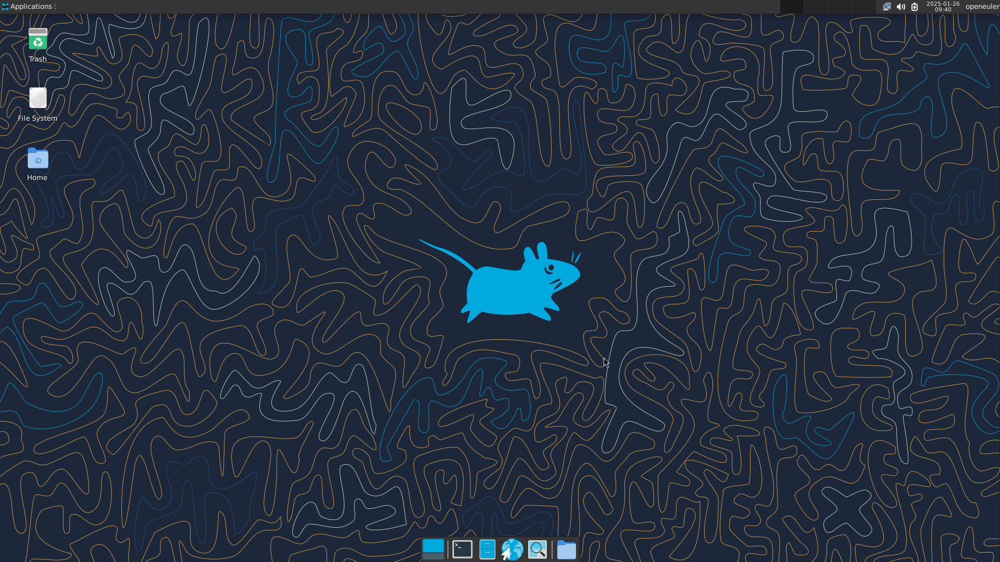

- 更换壁纸
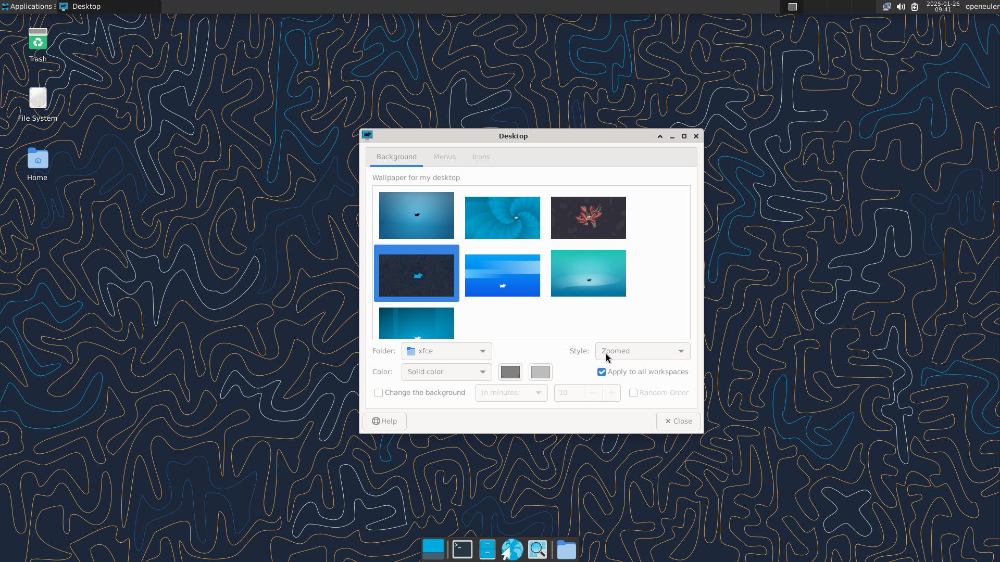

- 系统设置
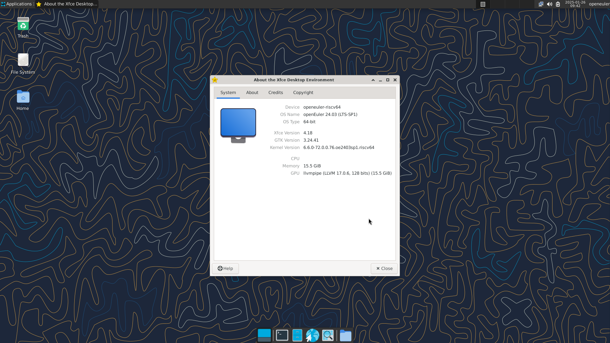


### 办公软件

源内暂无 libreoffice、openoffice 等办公软件。

### 视频播放测试

#### MPV

```bash
sudo dnf install mpv
```

1080p h.264 软解可以播放，帧率虽然显著高于 GNOME 桌面下的表现，但仍然很低，目测在个位数

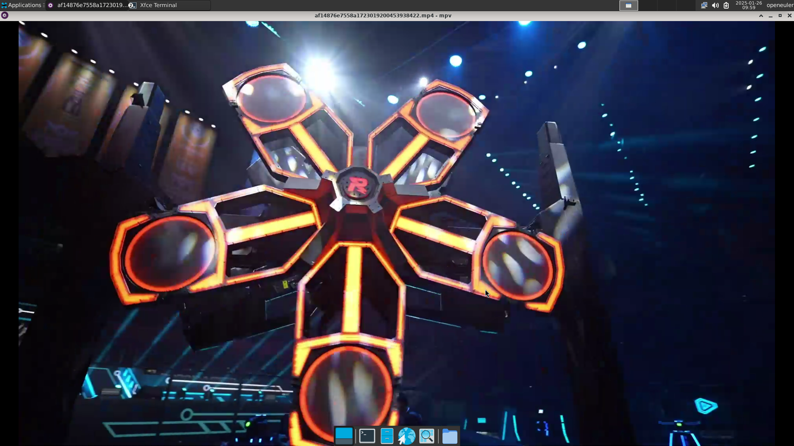

#### 自带播放器

无自带播放器

### 浏览器测试

#### Chromium

软件源中不存在该浏览器。

#### Firefox

```bash
sudo dnf install firefox
```

- 浏览器启动
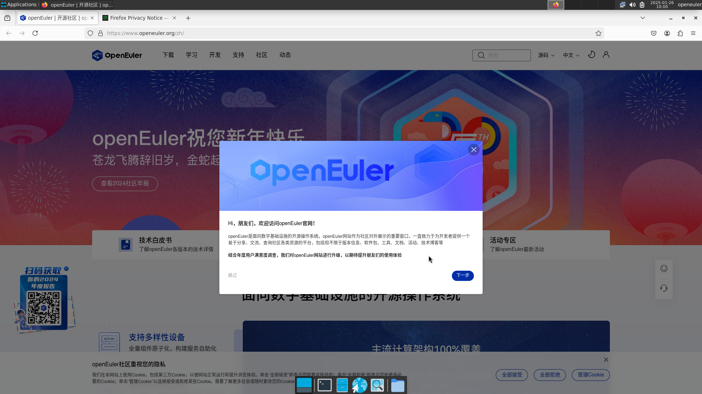

- 在线视频播放
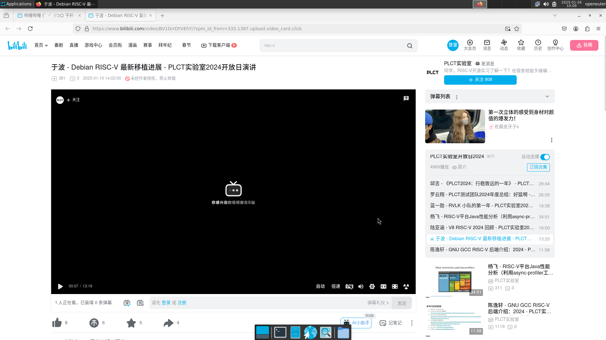
哔哩哔哩的360p视频在较长时间加载后仍无法播放

- 浏览器性能测试

Speedometer 分数为 0.4922 += 0.0045:
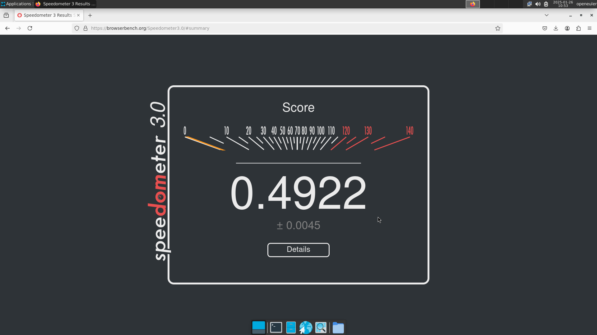

- 浏览器解码能力
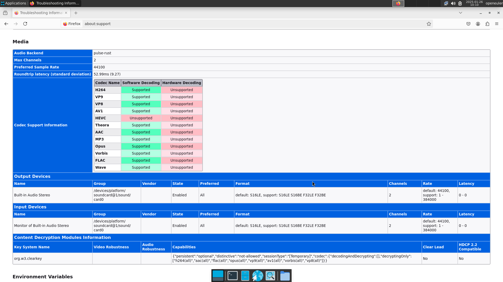

- 网页浏览
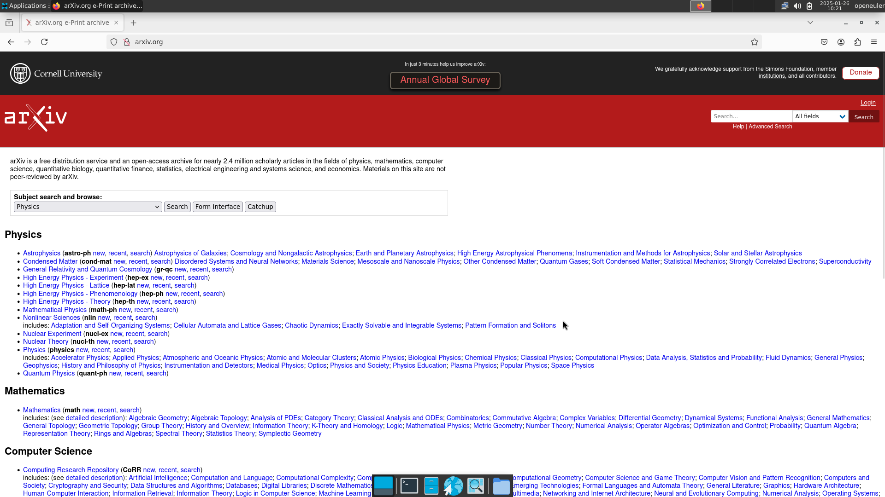

- 收藏
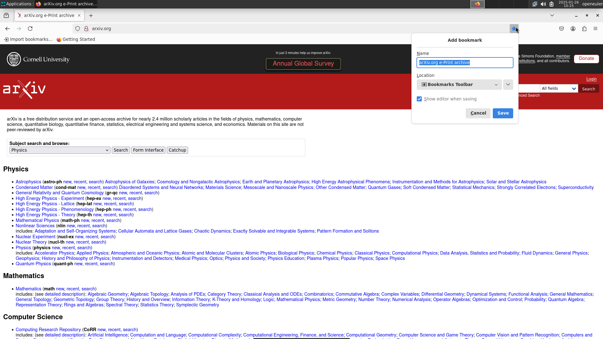

- 阅读 PDF
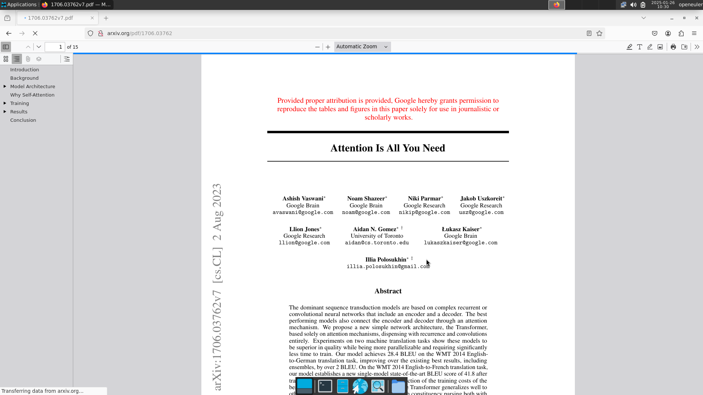

- 下载
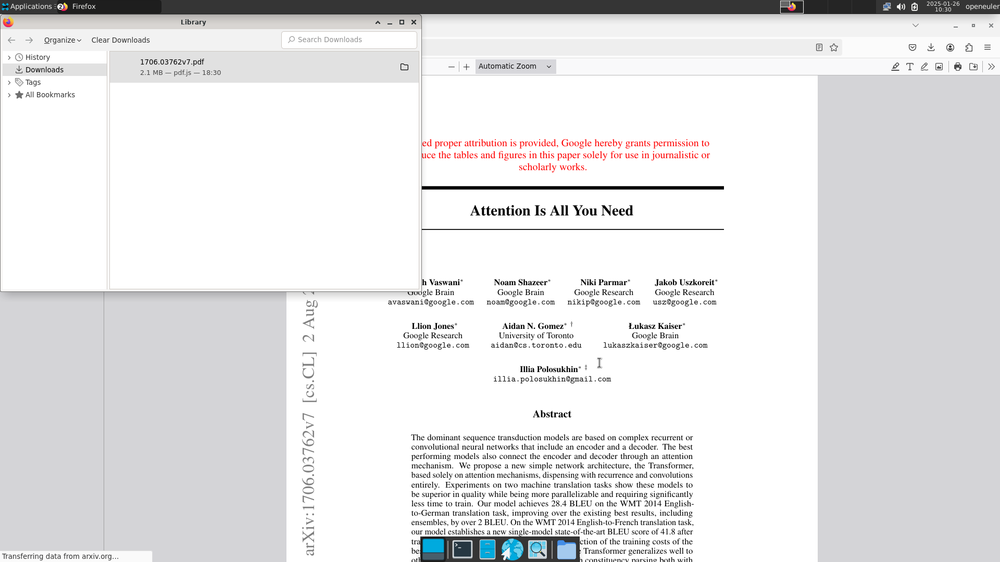

- 检查网页源码
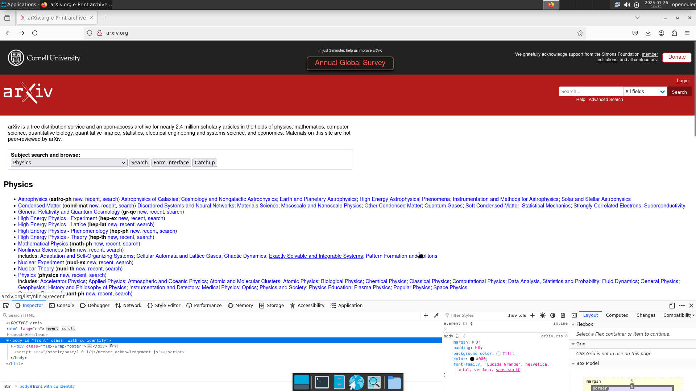

- 历史记录
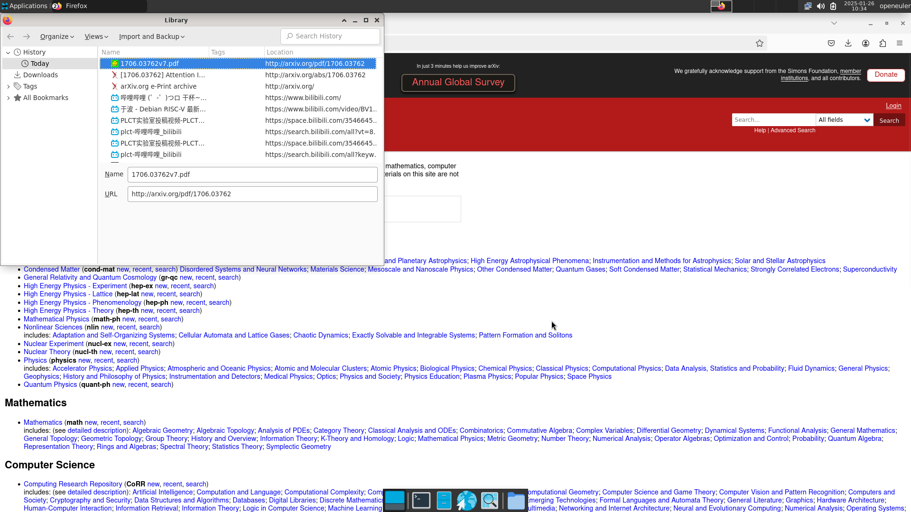

- 设置
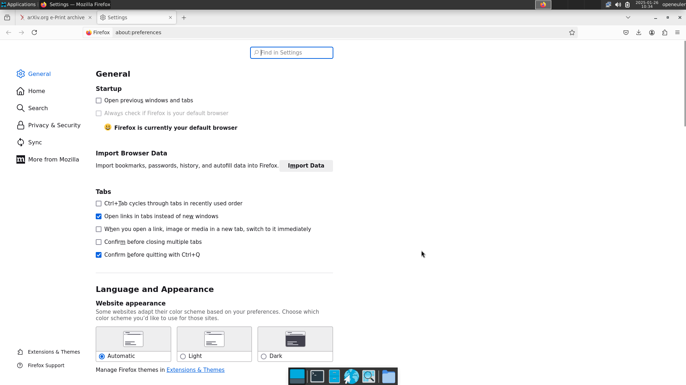
