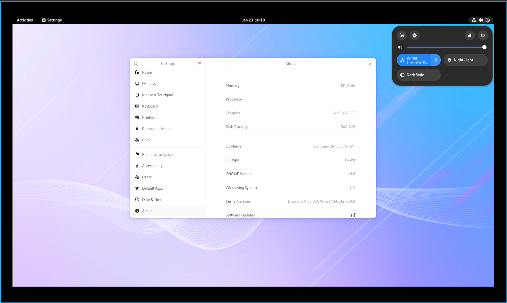
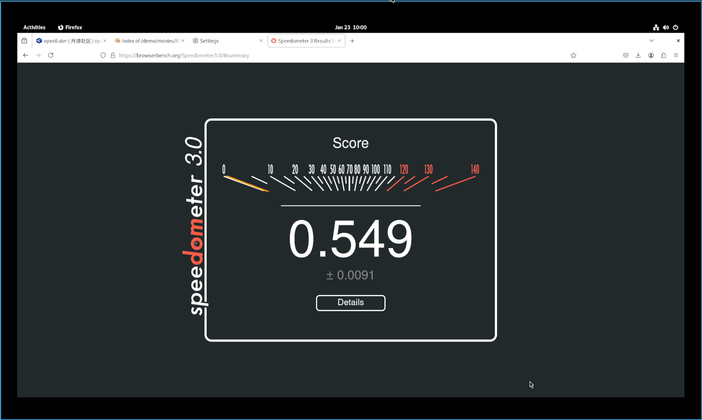
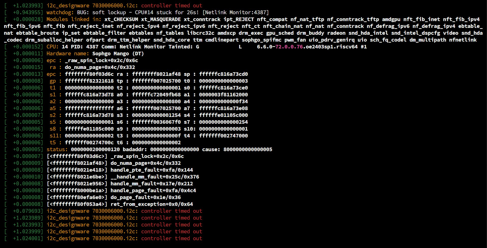
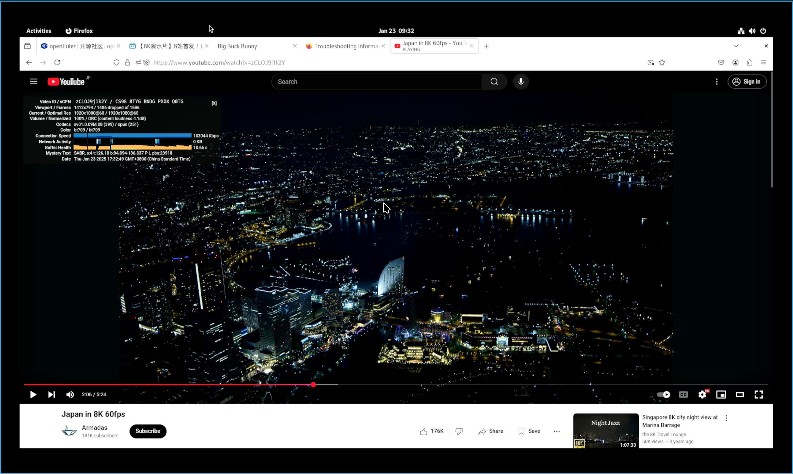
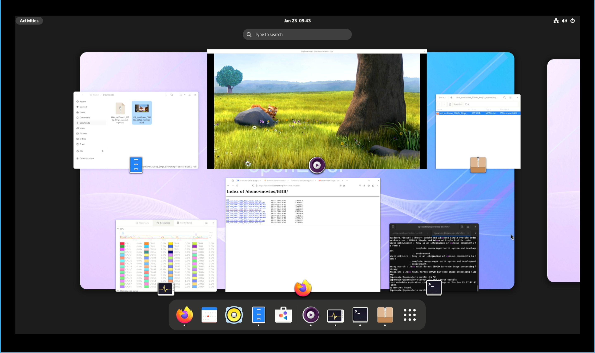
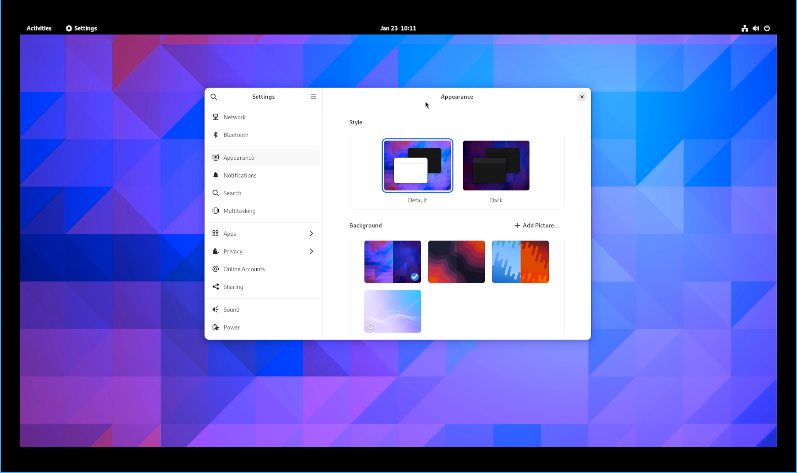

# openEuler RISC-V Pioneer 测试报告

桌面使用较为流畅；视频硬解缺失，但得益于 SG2042 的强大性能，本地播放器仍可流畅软解视频；浏览器软解有明显卡顿。

浏览器总体性能较低，Speedometer 不足 1 分；部分浏览器性能基准测试会导致 Kernel Oops。

## 测试环境

### 操作系统信息

- 系统版本：openEuler RISC-V 24.03 LTS SP1 (Image, Linux Boot 启动)
- 下载链接：[openEuler 官网](https://www.openeuler.org/zh/download/) (Choose: riscv64 -> 嵌入式 -> SG2042 -> 选择镜像仓)
  - 固件：sg2042_firmware_linuxboot.img.zip，在下载链接同一页面上
- 参考安装文档：[Installing on Pioneer Box - openEuler Docs](https://docs.openeuler.org/zh/docs/24.03_LTS/docs/Installation/RISC-V-Pioneer1.3.html)

### 硬件信息

- Milk-V Pioneer Box v1.3
- microSD 卡一张（或 NVMe SSD + NVMe SSD 转 USB 硬盘盒）
- USB Type-C 线缆一条（用来连接板载串口）

## 安装步骤

### 使用 `dd` 分别刷写固件和镜像到 microSD 卡和 NVMe SSD

下载**固件**，解压，使用 `dd` 烧录至 **microSD 卡**。

将下面的 `/dev/mmcblk0` 替换成真实硬盘位置。

```shell
unzip sg2042_firmware_linuxboot.img.zip
sudo dd if=sg2042_firmware_linuxboot.img of=/dev/mmcblk0 bs=512K iflag=fullblock oflag=direct conv=fsync status=progress
```

下载**系统镜像**，解压，使用 `dd` 烧录至 **NVMe SSD**。

如果您在使用 Windows，推荐使用 Rufus 或 Etcher 这类工具进行烧写。

将下面的 `/dev/sda` 替换成真实硬盘位置。

```shell
unzip openEuler-24.03-LTS-riscv64-sg2042.img.zip
sudo wipefs -af /dev/sda
sudo dd if=openEuler-24.03-LTS-riscv64-sg2042.img of=/dev/sda bs=1M status=progress
sudo eject /dev/sda
```

### 登录系统

在 openEuler Docs 中写到：

> `Image` 版本使用者：
> 
> 由于当前出厂固件的局限性，设备启动时 `RISC-V` 串口回显并不完整，操作系统未加载完成时串口输出即会关闭。需将显卡插入 `PCIe` 槽位并连接显示器才能观察到完整的启动过程。

因此，我们将使用 SSH 而不是串口登录系统。可在路由器上检查机器 IP。

默认用户名：`openeuler` 或 `root`
默认密码：`openEuler12#$`

### 安装桌面环境

以 GNOME 为例：
```shelll
sudo dnf update
sudo dnf install dejavu-fonts liberation-fonts gnu-*-fonts google-*-fonts
sudo dnf install xorg-*
sudo dnf install adwaita-icon-theme atk atkmm at-spi2-atk at-spi2-core baobab \
 abattis-cantarell-fonts cheese clutter clutter-gst3 clutter-gtk cogl dconf \
 dconf-editor devhelp eog epiphany evince evolution-data-server file-roller folks \
 gcab gcr gdk-pixbuf2 gdm gedit geocode-glib gfbgraph gjs glib2 glibmm24 \
 glib-networking gmime30 gnome-autoar gnome-backgrounds gnome-bluetooth \
 gnome-boxes gnome-builder gnome-calculator gnome-calendar gnome-characters \
 gnome-clocks gnome-color-manager gnome-contacts gnome-control-center \
 gnome-desktop3 gnome-disk-utility gnome-font-viewer gnome-getting-started-docs \
 gnome-initial-setup gnome-keyring gnome-logs gnome-menus gnome-music \
 gnome-online-accounts gnome-online-miners gnome-photos gnome-remote-desktop \
 gnome-screenshot gnome-session gnome-settings-daemon gnome-shell \
 gnome-shell-extensions gnome-software gnome-system-monitor gnome-terminal \
 gnome-tour gnome-user-docs gnome-user-share gnome-video-effects \
 gnome-weather gobject-introspection gom grilo grilo-plugins \
 gsettings-desktop-schemas gsound gspell gssdp gtk3 gtk4 gtk-doc gtkmm30 \
 gtksourceview4 gtk-vnc2 gupnp gupnp-av gupnp-dlna gvfs json-glib libchamplain \
 libdazzle libgdata libgee libgnomekbd libgsf libgtop2 libgweather libgxps libhandy \
 libmediaart libnma libnotify libpeas librsvg2 libsecret libsigc++20 libsoup \
 mm-common mutter nautilus orca pango pangomm libphodav python3-pyatspi \
 python3-gobject rest rygel simple-scan sushi sysprof tepl totem totem-pl-parser \
 tracker3 tracker3-miners vala vte291 yelp yelp-tools \
 yelp-xsl zenity
```

设置系统默认以 GUI 登录：

```
sudo systemctl enable gdm
sudo systemctl set-default graphical.target
```

Xfce 因缺少软件包暂不可用。

## 启动信息

连接显示器、键盘、鼠标，重启设备并登录 GUI。

下列测试使用 HDMI 采集卡完成。可正常启动并进入 GUI 桌面。



## 功能测试

### 浏览器测试

因 openEuler 24.03 LTS SP1 软件源中无 Chromium, 本次测试使用 Firefox 进行。

Speedometer 分数为 0.549 ± 0.0091:



Basemark 测试失败；测试时发现 WebGL 2.0 Test (test 5/20) 会导致 kernel oops, 反复测试均稳定复现：



### 办公软件测试

软件源内无可用办公软件。

### 视频播放测试

安装 `mpv`:

```shell
sudo dnf install mpv
```

本地可流畅播放 Big Buck Bunny (H.264 1080p 60fps)，无硬件解码：


在线视频测试选用 YouTube 上的 [Japan in 8K 60fps](https://www.youtube.com/watch?v=zCLOJ9j1k2Y) 作为样片。在 1080p 60fps 下，视频可以播放但较为卡顿且有明显掉帧现象。



### 桌面环境测试
能正常使用 GNOME。

- 桌面环境/任务活动视图


- 更换壁纸


