# openEuler QEMU 测试报告

## 测试环境

### 系统信息

- 系统版本：openEuler 24.03 SP1
- 下载链接：https://mirrors.tuna.tsinghua.edu.cn/openeuler/openEuler-24.03-LTS-SP1/virtual_machine_img/riscv64/openEuler-24.03-LTS-SP1-riscv64.qcow2.xz
- 参考安装文档：https://docs.openeuler.org/zh/docs/24.03_LTS_SP1/docs/Installation/RISC-V-QEMU.html
- 桌面环境: 无自带桌面环境 (可选 ukui, dde, xfce, gnome, kiran)

### 硬件信息

- qemu-system-riscv64

## 系统安装步骤

### 安装 qemu-system-riscv64

```shell
dnf install qemu-system-riscv
```

### 获取系统文件

```
wget https://repo.openeuler.org/openEuler-24.03-LTS-SP1/virtual_machine_img/riscv64/RISCV_VIRT_CODE.fd
wget https://repo.openeuler.org/openEuler-24.03-LTS-SP1/virtual_machine_img/riscv64/RISCV_VIRT_VARS.fd
wget https://repo.openeuler.org/openEuler-24.03-LTS-SP1/virtual_machine_img/riscv64/fw_dynamic_oe_penglai.bin
wget https://repo.openeuler.org/openEuler-24.03-LTS-SP1/virtual_machine_img/riscv64/openEuler-24.03-LTS-SP1-riscv64.qcow2.xz
wget https://repo.openeuler.org/openEuler-24.03-LTS-SP1/virtual_machine_img/riscv64/openEuler-24.03-LTS-SP1-riscv64.qcow2.xz.sha256sum
wget https://repo.openeuler.org/openEuler-24.03-LTS-SP1/virtual_machine_img/riscv64/start_vm.sh
wget https://repo.openeuler.org/openEuler-24.03-LTS-SP1/virtual_machine_img/riscv64/start_vm_penglai.sh
sha256sum -c openEuler-24.03-LTS-SP1-riscv64.qcow2.xz.sha256sum # 可选进行 sha256sum 校验。
xzip -d openEuler-24.03-LTS-SP1-riscv64.qcow2.xz
```

### 启动配置

修改后可以 SDL 方式显示图形画面的 start_vm.sh：

```shell
#!/usr/bin/env bash

# The script is created for starting a riscv64 qemu virtual machine with specific parameters.

RESTORE=$(echo -en '\001\033[0m\002')
YELLOW=$(echo -en '\001\033[00;33m\002')

## Configuration
vcpu=8
memory=8
drive="$(ls *.qcow2)"
fw1="RISCV_VIRT_CODE.fd"
fw2="RISCV_VIRT_VARS.fd"
ssh_port=12055
[[ $spice_port ]] && audiobackend="spice" || audiobackend="none" # When Spice is enabled, set the audio backend to spice. Otherwise, set the audio backend to none. The value can be changed as needed.

cmd="qemu-system-riscv64 \
  -machine virt,pflash0=pflash0,pflash1=pflash1,acpi=off \
  -smp "$vcpu" -m "$memory"G \
  -display sdl,gl=on \
  -audiodev "$audiobackend",id=snd0 \
  -blockdev node-name=pflash0,driver=file,read-only=on,filename="$fw1" \
  -blockdev node-name=pflash1,driver=file,filename="$fw2" \
  -drive file="$drive",format=qcow2,id=hd0,if=none \
  -object rng-random,filename=/dev/urandom,id=rng0 \
  -device virtio-gpu-gl \
  -device virtio-rng-device,rng=rng0 \
  -device virtio-blk-device,drive=hd0 \
  -device virtio-net-device,netdev=usernet \
  -netdev user,id=usernet,hostfwd=tcp::"$ssh_port"-:22 \
  -device qemu-xhci -usb -device usb-kbd -device usb-tablet -device usb-audio,audiodev=snd0"

echo ${YELLOW}:: Starting VM...${RESTORE}
echo ${YELLOW}:: Using following configuration${RESTORE}
echo ""
echo ${YELLOW}vCPU Cores: "$vcpu"${RESTORE}
echo ${YELLOW}Memory: "$memory"G${RESTORE}
echo ${YELLOW}Disk: "$drive"${RESTORE}
echo ${YELLOW}SSH Port: "$ssh_port"${RESTORE}
echo ""
echo ${YELLOW}:: NOTE: Make sure ONLY ONE .qcow2 file is${RESTORE}
echo ${YELLOW}in the current directory${RESTORE}
echo ""
echo ${YELLOW}:: Tip: Try setting DNS manually if QEMU user network doesn\'t work well. ${RESTORE}
echo ${YELLOW}:: HOWTO -\> https://serverfault.com/a/810639 ${RESTORE}
echo ""
echo ${YELLOW}:: Tip: If \'ping\' reports permission error, try reinstalling \'iputils\'. ${RESTORE}
echo ${YELLOW}:: HOWTO -\> \'sudo dnf reinstall iputils\' ${RESTORE}
echo ""

sleep 2

eval $cmd
```

### 启动和登录系统

给予执行权限并启动虚拟机：

```shell
sudo chmod +x start_vm.sh
./start_vm.sh
```

系统将默认时不带有桌面环境，可选参照 [UKUI](https://docs.openeuler.org/zh/docs/24.03_LTS_SP1/docs/desktop/ukui.html) 文档安装。

```
dnf install ukui
```

- 安装 UKUI 启动后登陆界面

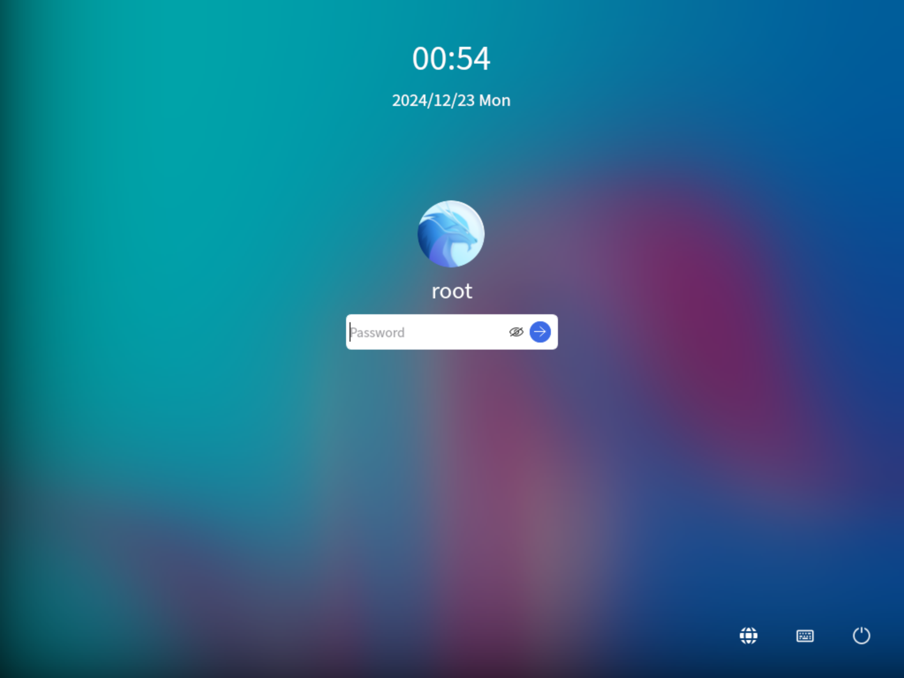

默认用户名：`openeuler` / `root`
密码：`openEuler12#$`

### 启动信息

见 log/oerv_ukui_dmesg.log

## 功能测试

dnf 软件包管理器正常工作，源均能访问。

### 浏览器测试

若安装了 UKUI，则会自带一个 Firefox 浏览器。网页正常渲染。

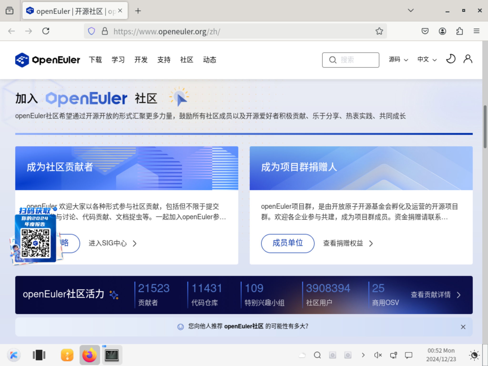

WebGL 水族馆。

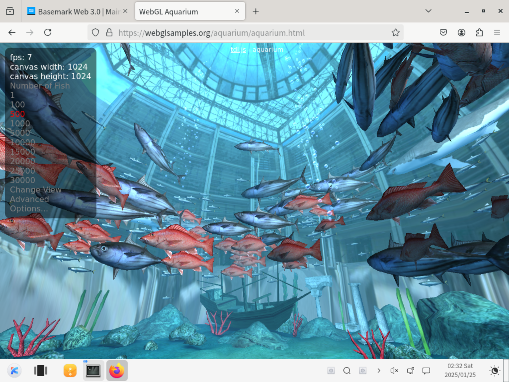

Basemark 测试可以正常跑完。（性能分取决于宿主机性能，参考价值低。）

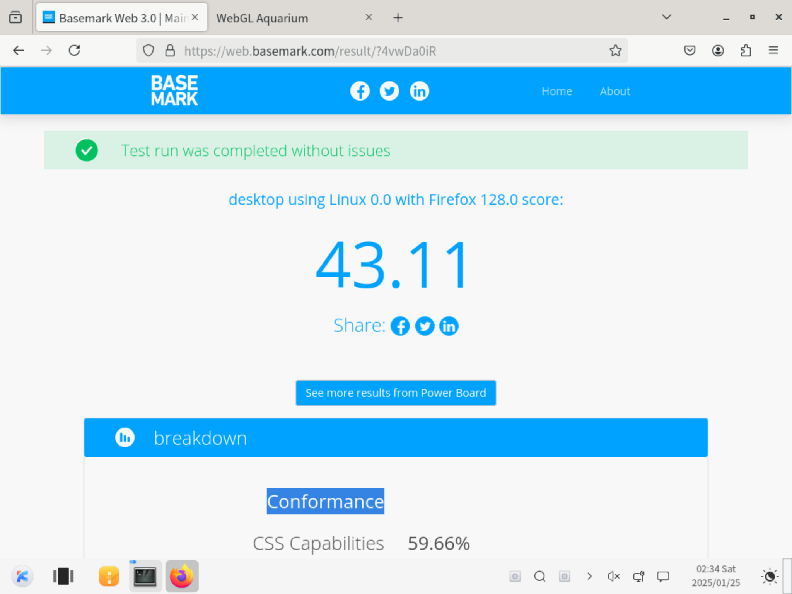

### 办公软件测试

镜像内无预装办公软件。镜像源内未打包 libreoffice 等常见办公软件，无法测试。

### 视频播放测试

若安装了 UKUI，则自带一个 Media Player 播放器。但无法启动。

使用 usb-audio 和 virtio-sound-pci 通入音频时均无法识别音频设备。

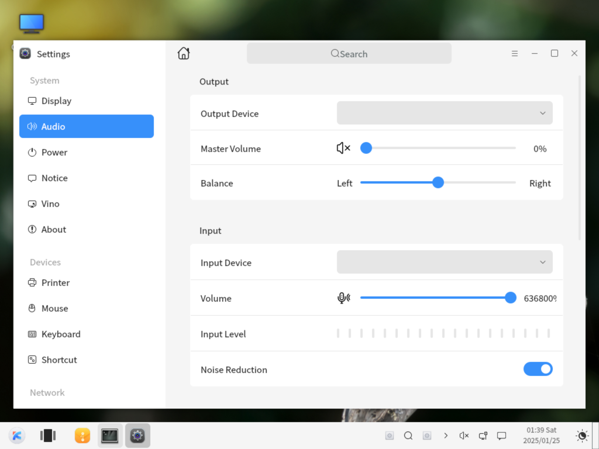

通过 mpv 可正常解码流畅播放 [在线流媒体视频](http://commondatastorage.googleapis.com/gtv-videos-bucket/sample/BigBuckBunny.mp4) 画面。但因无可识别的音频输出设备无声。

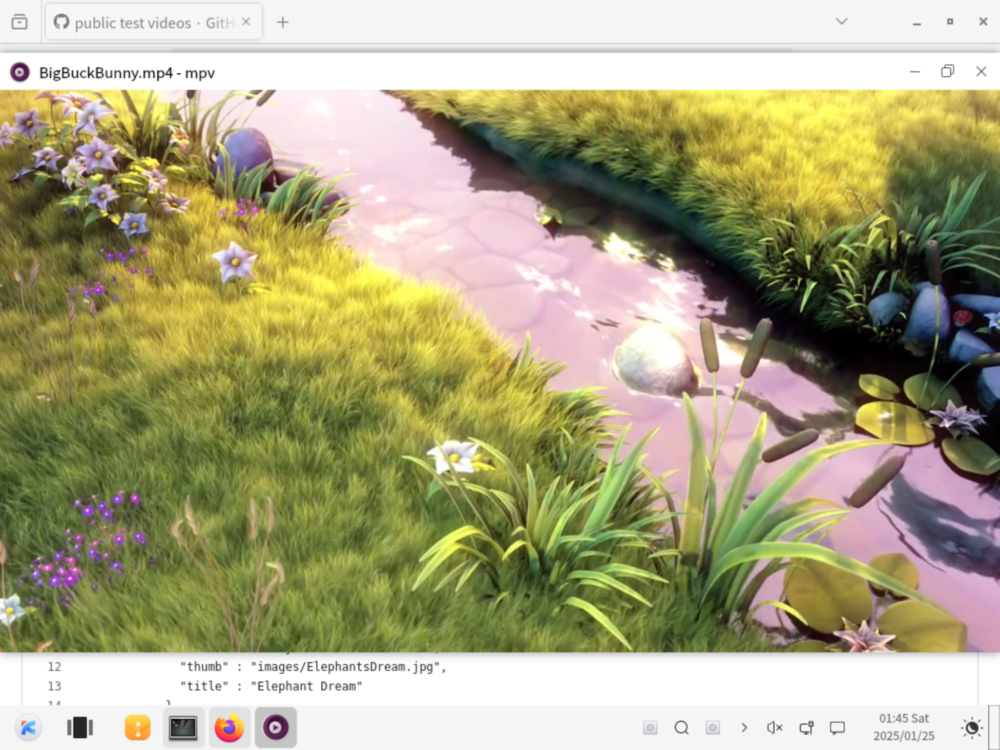

### 桌面环境测试
能较为流畅的使用 UKUI。

- 桌面环境
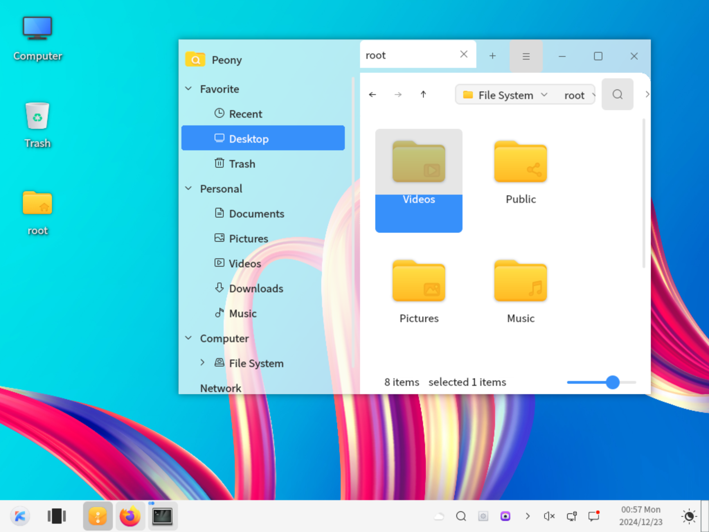

- 更换壁纸
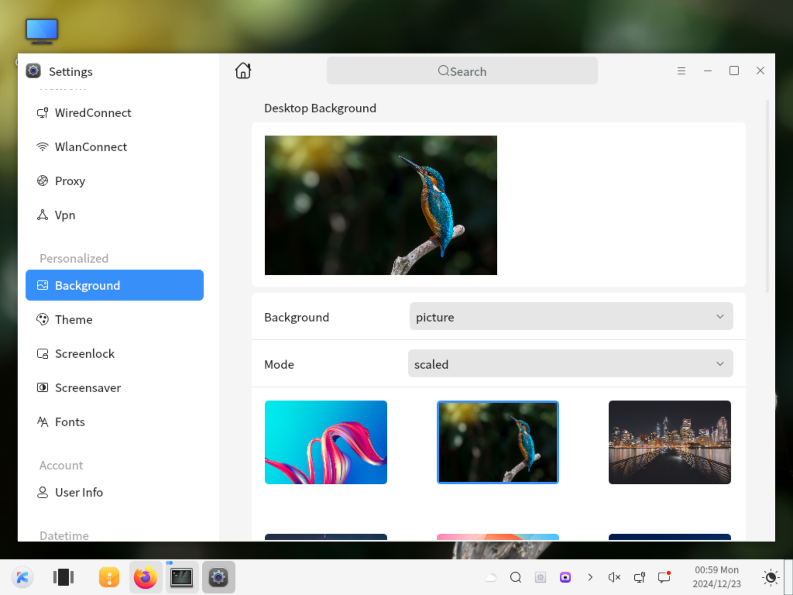

- 任务活动视图
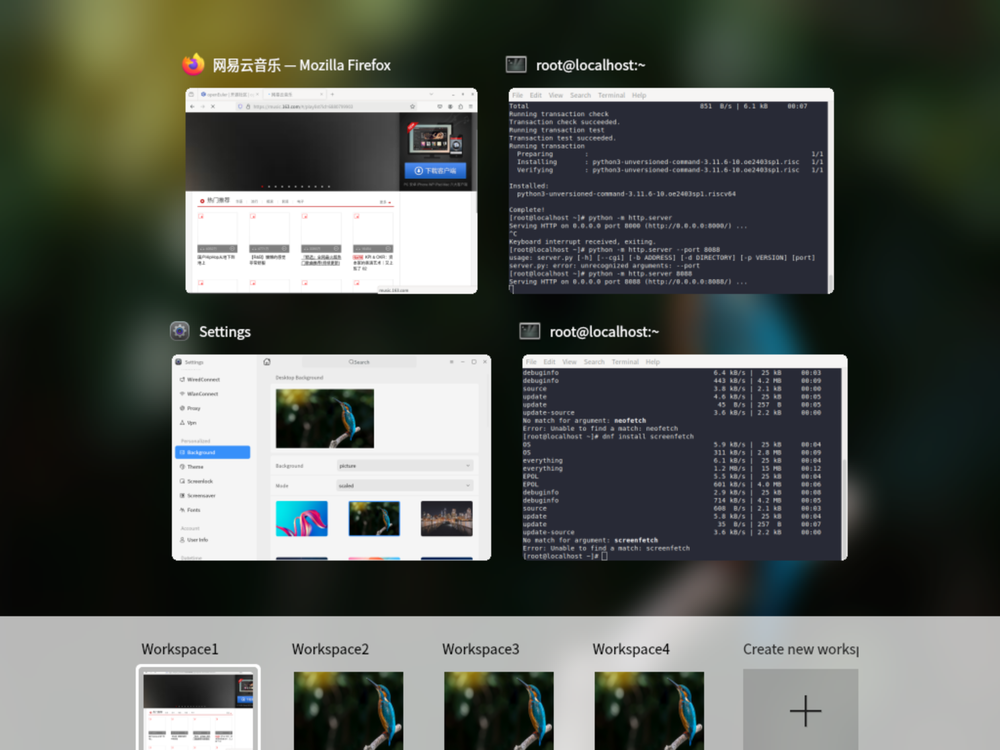

- 系统设置 (关于)
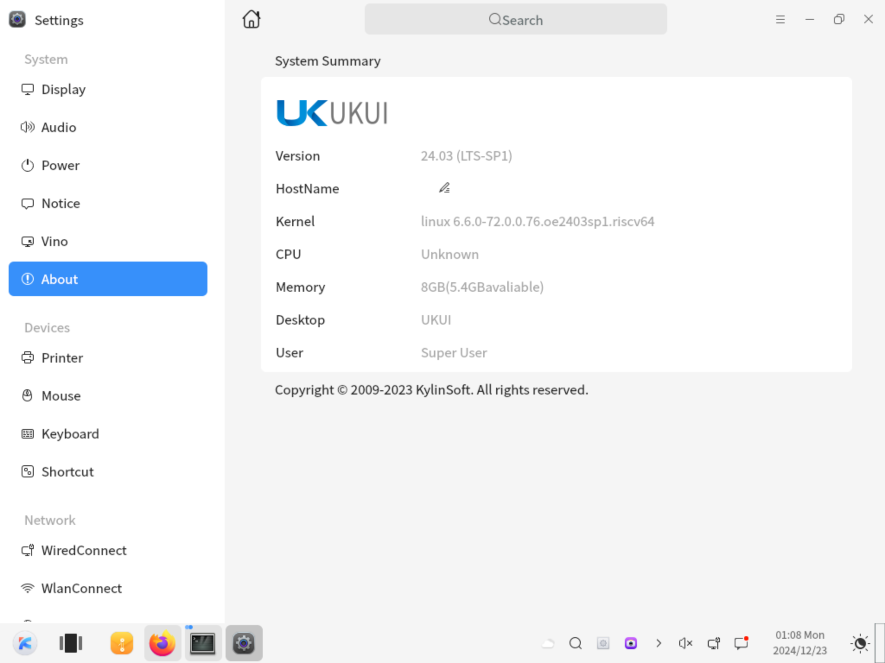


- 系统设置 (主题)
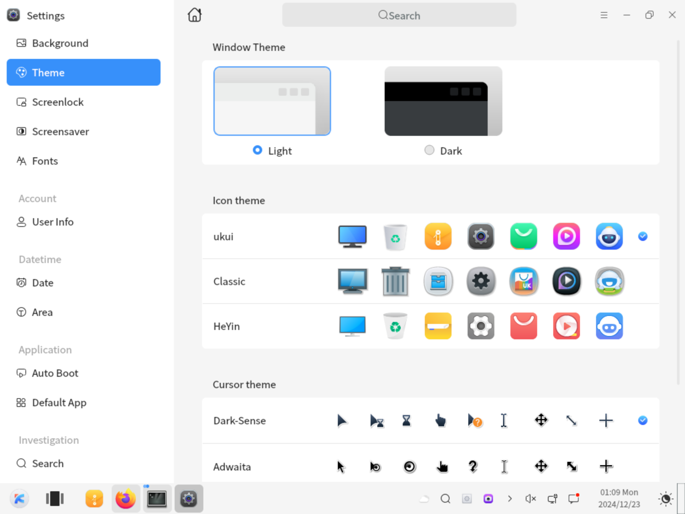

