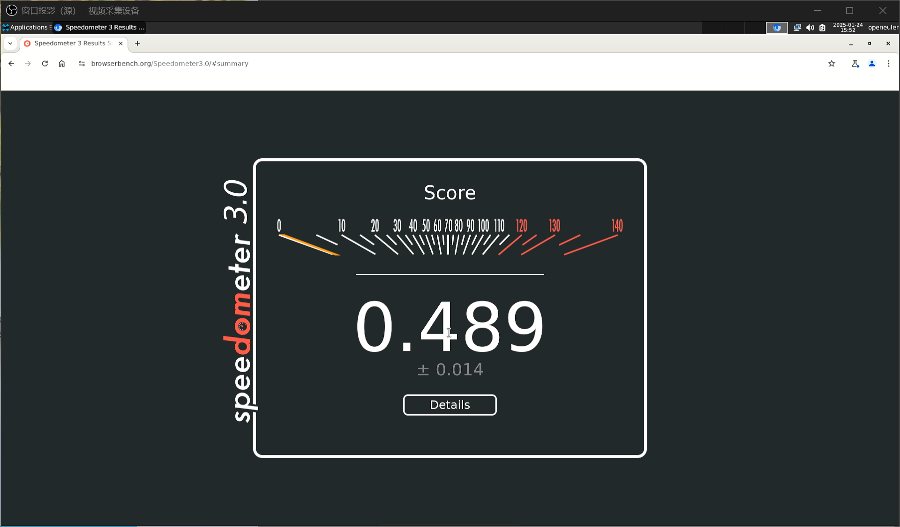

# openEuler RISC-V 24.09 HiFive Unmatched 版本测试报告

> [!NOTE]
> 此次测试的镜像并非主线发布的版本，而是 openEuler RISC-V SIG 组自行发布的版本。

受限于 CPU 性能，部分场景的系统响应速度较慢，如系统启动和软件包管理；部分软件包缺失，如 VLC 和 LibreOffice；

浏览器默认开启了 GPU 渲染加速，但在尝试进行基准测试时会触发 GPU hand 进而崩溃/卡死，且本地和在线视频硬解均未开启，视频播放体验较差。

总的来说，只能满足基本的桌面使用需求。

## 测试环境

### 操作系统信息

- 系统版本：openEuler 24.09 testing, 20241105
- 下载链接：https://mirror.iscas.ac.cn/openeuler-sig-riscv/openEuler-RISC-V/testing/20241105/v0.1/Unmatched/
    - 选用 Xfce 镜像
- 参考安装文档：https://mirror.iscas.ac.cn/openeuler-sig-riscv/openEuler-RISC-V/testing/20241105/v0.1/Unmatched/README.Unmatched.txt

### 硬件信息

- HiFive Unmatched Rev A
- microUSB 线缆一条（随 HiFive Unmatched 附赠）
- ATX 电源一个
- PCI-E 显卡一张（本次使用：AMD Radeon R5 230）
- microSD 卡一张（Sandisk Extreme Pro 64G UHS-I）
- USB 键盘&鼠标
- HDMI 显示器/采集卡，HDMI 线缆（显卡自带 VGA/DVI，亦可使用）
- M.2 NVMe SSD（可选）
    - 请参考安装文档进行操作。

## 安装步骤

### 引导设备选择

确保拨码开关已调整为从 microSD 卡引导。若您未更改，出厂默认即为从 microSD 卡引导。

拨码开关应如下设置：`MSEL[3:0]=1011`

### 使用 dd 刷写镜像到 microSD 卡

```shell
wget https://mirror.iscas.ac.cn/openeuler-sig-riscv/openEuler-RISC-V/testing/20241105/v0.1/Unmatched/openEuler-24.09-V1-xfce-unmatched-testing.img.zst
zstd -T0 -dkv openEuler-24.09-V1-xfce-unmatched-testing.img.zst
sudo dd if=openEuler-24.09-V1-xfce-unmatched-testing.img of=/dev/sdX bs=1M status=progress; sync
```

### 其它说明

安装文档中已提到使用 SSD 的启动方式，若板载 SPI Flash 已经刷入了主线 U-Boot，可仅修改 extlinux 中的硬盘配置，无须 microSD 卡即可启动。

注意需要更改 DIP 开关/启动模式。

主线 U-Boot 刷入具体步骤请参照 U-Boot 官方文档：https://docs.u-boot.org/en/latest/board/sifive/unmatched.html

## 登录系统

通过板载串口（使用 microUSB 线缆连接至其他计算机）登录系统。

连接显示器、键盘、鼠标等外设。

默认用户名：`openeuler` 或 `root`
默认密码：`openEuler12#$`


## 启动信息

```log
Welcome to 6.6.0-41.0.0.51.oe2409.riscv64

System information as of time:  Fri Jan 24 09:09:15 PM CST 2025

System load:    2.36
Memory used:    2.5%
Swap used:      0.0%
Usage On:       22%
IP address:     10.0.0.120
Users online:   2
To run a command as administrator(user "root"),use "sudo <command>".
[openeuler@openeuler-riscv64 ~]$
```

## 桌面环境


从上电启动到串口可登录花费不到一分钟，但再到显示登录界面需再等待至少两分钟。

得益于独立显卡，桌面体验较为流畅。

### 软件包管理

由于系统没有预装稍后要测试的媒体播放器，尝试使用 `dnf` 安装 `vlc` 失败（见下文）。

据此怀疑此 testing 版本的部分软件包没有完全构建。

此外，受限于 FU740 的 CPU 性能，软件包安装通常需要耐心等待较久时间：仅包管理器元数据索引刷新就需要耗费约 3 分钟时间。

### 视频播放

系统没有预装媒体播放器，尝试手动通过 `dnf` 安装 `vlc` 和 `mpv` 播放器。

其中 VLC 因依赖缺失，安装失败：

```log
[openeuler@openeuler-riscv64 ~]$ dnf search vlc
hw                                                                                                                           3.0 kB/s | 2.7 kB     00:00    
OS                                                                                                                           5.5 MB/s |  23 MB     00:04    
EPOL                                                                                                                         2.9 MB/s | 4.9 MB     00:01    
extra                                                                                                                        576 kB/s | 717 kB     00:01    
update                                                                                                                       290  B/s | 257  B     00:00    
everything                                                                                                                   5.9 MB/s |  23 MB     00:03    
debuginfo                                                                                                                    5.9 MB/s |  23 MB     00:03    
Last metadata expiration check: 0:00:01 ago on Fri 24 Jan 2025 09:55:39 PM CST.
================================================================= Name Exactly Matched: vlc =================================================================vlc.riscv64 : The cross-platform open-source multimedia framework, player and server
================================================================ Name & Summary Matched: vlc ================================================================vlc-cli.riscv64 : VLC media player command line interface
vlc-debuginfo.riscv64 : Debug information for package vlc
vlc-debugsource.riscv64 : Debug sources for package vlc
vlc-devel.riscv64 : Development files for vlc
vlc-gui-ncurses.riscv64 : VLC media player TUI
vlc-gui-qt.riscv64 : VLC media player Qt GUI
vlc-gui-skins2.riscv64 : VLC media player Skins2 GUI
vlc-libs.riscv64 : VLC media player runtime libraries
vlc-plugin-crystalhd.riscv64 : VLC media player Crystal HD plugin
vlc-plugin-ffmpeg.riscv64 : VLC media player FFmpeg plugins
vlc-plugin-fluidsynth.riscv64 : VLC media player MIDI playback plugin
vlc-plugin-gnome.riscv64 : VLC media player Gnome Keyring plugin
vlc-plugin-gstreamer.riscv64 : VLC media player GStreamer codec plugin
vlc-plugin-ieee1394.riscv64 : VLC media player IEEE 1394 plugins
vlc-plugin-jack.riscv64 : VLC media player JACK plugins
vlc-plugin-kde.riscv64 : VLC media player KWallet plugin
vlc-plugin-lua.riscv64 : VLC media player lua scripting plugins
vlc-plugin-notify.riscv64 : VLC media player notification plugin
vlc-plugin-opencv.riscv64 : VLC media player OpenCV plugins
vlc-plugin-pulseaudio.riscv64 : VLC media player PulseAudio plugins
vlc-plugin-samba.riscv64 : VLC media player SMB plugin
vlc-plugin-svg.riscv64 : VLC media player SVG plugins
vlc-plugin-visualization.riscv64 : VLC media player visualization plugins
vlc-plugin-vnc.riscv64 : VLC media player VNC plugin
vlc-plugins-base.riscv64 : VLC media player core
vlc-plugins-video-out.riscv64 : VLC media player vout plugins
[openeuler@openeuler-riscv64 ~]$ sudo dnf install vlc
[sudo] password for openeuler: 
hw                                                                                                                           3.3 kB/s | 2.7 kB     00:00    
OS                                                                                                                           5.7 MB/s |  23 MB     00:04    
EPOL                                                                                                                         3.5 MB/s | 4.9 MB     00:01    
extra                                                                                                                        864 kB/s | 717 kB     00:00    
update                                                                                                                       390  B/s | 257  B     00:00    
everything                                                                                                                   5.9 MB/s |  23 MB     00:03    
debuginfo                                                                                                                    5.9 MB/s |  23 MB     00:03    
Error: 
 Problem: package vlc-3.0.20-1.oe2403.riscv64 from extra requires vlc-gui-qt(riscv-64) = 3.0.20-1.oe2403, but none of the providers can be installed
  - package vlc-gui-qt-3.0.20-1.oe2403.riscv64 from extra requires vlc-plugins-base(riscv-64) = 3.0.20-1.oe2403, but none of the providers can be installed
  - conflicting requests
  - nothing provides libvpx.so.8()(64bit) needed by vlc-plugins-base-3.0.20-1.oe2403.riscv64 from extra
(try to add '--skip-broken' to skip uninstallable packages or '--nobest' to use not only best candidate packages)
[openeuler@openeuler-riscv64 ~]$
```

安装 mpv 成功，但缺少硬件解码支持（即使添加了 --hwdec=auto），mpv 运行于软件解码模式，尝试播放 Big Buck Bunny 1080P 60FPS 演示片，较为卡顿，丢帧严重：

```log
[openeuler@openeuler-riscv64 ~]$ DISPLAY=:0 mpv bbb_sunflower_1080p_60fps_normal.mp4 --hwdec=auto
 (+) Video --vid=1 (*) (h264 1920x1080 60.000fps)
 (+) Audio --aid=1 (*) (mp3 2ch 48000Hz)
     Audio --aid=2 (*) (ac3 6ch 48000Hz)
File tags:
 Artist: Blender Foundation 2008, Janus Bager Kristensen 2013
 Comment: Creative Commons Attribution 3.0 - http://bbb3d.renderfarming.net
 Composer: Sacha Goedegebure
 Genre: Animation
 Title: Big Buck Bunny, Sunflower version
Failed to open VDPAU backend libvdpau_r600.so: cannot open shared object file: No such file or directory
Failed to open VDPAU backend libvdpau_r600.so: cannot open shared object file: No such file or directory
[ffmpeg/video] h264_v4l2m2m: Could not find a valid device
[ffmpeg/video] h264_v4l2m2m: can't configure decoder
Could not open codec.
AO: [pulse] 48000Hz stereo 2ch float
VO: [gpu] 1920x1080 yuv420p
AV: 00:00:00 / 00:10:34 (0%) A-V:  0.427 Dropped: 20

Audio/Video desynchronisation detected! Possible reasons include too slow
hardware, temporary CPU spikes, broken drivers, and broken files. Audio
position will not match to the video (see A-V status field).

AV: 00:00:00 / 00:10:34 (0%) A-V:  0.592 Dropped: 25

Exiting... (Quit)
```


### 网页浏览

#### Firefox

系统并未预装浏览器，尝试手动安装 Firefox：`sudo dnf install -y firefox`

经检查，Firefox 运行在 GPU 硬件加速渲染模式下：


视频硬件解码不工作：


播放 bilibili 360P H264 视频时偶有掉帧卡顿，CPU 负载较高：


Speedometer 3.0 得分：0.186 ± 0.0027


尝试执行 BaseMark 测试时，触发 GPU hang，日志详见 [gpuhang-dmesg.log](./gpuhang-dmesg.log)。

#### Chromium

系统并未预装浏览器，尝试手动安装 Chromium：`sudo dnf install -y chromium`

经检查，Chromium 的 GPU 硬件加速已开启：


视频硬件解码默认未开启：


尝试打开 bilibili.com 视频，360P 25FPS 下，AV1 和 H264 软解均正常工作；AV1 与 H264 下 CPU 满载，视频丢帧严重，体验较差。


Speedometer 3.0 得分 0.489 ± 0.014



尝试执行 BaseMark Web 测试时，浏览器崩溃并触发 Aborted / core dump：

```log
/usr/bin/../lib/gcc/riscv64-openEuler-linux/12/../../../../include/c++/12/optional:477: _Tp &std::_Optional_base_impl<content::DocumentAssociatedData, std::_Optional_base<content::DocumentAssociatedData>>::_M_get() [_Tp = content::DocumentAssociatedData, _Dp = std::_Optional_base<content::DocumentAssociatedData>]: Assertion 'this->_M_is_engaged()' failed.
[0125/000941.795043:ERROR:elf_dynamic_array_reader.h(64)] tag not found
[0125/000941.797736:ERROR:elf_dynamic_array_reader.h(64)] tag not found
[0125/000941.857385:ERROR:file_io_posix.cc(145)] open /sys/devices/system/cpu/cpu0/cpufreq/scaling_cur_freq: No such file or directory (2)
[0125/000941.857565:ERROR:file_io_posix.cc(145)] open /sys/devices/system/cpu/cpu0/cpufreq/scaling_max_freq: No such file or directory (2)
Received signal 6
#0 0x002ac720a9b6 (/usr/lib64/chromium/chrome+0xb4599b5)
#1 0x002ac71f60dc (/usr/lib64/chromium/chrome+0xb4450db)
#2 0x002ac720a844 (/usr/lib64/chromium/chrome+0xb459843)
#3 0x003f849f5800 ([vdso]+0x7ff)
#4 0x003f8291ee8c (/usr/lib64/libc.so.6+0x68e8b)
#5 0x003f828eae9e gsignal
#6 0x003f828dc584 abort
#7 0x003f816ddbf8 std::__glibcxx_assert_fail()
#8 0x002ac48f2ba8 (/usr/lib64/chromium/chrome+0x8b41ba7)
#9 0x002ac165acda (/usr/lib64/chromium/chrome+0x58a9cd9)
#10 0x002ac474d066 (/usr/lib64/chromium/chrome+0x899c065)
#11 0x002ac474cf5a (/usr/lib64/chromium/chrome+0x899bf59)
#12 0x002ac47f805c (/usr/lib64/chromium/chrome+0x8a4705b)
#13 0x002ac4917cb2 (/usr/lib64/chromium/chrome+0x8b66cb1)
#14 0x002ac48ec8ac (/usr/lib64/chromium/chrome+0x8b3b8ab)
#15 0x002ac48eba78 (/usr/lib64/chromium/chrome+0x8b3aa77)
#16 0x002ac49200fc (/usr/lib64/chromium/chrome+0x8b6f0fb)
#17 0x002ac4920082 (/usr/lib64/chromium/chrome+0x8b6f081)
#18 0x002ac3071f7e (/usr/lib64/chromium/chrome+0x72c0f7d)
#19 0x002ac7973d7c (/usr/lib64/chromium/chrome+0xbbc2d7b)
#20 0x002ac797ba02 (/usr/lib64/chromium/chrome+0xbbcaa01)
#21 0x002ac7975238 (/usr/lib64/chromium/chrome+0xbbc4237)
#22 0x002ac7d2f186 (/usr/lib64/chromium/chrome+0xbf7e185)
#23 0x002ac7d2f3da (/usr/lib64/chromium/chrome+0xbf7e3d9)
#24 0x002ac718e244 (/usr/lib64/chromium/chrome+0xb3dd243)
#25 0x002ac71a917c (/usr/lib64/chromium/chrome+0xb3f817b)
#26 0x002ac71a8d46 (/usr/lib64/chromium/chrome+0xb3f7d45)
#27 0x002ac71a9510 (/usr/lib64/chromium/chrome+0xb3f850f)
#28 0x002ac72230d0 (/usr/lib64/chromium/chrome+0xb4720cf)
#29 0x003f848b0704 (/usr/lib64/libglib-2.0.so.0.7800.6+0x4c703)
#30 0x003f848b1bba (/usr/lib64/libglib-2.0.so.0.7800.6+0x4dbb9)
#31 0x003f848b2100 g_main_context_iteration
#32 0x002ac7222788 (/usr/lib64/chromium/chrome+0xb471787)
#33 0x002ac71a9842 (/usr/lib64/chromium/chrome+0xb3f8841)
#34 0x002ac716dca0 (/usr/lib64/chromium/chrome+0xb3bcc9f)
#35 0x002ac4364e58 (/usr/lib64/chromium/chrome+0x85b3e57)
#36 0x002ac43671ea (/usr/lib64/chromium/chrome+0x85b61e9)
#37 0x002ac436256e (/usr/lib64/chromium/chrome+0x85b156d)
#38 0x002ac647cc2a (/usr/lib64/chromium/chrome+0xa6cbc29)
#39 0x002ac647e13a (/usr/lib64/chromium/chrome+0xa6cd139)
#40 0x002ac647df02 (/usr/lib64/chromium/chrome+0xa6ccf01)
#41 0x002ac647ba3a (/usr/lib64/chromium/chrome+0xa6caa39)
#42 0x002ac647bf92 (/usr/lib64/chromium/chrome+0xa6caf91)
#43 0x002ac1465216 ChromeMain
#44 0x003f828dc958 (/usr/lib64/libc.so.6+0x26957)
#45 0x003f828dca00 __libc_start_main
#46 0x002ac1464f64 _start
[end of stack trace]
Aborted (core dumped)
```

测试未能完成。


### 办公套件

系统未预装办公套件，尝试手动安装 LibreOffice 时，因依赖缺失而失败：

```log
[openeuler@openeuler-riscv64 ~]$ sudo dnf install libreoffice
[sudo] password for openeuler: 
Last metadata expiration check: 2:03:30 ago on Fri 24 Jan 2025 10:08:21 PM CST.
Error: 
 Problem: package libreoffice-1:24.2.3.2-1.oe2403.riscv64 from extra requires libreoffice-calc(riscv-64) = 1:24.2.3.2-1.oe2403, but none of the providers can be installed
  - package libreoffice-calc-1:24.2.3.2-1.oe2403.riscv64 from extra requires libreoffice-pdfimport(riscv-64) = 1:24.2.3.2-1.oe2403, but none of the providers can be installed
  - conflicting requests
  - nothing provides libpoppler.so.133()(64bit) needed by libreoffice-pdfimport-1:24.2.3.2-1.oe2403.riscv64 from extra
  - nothing provides libpoppler.so.133(POPPLER_133)(64bit) needed by libreoffice-pdfimport-1:24.2.3.2-1.oe2403.riscv64 from extra
(try to add '--skip-broken' to skip uninstallable packages or '--nobest' to use not only best candidate packages)
[openeuler@openeuler-riscv64 ~]$ 
```