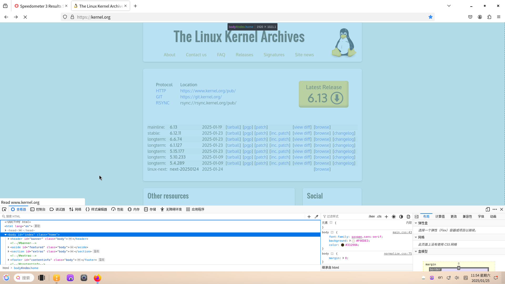
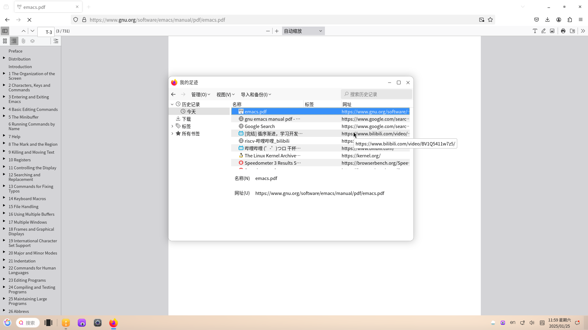
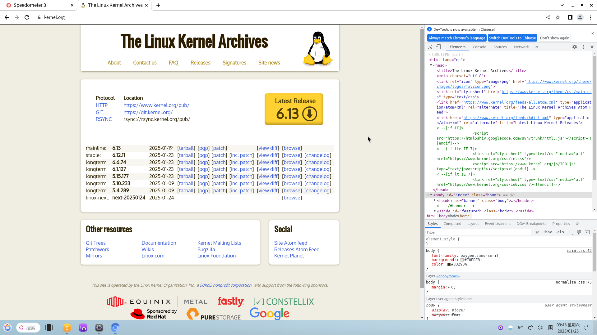
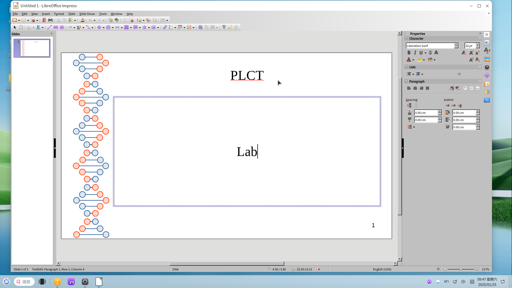
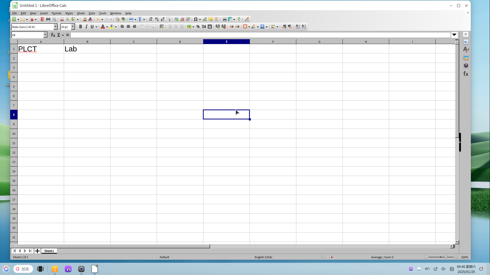

# openKylin 2.0 BPI-F3 测试报告

## 测试环境

### 系统信息

- 系统版本：openKylin v2.0-SP1
- 下载链接：[https://www.openkylin.top/downloads/index-cn.html](https://www.openkylin.top/downloads/index-cn.html)
- 桌面环境: UKUI
- 参考安装文档：[https://docs.openkylin.top/zh/01_%E5%AE%89%E8%A3%85%E5%8D%87%E7%BA%A7%E6%8C%87%E5%8D%97/%E5%9C%A8riscv%E4%B8%8A%E5%AE%89%E8%A3%85/%E5%9C%A8LicheePi4A%E4%B8%8A%E5%AE%89%E8%A3%85openKylin](https://docs.openkylin.top/zh/01_%E5%AE%89%E8%A3%85%E5%8D%87%E7%BA%A7%E6%8C%87%E5%8D%97/%E5%9C%A8riscv%E4%B8%8A%E5%AE%89%E8%A3%85/%E5%9C%A8LicheePi4A%E4%B8%8A%E5%AE%89%E8%A3%85openKylin)

### 硬件信息

- BPI-F3 (4G RAM + 16GB eMMC)
- 电源适配器
- USB to UART 调试器一个

## 安装步骤

### 刷写镜像

将镜像刷入 sdcard 中。

```bash
tar -xvf openKylin-Embedded-V2.0-SP1-spacemit-k1-riscv64.img.tar.xz
sudo dd if=openKylin-Embedded-V2.0-SP1-spacemit-k1-riscv64.img of=/dev/sda bs=4M status=progress
```

### 登录系统

通过串口登录系统。

默认用户名： `openkylin`
默认密码： `openkylin`

### 启动信息

```log
openkylin login: openkylin
密码： 
Welcome to openKylin 2.0 (GNU/Linux 6.1.15 riscv64)

 * Support:        https://openkylin.top

The programs included with the openKylin system are free software;
the exact distribution terms for each program are described in the
individual files in /usr/share/doc/*/copyright.

openKylin comes with ABSOLUTELY NO WARRANTY, to the extent permitted by
applicable law.

You do not have any new mail.
load environment: QT_ACCESSIBILITY=1
load environment: PATH=/usr/local/sbin:/usr/local/bin:/usr/sbin:/usr/bin:/sbin:/bin:/usr/games:/usr/local/games:/snap/bin
load environment: COGL_DRIVER=gles2
load environment: GDK_GL=gles
load environment: XWAYLAND_NO_GLAMOR=1
load environment: SDL_VIDEODRIVER=wayland
load environment: MESA_LOADER_DRIVER_OVERRIDE=pvr

openkylin@openkylin:~$ uname -a
Linux openkylin 6.1.15 #1.0.14.1 SMP PREEMPT Fri Aug 30 18:58:33 UTC 2024 riscv64 riscv64 riscv64 GNU/Linux

openkylin@openkylin:~$ cat /etc/os-release 
NAME="openKylin"
FULL_NAME="openKylin"
VERSION="2.0 (nile)"
VERSION_US="2.0 (nile)"
ID=openkylin
PRETTY_NAME="openKylin 2.0"
VERSION_ID="2.0"
HOME_URL="https://www.openkylin.top/"
VERSION_CODENAME=nile
PRODUCT_FEATURES=3

openkylin@openkylin:~$ cat /proc/cpuinfo 
processor       : 0
hart            : 0
model name      : Spacemit(R) X60
isa             : rv64imafdcv_sscofpmf_sstc_svpbmt_zicbom_zicboz_zicbop_zihintpause
mmu             : sv39
mvendorid       : 0x710
marchid         : 0x8000000058000001
mimpid          : 0x1000000049772200

processor       : 1
hart            : 1
model name      : Spacemit(R) X60
isa             : rv64imafdcv_sscofpmf_sstc_svpbmt_zicbom_zicboz_zicbop_zihintpause
mmu             : sv39
mvendorid       : 0x710
marchid         : 0x8000000058000001
mimpid          : 0x1000000049772200

processor       : 2
hart            : 2
model name      : Spacemit(R) X60
isa             : rv64imafdcv_sscofpmf_sstc_svpbmt_zicbom_zicboz_zicbop_zihintpause
mmu             : sv39
mvendorid       : 0x710
marchid         : 0x8000000058000001
mimpid          : 0x1000000049772200

processor       : 3
hart            : 3
model name      : Spacemit(R) X60
isa             : rv64imafdcv_sscofpmf_sstc_svpbmt_zicbom_zicboz_zicbop_zihintpause
mmu             : sv39
mvendorid       : 0x710
marchid         : 0x8000000058000001
mimpid          : 0x1000000049772200

processor       : 4
hart            : 4
model name      : Spacemit(R) X60
isa             : rv64imafdcv_sscofpmf_sstc_svpbmt_zicbom_zicboz_zicbop_zihintpause
mmu             : sv39
mvendorid       : 0x710
marchid         : 0x8000000058000001
mimpid          : 0x1000000049772200

processor       : 5
hart            : 5
model name      : Spacemit(R) X60
isa             : rv64imafdcv_sscofpmf_sstc_svpbmt_zicbom_zicboz_zicbop_zihintpause
mmu             : sv39
mvendorid       : 0x710
marchid         : 0x8000000058000001
mimpid          : 0x1000000049772200

processor       : 6
hart            : 6
model name      : Spacemit(R) X60
isa             : rv64imafdcv_sscofpmf_sstc_svpbmt_zicbom_zicboz_zicbop_zihintpause
mmu             : sv39
mvendorid       : 0x710
marchid         : 0x8000000058000001
mimpid          : 0x1000000049772200

processor       : 7
hart            : 7
model name      : Spacemit(R) X60
isa             : rv64imafdcv_sscofpmf_sstc_svpbmt_zicbom_zicboz_zicbop_zihintpause
mmu             : sv39
mvendorid       : 0x710
marchid         : 0x8000000058000001
mimpid          : 0x1000000049772200
```

## 功能测试

### 浏览器测试

#### Firefox

- 浏览器启动


- 在线视频播放

没有webgl与硬件解码支持，加载和播放视频较慢，播放高分辨率视频时会卡顿


- 浏览器性能测试


- 网页浏览


- 收藏


- 阅读 PDF


- 下载


- 检查网页源码


- 历史记录


- 设置


- GPU 加速

没有webgl与硬件解码支持


#### Chromium 浏览器

- 浏览器启动


- 网页浏览


- 在线视频播放

没有GPU硬件加速，播放高分辨率视频时会卡顿


- 浏览器性能测试

在运行speedometer3.0测试时，标签页会在过程中崩溃，无法完成测试


- 收藏


- 阅读 PDF


- 下载


- 检查网页源码


- 历史记录


- 设置


- GPU 加速


### 办公软件测试

- Word


- PowerPoint


- Excel




### 视频播放测试

- MPV
正常播放，但没有硬件解码，播放高分辨率视频时会卡顿


- 自带影音应用
正常播放，但打开速度较慢，没有硬件解码


### 桌面环境测试
能较为流畅的使用

- 桌面环境


- 更换壁纸


- 系统设置
