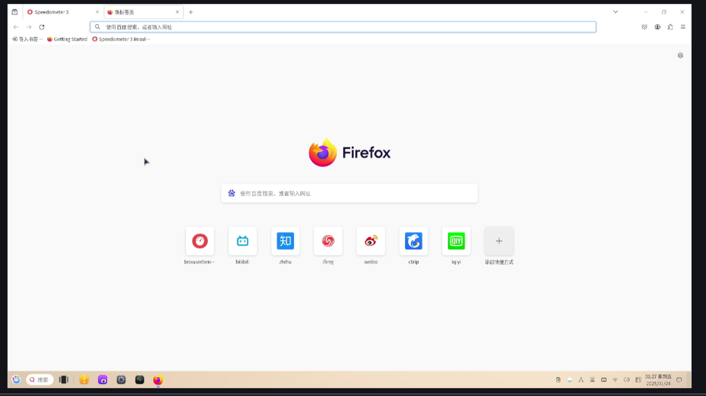
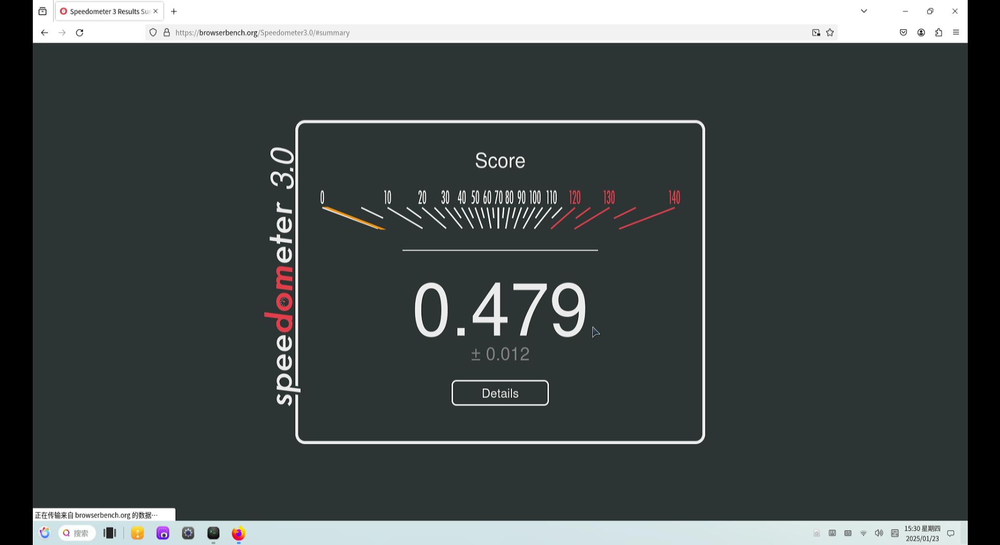
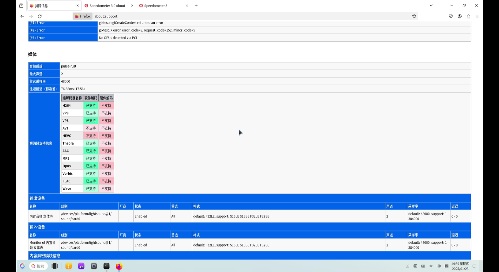
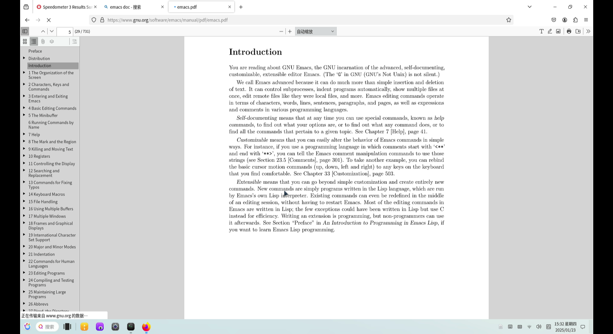
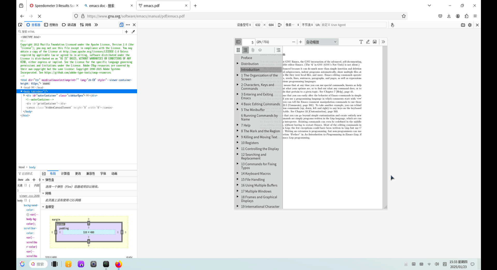
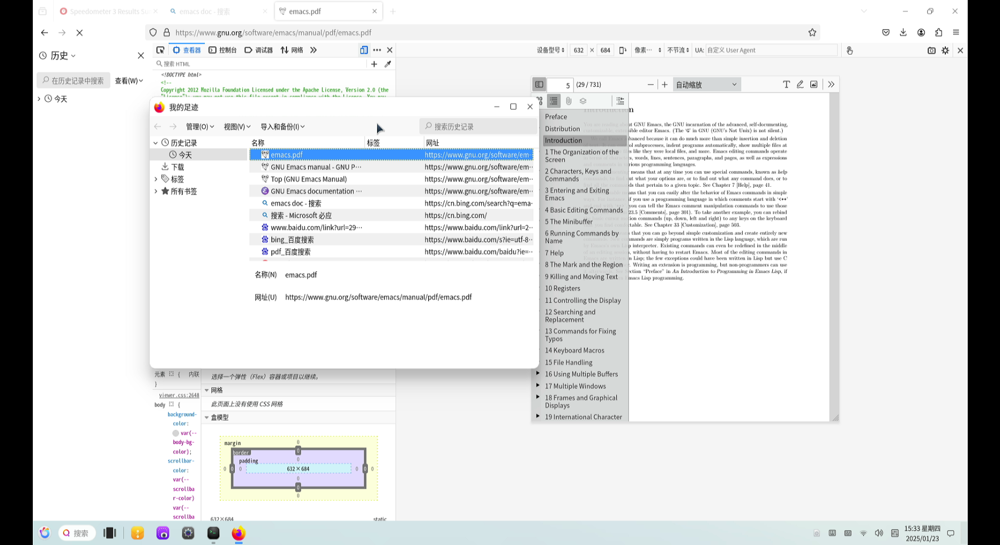
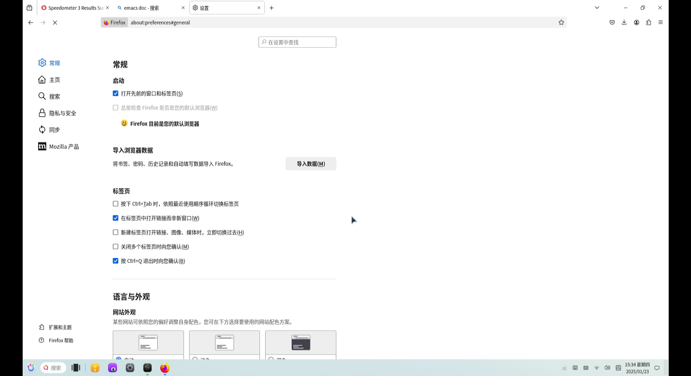
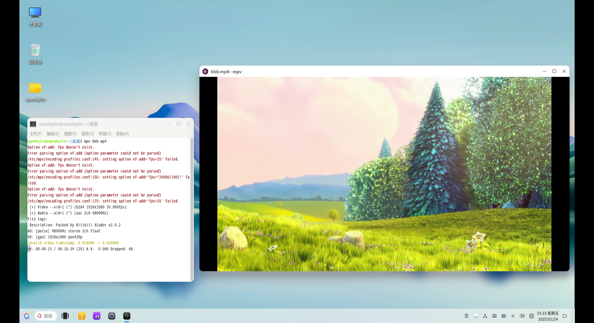
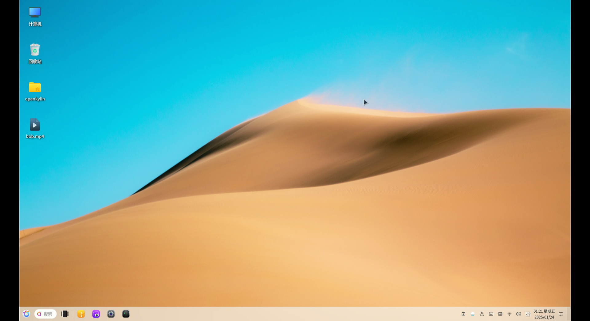
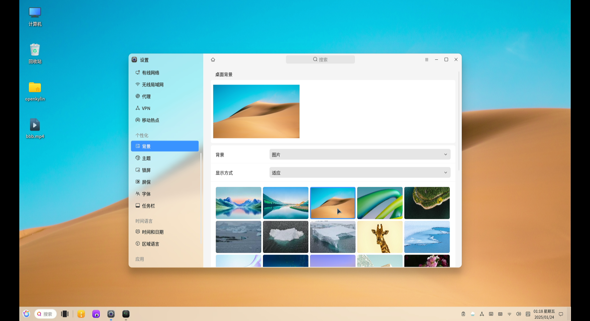

# openKylin 2.0 LPi4A 测试报告

## 测试环境

### 系统信息

- 系统版本：openKylin v2.0-SP1
- 下载链接：[https://www.openkylin.top/downloads/index-cn.html](https://www.openkylin.top/downloads/index-cn.html)
- 桌面环境: UKUI
- 参考安装文档：[https://docs.openkylin.top/zh/01_%E5%AE%89%E8%A3%85%E5%8D%87%E7%BA%A7%E6%8C%87%E5%8D%97/%E5%9C%A8riscv%E4%B8%8A%E5%AE%89%E8%A3%85/%E5%9C%A8LicheePi4A%E4%B8%8A%E5%AE%89%E8%A3%85openKylin](https://docs.openkylin.top/zh/01_%E5%AE%89%E8%A3%85%E5%8D%87%E7%BA%A7%E6%8C%87%E5%8D%97/%E5%9C%A8riscv%E4%B8%8A%E5%AE%89%E8%A3%85/%E5%9C%A8LicheePi4A%E4%B8%8A%E5%AE%89%E8%A3%85openKylin)

### 硬件信息

- Lichee Pi 4A (16G RAM + 128G eMMC)
- 电源适配器
- USB to UART 调试器一个

## 安装步骤

### 刷写 bootloader

解压安装套件。
进入 fastboot 工具所在目录。
刷入 u-boot 与 boot。

```bash
tar -xvf openKylin-Embedded-V2.0-SP1-Release-licheepi4a-riscv64.tar.xz
cd openKylin-Embedded-V2.0-SP1-Release-licheepi4a-riscv64/
sudo fastboot flash ram u-boot-with-spl-lpi4a(-16g).bin
sudo fastboot reboot
sudo fastboot flash uboot u-boot-with-spl-lpi4a(-16g).bin
sudo fastboot flash boot boot-lpi4a-20240720_171951.ext4
```

### 刷写镜像

将 root 分区刷入 eMMC 中。

```bash
sudo fastboot flash root openKylin-2.0-sp1-licheepi4a-riscv64.img
```

### 登录系统

通过串口登录系统。

默认用户名： `openkylin`
默认密码： `openkylin`

## 预期结果

系统正常启动，能够通过板载串口登录。

## 实际结果

系统正常启动，成功通过板载串口登录。

### 启动信息

屏幕录像（从刷写镜像到登录系统）：


[](https://asciinema.org/a/W0w4KbFDEjvuvPLGIyEYHtFdS)
```log
openKylin 2.0 SP1 openkylin ttyS0

openkylin login: openkylin
密码： 
Welcome to openKylin 2.0 SP1 (GNU/Linux 5.10.113-th1520 riscv64)

 * Support:        https://openkylin.top

The programs included with the openKylin system are free software;
the exact distribution terms for each program are described in the
individual files in /usr/share/doc/*/copyright.

openKylin comes with ABSOLUTELY NO WARRANTY, to the extent permitted by
applicable law.

load environment: QT_ACCESSIBILITY=1
load environment: PATH=/usr/local/sbin:/usr/local/bin:/usr/sbin:/usr/bin:/sbin:/bin:/usr/games:/usr/local/games
openkylin@openkylin:~$ uname -a
Linux openkylin 5.10.113-th1520 #2024.07.20.13.28+d8f77de53 SMP PREEMPT Sat Jul 20 13:29:42 UTC  riscv64 riscv64 riscv64 GNU/Linux
openkylin@openkylin:~$ cat /etc/os-release
NAME="openKylin"
FULL_NAME="openKylin"
VERSION="2.0 SP1 (nile)"
VERSION_US="2.0 SP1 (nile)"
ID=openkylin
PRETTY_NAME="openKylin 2.0 SP1"
VERSION_ID="2.0"
HOME_URL="https://www.openkylin.top/"
VERSION_CODENAME=nile
PRODUCT_FEATURES=3
openkylin@openkylin:~$ cat /proc/cpuinfo 
processor       : 0
hart            : 0
isa             : rv64imafdcvsu
mmu             : sv39
cpu-freq        : 1.848Ghz
cpu-icache      : 64KB
cpu-dcache      : 64KB
cpu-l2cache     : 1MB
cpu-tlb         : 1024 4-ways
cpu-cacheline   : 64Bytes
cpu-vector      : 0.7.1

processor       : 1
hart            : 1
isa             : rv64imafdcvsu
mmu             : sv39
cpu-freq        : 1.848Ghz
cpu-icache      : 64KB
cpu-dcache      : 64KB
cpu-l2cache     : 1MB
cpu-tlb         : 1024 4-ways
cpu-cacheline   : 64Bytes
cpu-vector      : 0.7.1

processor       : 2
hart            : 2
isa             : rv64imafdcvsu
mmu             : sv39
cpu-freq        : 1.848Ghz
cpu-icache      : 64KB
cpu-dcache      : 64KB
cpu-l2cache     : 1MB
cpu-tlb         : 1024 4-ways
cpu-cacheline   : 64Bytes
cpu-vector      : 0.7.1

processor       : 3
hart            : 3
isa             : rv64imafdcvsu
mmu             : sv39
cpu-freq        : 1.848Ghz
cpu-icache      : 64KB
cpu-dcache      : 64KB
cpu-l2cache     : 1MB
cpu-tlb         : 1024 4-ways
cpu-cacheline   : 64Bytes
cpu-vector      : 0.7.1

openkylin@openkylin:~$ 
 ```


### 浏览器测试

#### Firefox

有稳定性问题

- 浏览器启动


- 在线视频播放 


- 浏览器性能测试


- 视频解码


- 收藏


- 阅读 PDF


- 下载


- 检查网页源码


- 历史记录


- 设置


        
#### Chromium

软件源内无 chromium

### 办公软件测试

因为软件包版本锁定,无法安装 LibreOffice 进行办公软件测试

### 视频播放测试

- MPV
可以正常使用软件解码播放


- VLC
因为软件包版本锁定,无法安装

- Parole
可以正常使用软件解码播放


### 桌面环境测试
能较为流畅的使用

- 桌面环境


- 更换壁纸


- 任务活动视图
无法打开任务活动视图,点击后屏幕会闪烁

- 系统设置


