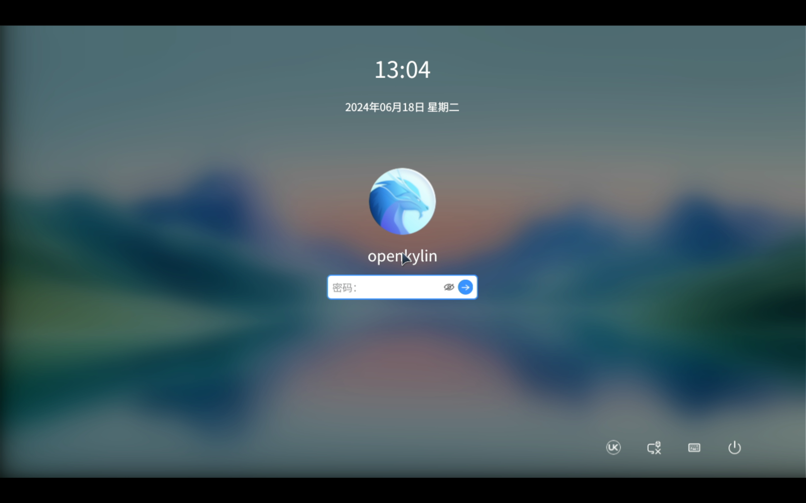
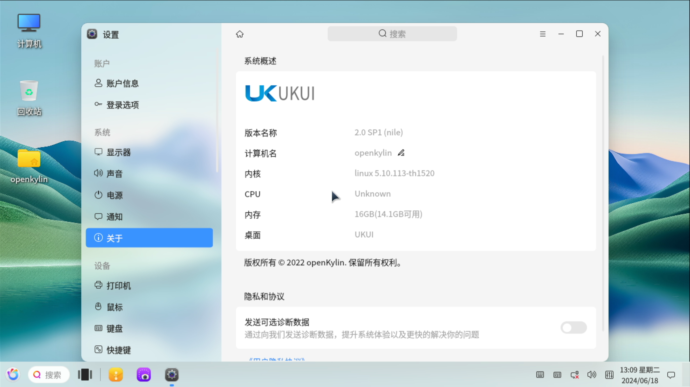
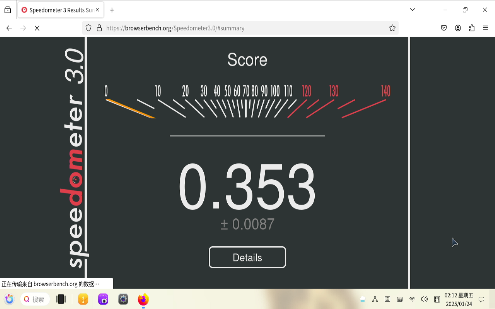

# openKylin v2.0 SP1 LicheePi 4A 测试报告

## 测试环境

### 系统信息

- 系统版本：openKylin v2.0 SP1
- 下载链接：https://www.openkylin.top/downloads/download-smp.php?id=86
- 参考安装文档：https://docs.openkylin.top/zh/01_%E5%AE%89%E8%A3%85%E5%8D%87%E7%BA%A7%E6%8C%87%E5%8D%97/%E5%9C%A8riscv%E4%B8%8A%E5%AE%89%E8%A3%85/%E5%9C%A8LicheePi4A%E4%B8%8A%E5%AE%89%E8%A3%85openKylin
- 桌面环境: UKUI（系统已预装）

### 硬件信息

- Lichee Pi 4A (8G RAM + 32GB eMMC)
- 电源适配器
- Type-C 数据线一个

## 安装步骤

### 安装镜像

解压安装套件并进入目录。

```bash
tar -xvf openKylin-Embedded-V2.0-SP1-licheepi4a-riscv64.tar.xz
cd openKylin-Embedded-V2.0-SP1-licheepi4a-riscv64/
```

目录中应当已经包含了 `fastboot` 应用和 `thead-image-linux.sh` 脚本文件。该脚本文件中包含了刷写镜像的命令。

将 LicheePi 4A 使用 Type-C 接口连接到电脑上，同时上电时按住 `boot` 键，进入 fastboot 模式。而后运行脚本文件。

```bash
sudo ./thead-image-linux.sh
```

### 登录系统

重启系统后可见安装界面。

默认用户名：`openkylin`
密码：`openkylin`

### 扩大分区

扩大 root 分区，使其占满整个 eMMC。

```bash
sudo resize2fs /dev/mmcblk0p4
```

### 启动信息

```log
openKylin 2.0 SP1 openkylin ttyS0

openkylin login: openkylin
密码： 
Welcome to openKylin 2.0 SP1 (GNU/Linux 5.10.113-th1520 riscv64)

 * Support:        https://openkylin.top

The programs included with the openKylin system are free software;
the exact distribution terms for each program are described in the
individual files in /usr/share/doc/*/copyright.

openKylin comes with ABSOLUTELY NO WARRANTY, to the extent permitted by
applicable law.

load environment: QT_ACCESSIBILITY=1
load environment: PATH=/usr/local/sbin:/usr/local/bin:/usr/sbin:/usr/bin:/sbin:/bin:/usr/games:/usr/local/games
openkylin@openkylin:~$ uname -a
Linux openkylin 5.10.113-th1520 #2024.07.20.13.28+d8f77de53 SMP PREEMPT Sat Jul 20 13:29:42 UTC  riscv64 riscv64 riscv64 GNU/Linux
openkylin@openkylin:~$ cat /etc/os-release 
NAME="openKylin"
FULL_NAME="openKylin"
VERSION="2.0 SP1 (nile)"
VERSION_US="2.0 SP1 (nile)"
ID=openkylin
PRETTY_NAME="openKylin 2.0 SP1"
VERSION_ID="2.0"
HOME_URL="https://www.openkylin.top/"
VERSION_CODENAME=nile
PRODUCT_FEATURES=3
openkylin@openkylin:~$ lscpu 
架构：            riscv64
  字节序：        Little Endian
CPU:              4
  在线 CPU 列表： 0-3
openkylin@openkylin:~$ 
```

登录界面：

## 功能测试

测试过程中遇到多次kernel panic。

```log
[  839.944969] Kernel panic - not syncing: Attempted to kill init! exitcode=0x0000008b
[  839.947063] Process 5937(apport) has RLIMIT_CORE set to 1
[  839.952636] SMP: stopping secondary CPUs
[  839.952676] enter panic_cpufreq_notifier_call
[  839.952777] finish to execute cpufreq notifier callback on panic
[  839.972564] ---[ end Kernel panic - not syncing: Attempted to kill init! exitcode=0x0000008b ]---
```

```log
Broadcast message from systemd-journald@openkylin (Fri 2025-01-24 01:28:08 UTC):

systemd[1]: Caught <ILL> from PID -988320604.


Broadcast message from systemd-journald@openkylin (Fri 2025-01-24 01:28:08 UTC):

systemd[1]: Caught <ILL>, dumped core as pid 4609.


Broadcast message from systemd-journald@openkylin (Fri 2025-01-24 01:28:08 UTC):

systemd[1]: Freezing execution.
```

### 桌面环境测试

桌面加载完毕后，体验较为流畅。

- 桌面环境

- 更换壁纸


- 任务活动视图
尝试进入多任务视图时ui闪烁，无法进入多任务视图

- 系统设置


### 办公软件

无法正常安装 libreoffice，报错展示如下：
```log
openkylin@openkylin:~$ sudo apt install libreoffice
正在读取软件包列表... 完成
正在分析软件包的依赖关系树... 完成
正在读取状态信息... 完成                 
有一些软件包无法被安装。如果您用的是 unstable 发行版，这也许是
因为系统无法达到您要求的状态造成的。该版本中可能会有一些您需要的软件
包尚未被创建或是它们已被从新到(Incoming)目录移出。
下列信息可能会对解决问题有所帮助：

下列软件包有未满足的依赖关系：
 libreoffice : 依赖: libreoffice-core (= 4:7.4.7-ok1.4) 但无法安装它
               依赖: libreoffice-writer 但无法安装它
               依赖: python3-uno (>= 4.4.0~beta2) 但无法安装它
               推荐: libreoffice-nlpsolver 但无法安装它
               推荐: libreoffice-report-builder 但无法安装它
               推荐: libreoffice-script-provider-bsh 但无法安装它
               推荐: libreoffice-script-provider-js 但无法安装它
               推荐: libreoffice-script-provider-python 但无法安装它
               推荐: libreoffice-sdbc-mysql 但无法安装它
               推荐: libreoffice-sdbc-postgresql 但无法安装它
               推荐: libreoffice-wiki-publisher 但无法安装它
 libreoffice-base : 依赖: libreoffice-core (= 4:7.4.7-ok1.4) 但无法安装它
                    推荐: libreoffice-writer 但无法安装它
 libreoffice-base-core : 依赖: libreoffice-core-nogui (= 4:7.4.7-ok1.4) 但无法安装它 或
                                 libreoffice-core (= 4:7.4.7-ok1.4) 但无法安装它
 libreoffice-base-drivers : 依赖: libreoffice-core-nogui 但无法安装它 或
                                    libreoffice-core 但无法安装它
                            推荐: libreoffice-sdbc-hsqldb 但无法安装它
                            推荐: libreoffice-sdbc-firebird 但MPV无法安装它
 libreoffice-calc : 依赖: libreoffice-core (= 4:7.4.7-ok1.4) 但无法安装它
 libreoffice-draw : 依赖: libreoffice-core (= 4:7.4.7-ok1.4) 但无法安装它
 libreoffice-impress : 依赖: libreoffice-core (= 4:7.4.7-ok1.4) 但无法安装它
                       依赖: libbox2d2.3.0 但无法安装它
 libreoffice-math : 依赖: libreoffice-core (= 4:7.4.7-ok1.4) 但无法安装它
 libreoffice-report-builder-bin : 依赖: libreoffice-core 但无法安装它
E: 无法修正错误，因为您要求某些软件包保持现状，就是它们破坏了软件包间的依赖关系。
```

### 视频播放测试

#### VLC

无法安装：

```log
openkylin@openkylin:~$ sudo apt install vlc
正在读取软件包列表... 完成
正在分析软件包的依赖关系树... 完成
正在读取状态信息... 完成                 
有一些软件包无法被安装。如果您用的是 unstable 发行版，这也许是
因为系统无法达到您要求的状态造成的。该版本中可能会有一些您需要的软件
包尚未被创建或是它们已被从新到(Incoming)目录移出。
下列信息可能会对解决问题有所帮助：

下列软件包有未满足的依赖关系：
 vlc-plugin-base : 依赖: libavcodec59 (>= 7:5.0)
                   依赖: libavformat59 (>= 7:5.0)
 vlc-plugin-video-output : 依赖: libavcodec59 (>= 7:5.0)
E: 无法修正错误，因为您要求某些软件包保持现状，就是它们破坏了软件包间的依赖关系。
```

#### MPV

720p h.264正常播放


#### 自带播放器

720p h.264正常播放


### 浏览器测试

#### Chromium

软件源中不存在该浏览器。

#### Firefox

- 浏览器启动


- 在线视频播放

需等待网页加载完毕，关闭弹幕后，能流畅播放视频。

- 浏览器性能测试


- 网页浏览


- 收藏


- 阅读 PDF


- 下载


- 检查网页源码


- 历史记录


- 设置

