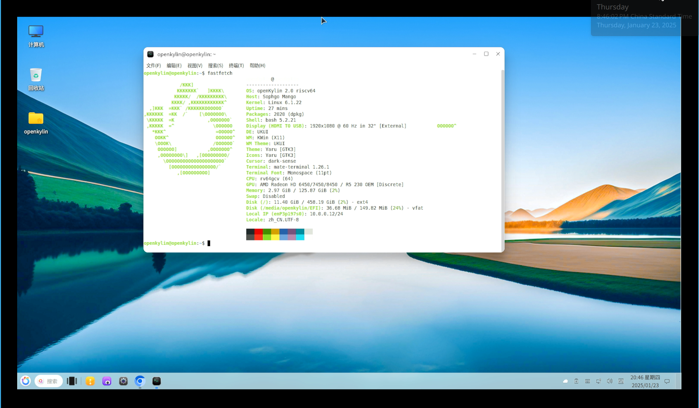
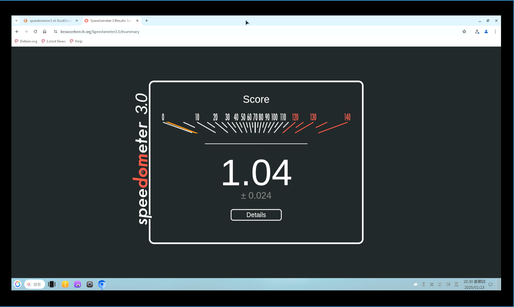
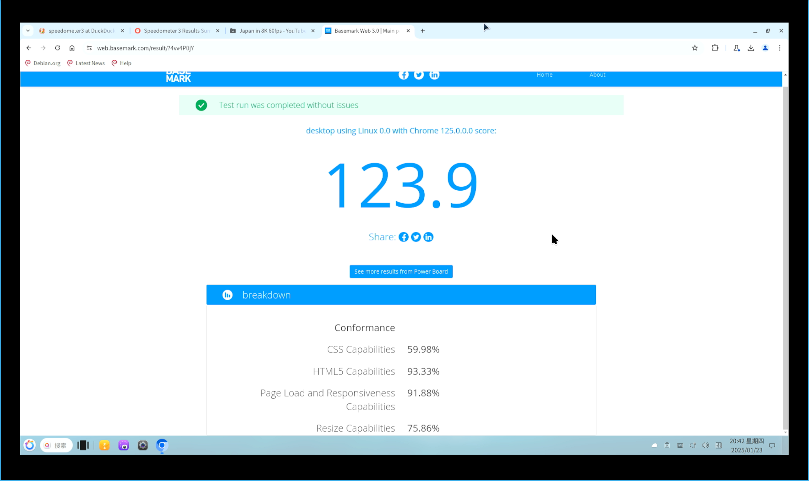
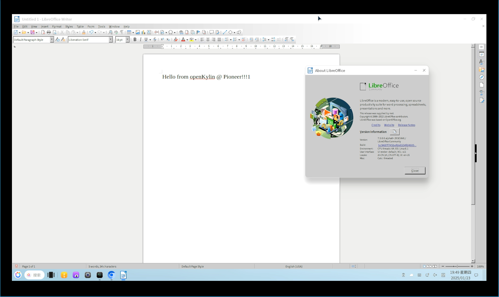
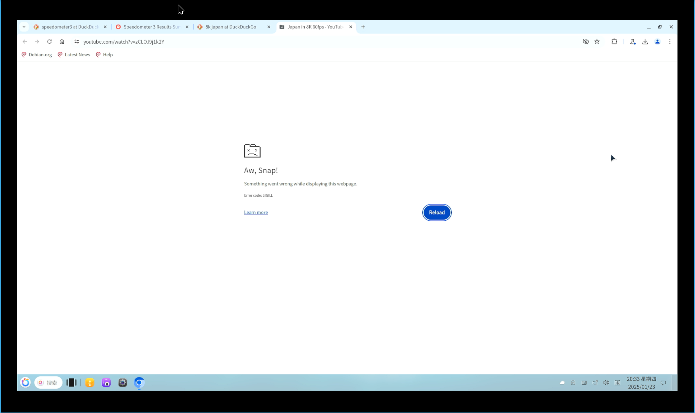
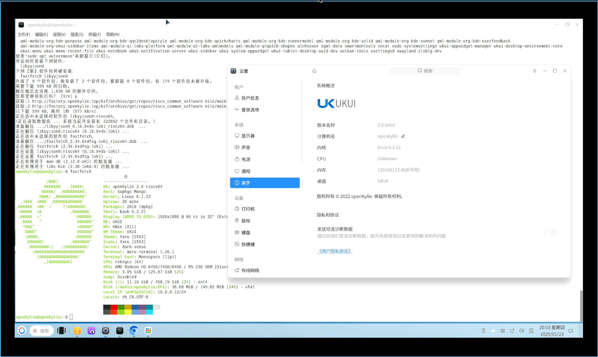

# openKylin RISC-V Pioneer 测试报告

openKylin RISC-V 在 Pioneer 开发板上的使用体验较为受限，仅依赖 SD 卡启动时几乎无法正常使用，必须配备 NVMe SSD 并进行额外配置才能获得基本可用的系统环境。

此外内核 dmesg 输出了大量报错信息，包括部分 `0x02 Illegal Instruction`，我们推测部分软件包的构建或适配可能存在问题。

在安装到 SSD 之后，除了在线视频播放遇到了浏览器崩溃的问题外，本地视频播放、办公软件、网页浏览基本能够满足使用需求，桌面整体体验较为流畅。

## 测试环境

- 系统版本：openKylin 2.0 SP1 RISC-V
- 下载链接：https://mirrors.hust.edu.cn/openkylin-cdimage/2.0-SP1/openKylin-Embedded-V2.0-SP1-milk-v-pioneer-riscv64.img.xz
- 参考安装文档：https://docs.openkylin.top/zh/01_%E5%AE%89%E8%A3%85%E5%8D%87%E7%BA%A7%E6%8C%87%E5%8D%97/%E5%9C%A8riscv%E4%B8%8A%E5%AE%89%E8%A3%85/%E5%9C%A8Milk-V_Pioneer%E4%B8%8A%E5%AE%89%E8%A3%85openKylin

### 硬件信息

- Milk-V Pioneer Box 
- microSD 卡一张
- HDMI 线 + 显示器
- （可选，推荐）NVMe SSD 一块
  - M.2 NVMe 转 USB 硬盘盒一个，用于烧录镜像至 SSD

## 安装步骤

### 刷写镜像

官方文档仅介绍了如何将镜像刷入 microSD 卡并启动。经测试发现 SD 卡启动速度非常缓慢（~20 分钟且无法加载出完整桌面），故为保证正常使用需要手动将镜像刷入 NVMe SSD。

大致步骤：

- 刷写完整镜像到 microSD，或只烧录固件部分的 FAT32 分区到 microSD
- 刷写镜像到 SSD
- 检查 SSD 上的 `/boot/extlinux` 和 `/etc/fstab`，将对应 microSD 卡启动的 `mmcblk0` 替换为 `nvme0n1`
- 插入 microSD 和 SSD，上电开机

### 登录系统

连接显示器、键盘、鼠标，通过图形界面登录系统。

默认用户名： `openkylin`
默认密码： `openkylin`

### 重分配硬盘空间

使用 `resize2fs` 扩大分区可用空间：

(WIP)

## 启动信息

下列测试使用 HDMI 采集卡完成。



## 功能测试

### 浏览器测试

本次测试使用预装的 Chromium 进行。

Speedometer 分数为 1.04 += 0.024：



Basemark 分数为 123.9：



### 办公软件测试

预装的 LibreOffice 可用：



### 视频播放测试

(WIP)

在线视频测试失败，尝试播放 YouTube 视频时 Chromium 标签页均会崩溃：



### 桌面环境测试

能流畅使用 UKUI。

- 桌面环境/任务活动视图


### 稳定性问题

测试途中观察 dmesg 发现 UKUI 各个系统组件，如 libavcodec 和 libtesseract 等库均会在内核中报错，如：

```log
[  863.257134] ffmpeg[5462]: unhandled signal 4 code 0x1 at 0x0000003f838bb580 in libavcodec.so.60.31.102[3f83800000+c63000]
[  863.257188] CPU: 9 PID: 5462 Comm: ffmpeg Not tainted 6.1.22 #11
[  863.257196] Hardware name: Sophgo Mango (DT)
[  863.257201] epc : 0000003f838bb580 ra : 0000003f838bb57a sp : 0000003fcd063dc0
[  863.257208]  gp : 0000002ac8a0e890 tp : 0000003f78cfc780 t0 : 00000000000000a2
[  863.257213]  t1 : 0000003f83879c6c t2 : 0000000000000077 s0 : 0000002afaee33c0
[  863.257217]  s1 : 0000003f85684d80 a0 : 0000000000000008 a1 : 0000002afaf52f00
[  863.257221]  a2 : 0000000000000000 a3 : 0000003f83ef2708 a4 : 0000000000000000
[  863.257225]  a5 : 000000000000000f a6 : 0000003f83cbdf1a a7 : 0000000000000003
[  863.257229]  s2 : 0000000000000000 s3 : 0000003f85684d80 s4 : 0000003f85684d80
[  863.257233]  s5 : 0000000000000000 s6 : 0000002afaf550a0 s7 : ffffffffffffffff
[  863.257237]  s8 : 0000002afae3d330 s9 : 0000002ac8a0f060 s10: 0000000000000000
[  863.257240]  s11: 0000002afae03540 t3 : 0000003f8262a3f0 t4 : 0000003f84bf1de0
[  863.257244]  t5 : 0000003f84462348 t6 : 0000003f85684d80
[  863.257248] status: 8000000200006020 badaddr: 00000000c2202773 cause: 0000000000000002
[ 1274.105128] ukui-control-ce[5905]: unhandled signal 11 code 0x1 at 0x0000003f728b5000 in libtesseract.so.5.0.3[3f72600000+2a8000]
[ 1274.105180] CPU: 12 PID: 5905 Comm: ukui-control-ce Not tainted 6.1.22 #11
[ 1274.105189] Hardware name: Sophgo Mango (DT)
[ 1274.105194] epc : 0000003f7269cd5c ra : 0000003fb910375a sp : 0000003fea0831c0
[ 1274.105200]  gp : 000000000024e298 tp : 0000003fb5b72780 t0 : 0000000001b76a83
[ 1274.105205]  t1 : 0000003f7240750c t2 : 0000003f72ed57b0 s0 : 0000003f72505558
[ 1274.105209]  s1 : 0000003fb91f3030 a0 : 0000003f728b4ff8 a1 : 0000003f728b5000
[ 1274.105214]  a2 : 0000000003991f00 a3 : 0000003fb91f1990 a4 : 0000003f72505450
[ 1274.105218]  a5 : 0000000000000000 a6 : a9840b9a88761903 a7 : 0000000000000005
[ 1274.105222]  s2 : 0000000000000002 s3 : 0000000000000004 s4 : 0000000000000003
[ 1274.105225]  s5 : 0000000000000001 s6 : 0000000000000001 s7 : 0000000000000000
[ 1274.105229]  s8 : 0000000000000000 s9 : 0000003fb91f1558 s10: 000000000398e660
[ 1274.105233]  s11: 00000000000016a6 t3 : 0000003fb9141da8 t4 : 00000000039849b0
[ 1274.105237]  t5 : 0000003fb8e02f3c t6 : 0000000000000021
[ 1274.105240] status: 8000000200006020 badaddr: 0000003f728b5000 cause: 000000000000000d
[ 1300.069615] ffmpeg[6748]: unhandled signal 4 code 0x1 at 0x0000003fbd4bb580 in libavcodec.so.60.31.102[3fbd400000+c63000]
[ 1300.069668] CPU: 5 PID: 6748 Comm: ffmpeg Not tainted 6.1.22 #11
[ 1300.069677] Hardware name: Sophgo Mango (DT)
[ 1300.069682] epc : 0000003fbd4bb580 ra : 0000003fbd4bb57a sp : 0000003fcaccbdc0
[ 1300.069688]  gp : 0000002abe7c4890 tp : 0000003fb2a4c780 t0 : 00000000000000a2
[ 1300.069693]  t1 : 0000003fbd479c6c t2 : 0000000000000077 s0 : 0000002ace9693c0
[ 1300.069698]  s1 : 0000003fbf3d0d80 a0 : 0000000000000008 a1 : 0000002ace9d8f00
[ 1300.069702]  a2 : 0000000000000000 a3 : 0000003fbdaf2708 a4 : 0000000000000000
[ 1300.069706]  a5 : 000000000000000f a6 : 0000003fbd8bdf1a a7 : 0000000000000003
[ 1300.069711]  s2 : 0000000000000000 s3 : 0000003fbf3d0d80 s4 : 0000003fbf3d0d80
[ 1300.069715]  s5 : 0000000000000000 s6 : 0000002ace9db0a0 s7 : ffffffffffffffff
[ 1300.069719]  s8 : 0000002ace8c3330 s9 : 0000002abe7c5060 s10: 0000000000000000
[ 1300.069723]  s11: 0000002ace889540 t3 : 0000003fbc22a3f0 t4 : 0000003fbebf1de0
[ 1300.069727]  t5 : 0000003fbe062348 t6 : 0000003fbf3d0d80
[ 1300.069731] status: 8000000200006020 badaddr: 00000000c2202773 cause: 0000000000000002
[ 1300.720705] peony[4933]: unhandled signal 11 code 0x2 at 0x0000003fa04cf000 in libtesseract.so.5.0.3[3fa2800000+2a8000]
[ 1300.720758] CPU: 4 PID: 4933 Comm: peony Not tainted 6.1.22 #11
[ 1300.720767] Hardware name: Sophgo Mango (DT)
[ 1300.720771] epc : 0000003fa289cd5c ra : 0000003fa49cf39e sp : 0000003fe5942380
[ 1300.720777]  gp : 00000000000eac90 tp : 0000003f9f01dc80 t0 : 0000000001b76a83
```
