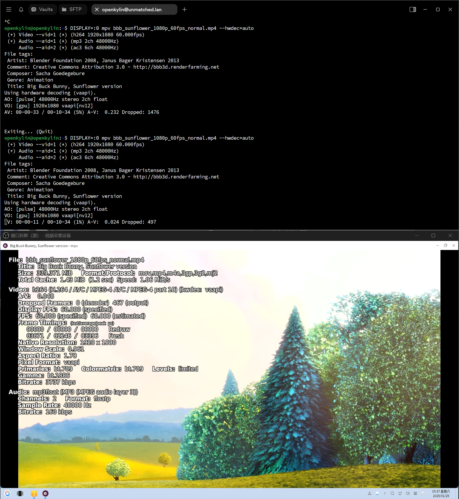

# openKylin 1.0 HiFive Unmatched 版本测试报告

openKylin 针对 SiFive HiFive Unmatched 的支持停留在 2023 年中发布的 openKylin 1.0。

受限于 FU740 的 CPU 性能，桌面首次启动时响应速度较慢；大部分桌面组件流畅度尚可。

系统预装的 Chromium 浏览器启动即崩溃，尝试安装 Firefox 浏览器失败，无法满足网页浏览需求；

办公软件同样缺失，Linux 环境下较为常用的 LibreOffice 软件包不全，无法安装。

视频播放方面，无论是使用 UKUI 配套的视频播放器，还是使用手动安装的 mpv 并追加硬件解码加速命令行参数，都无法正常调用视频硬件解码。加之 CPU 性能受限，出现了严重的音画不同步和掉帧现象。

总的来说，Unmatched 上的 openKylin 很难满足流畅的日常桌面体验。

## 测试环境

### 操作系统信息

- 系统版本：openKylin 1.0
- 下载链接：https://www.openkylin.top/downloads
- 参考安装文档：https://docs.openkylin.top/zh/%E7%A4%BE%E5%8C%BA%E5%BC%80%E5%8F%91%E6%8C%87%E5%8D%97/riscv%E4%B8%8A%E5%AE%89%E8%A3%85openKylin

### 硬件信息

- HiFive Unmatched Rev A
- microUSB 线缆一条（随 HiFive Unmatched 附赠）
- ATX 电源一个
- microSD 卡一张（Sandisk Extreme Pro 64G UHS-I）
- PCI-E 独立显卡一张（本次使用 Radeon R5 230）

## 安装步骤

### 引导设备选择

确保拨码开关已调整为从 microSD 卡引导。若您未更改，出厂默认即为从 microSD 卡引导。

拨码开关应如下设置：`MSEL[3:0]=1011`

### 使用 `ruyi` CLI 刷写镜像到 microSD 卡

安装 [`ruyi`](https://github.com/ruyisdk/ruyi) 包管理器，运行 `ruyi device provision` 并按提示操作。

### 登录系统

通过板载串口（使用 microUSB 线缆连接至其他计算机）或图形界面登录系统。

默认用户名：`openkylin`
默认密码：`openkylin`

### 启动信息

```log
Welcome to openKylin 1.0 (GNU/Linux 5.11.0-1030-generic riscv64)                                                      
                                                                                                                      
 * Support:        https://openkylin.top                                                                              
                                                                                                                      
The programs included with the openKylin system are free software;                                                    
the exact distribution terms for each program are described in the                                                    
individual files in /usr/share/doc/*/copyright.                                                                       
                                                                                                                      
openKylin comes with ABSOLUTELY NO WARRANTY, to the extent permitted by                                               
applicable law.                                                                                                       
                                                                                                                      
To run a command as administrator (user "root"), use "sudo <command>".                                                
See "man sudo_root" for details.                                                                                      
                                                                                                                      
openkylin@openkylin:~$                                                                                                
openkylin@openkylin:~$ cat /etc/os-release                                                                            
NAME="openKylin"                                                                                                      
FULL_NAME="openKylin"                                                                                                 
VERSION="1.0 (yangtze)"                                                                                               
VERSION_US="1.0 (yangtze)"                                                                                            
ID=openkylin                                                                                                          
PRETTY_NAME="openKylin 1.0"                                                                                           
VERSION_ID="1.0"                                                                                                      
HOME_URL="https://www.openkylin.top/"                                                                                 
VERSION_CODENAME=yangtze                                                                                              
PRODUCT_FEATURES=3                                                                                                    
openkylin@openkylin:~$ cat /proc/cpuinfo                                                                              
processor       : 0                                                                                                   
hart            : 4                                                                                                   
isa             : rv64imafdc                                                                                          
mmu             : sv39                                                                                                
uarch           : sifive,u74-mc                                                                                       
                                                                                                                      
processor       : 1                                                                                                   
hart            : 1                                                                                                   
isa             : rv64imafdc                                                                                          
mmu             : sv39                                                                                                
uarch           : sifive,u74-mc                                                                                       
                                                                                                                      
processor       : 2                                                                                                   
hart            : 2                                                                                                   
isa             : rv64imafdc                                                                                          
mmu             : sv39                                                                                                
uarch           : sifive,u74-mc                                                                                       
                                                                                                                      
processor       : 3                                                                                                   
hart            : 3                                                                                                   
isa             : rv64imafdc                                                                                          
mmu             : sv39                                                                                                
uarch           : sifive,u74-mc                                                                                       
                                                                                                                      
openkylin@openkylin:~$ 
```

屏幕录像（从刷写镜像到登录系统）：

[](https://asciinema.org/a/Wgz7wgCph6BhEQpEskH4LDMd4)

## 桌面环境

登录完成进入桌面后，点击左下角开始菜单按钮，到弹出菜单位置耗费约 30 秒，响应极慢。

初次点击时，ukui-sidebar 会长时间占满 CPU 资源。


UKUI 其他组件使用基本正常，响应速度尚可。

## 浏览器

系统预装了 Chromium 浏览器，但完全不可用，启动即崩溃，报 Stack Trace 如下：

```log
[4450:4450:0125/052758.312694:FATAL:double_fork_and_exec.cc(131)] execv /usr/lib64/chromium-browser/chrome_crashpad_handler: 没有那个文件或目录 (2)
#0 0x002ae62d830c (/usr/lib64/chromium-browser/chromium-browser+0x5e8630b)
#1 0x002ae6315a20 (/usr/lib64/chromium-browser/chromium-browser+0x5ec3a1f)
#2 0x002ae625058a (/usr/lib64/chromium-browser/chromium-browser+0x5dfe589)
#3 0x002ae62512bc (/usr/lib64/chromium-browser/chromium-browser+0x5dff2bb)
#4 0x002aeb05bb3e (/usr/lib64/chromium-browser/chromium-browser+0xac09b3d)
#5 0x002aeb04ec5c (/usr/lib64/chromium-browser/chromium-browser+0xabfcc5b)
#6 0x002ae8a36370 (/usr/lib64/chromium-browser/chromium-browser+0x85e436f)
#7 0x002ae8a309f6 (/usr/lib64/chromium-browser/chromium-browser+0x85de9f5)
#8 0x002ae18f9bd4 (/usr/lib64/chromium-browser/chromium-browser+0x14a7bd3)
#9 0x002ae5c0ec70 (/usr/lib64/chromium-browser/chromium-browser+0x57bcc6f)
#10 0x002ae5c0cfe4 (/usr/lib64/chromium-browser/chromium-browser+0x57bafe3)
#11 0x002ae5c0d172 (/usr/lib64/chromium-browser/chromium-browser+0x57bb171)
#12 0x002ae18f8d34 (/usr/lib64/chromium-browser/chromium-browser+0x14a6d33)
#13 0x003ff18a0af6 (/usr/lib/riscv64-linux-gnu/libc.so.6+0x26af5)
#14 0x003ff18a0ba2 (/usr/lib/riscv64-linux-gnu/libc.so.6+0x26ba1)
#15 0x002ae18f8b4c (/usr/lib64/chromium-browser/chromium-browser+0x14a6b4b)

Received signal 4 <unknown> 002ae6250cce
#0 0x002ae62d830c (/usr/lib64/chromium-browser/chromium-browser+0x5e8630b)
#1 0x002ae6315a20 (/usr/lib64/chromium-browser/chromium-browser+0x5ec3a1f)
#2 0x002ae62d8262 (/usr/lib64/chromium-browser/chromium-browser+0x5e86261)
#3 0x003ff2916800 ([vdso]+0x7ff)
#4 0x002ae6250cce (/usr/lib64/chromium-browser/chromium-browser+0x5dfeccd)
#5 0x002ae62512bc (/usr/lib64/chromium-browser/chromium-browser+0x5dff2bb)
#6 0x002aeb05bb3e (/usr/lib64/chromium-browser/chromium-browser+0xac09b3d)
#7 0x002aeb04ec5c (/usr/lib64/chromium-browser/chromium-browser+0xabfcc5b)
#8 0x002ae8a36370 (/usr/lib64/chromium-browser/chromium-browser+0x85e436f)
#9 0x002ae8a309f6 (/usr/lib64/chromium-browser/chromium-browser+0x85de9f5)
#10 0x002ae18f9bd4 (/usr/lib64/chromium-browser/chromium-browser+0x14a7bd3)
#11 0x002ae5c0ec70 (/usr/lib64/chromium-browser/chromium-browser+0x57bcc6f)
#12 0x002ae5c0cfe4 (/usr/lib64/chromium-browser/chromium-browser+0x57bafe3)
#13 0x002ae5c0d172 (/usr/lib64/chromium-browser/chromium-browser+0x57bb171)
#14 0x002ae18f8d34 (/usr/lib64/chromium-browser/chromium-browser+0x14a6d33)
#15 0x003ff18a0af6 (/usr/lib/riscv64-linux-gnu/libc.so.6+0x26af5)
#16 0x003ff18a0ba2 (/usr/lib/riscv64-linux-gnu/libc.so.6+0x26ba1)
#17 0x002ae18f8b4c (/usr/lib64/chromium-browser/chromium-browser+0x14a6b4b)
[end of stack trace]
```

查看 dmesg：

```log
[  418.748676] chromium-browse[4450]: unhandled signal 4 code 0x1 at 0x0000002ae6250cce in chromium-browser[2ae0452000+f32f000]
[  418.748763] CPU: 1 PID: 4450 Comm: chromium-browse Tainted: G        W         5.11.0-1030-generic #34
[  418.748776] epc: 0000002ae6250cce ra : 0000002ae6250ccc sp : 0000003fffa55210
[  418.748791]  gp : 0000002af00ba228 tp : 0000003feecd4fc0 t0 : 0000002ae62d882c
[  418.748806]  t1 : 0000002ae189c6ec t2 : 0000ff0000000000 s0 : 0000003fffa562a0
[  418.748822]  s1 : 0000002af010e2e0 a0 : 0000000000000000 a1 : 0000000000000000
[  418.748836]  a2 : 0000000000000541 a3 : 0000000000000540 a4 : 0000000000000062
[  418.748851]  a5 : 0000000000000001 a6 : 0000000000000000 a7 : 0000003fffa55268
[  418.748866]  s2 : 0000003fffa56358 s3 : 0000000000000540 s4 : 0000002af010e300
[  418.748881]  s5 : 0000003ff2932d40 s6 : 0000002af001bde4 s7 : 0000000000000540
[  418.748896]  s8 : 0000003fffa56348 s9 : 0000003ff2932d40 s10: 0000003fffa55a60
[  418.748911]  s11: 000000040023e800 t3 : 0000003ff1a60814 t4 : 000000040022c000
[  418.748926]  t5 : 0000000000000a00 t6 : 0000000000003200
[  418.748937] status: 0000000200004020 badaddr: 0000000000000000 cause: 0000000000000002
```

> `cause: 0000000000000002` 对应 Illegal Instruction / 非法指令。

尝试通过包管理器搜索 Firefox，无可安装的软件包：

```log
openkylin@openkylin:~$ apt search firefox
正在排序... 完成
全文搜索... 完成  
bleachbit/yangtze 3.9.0-ok1 all
  delete unnecessary files from the system

buku/yangtze 4.3+ds-ok1 all
  Powerful command-line bookmark manager

chrome-gnome-shell/yangtze 10.1-ok1 all
  GNOME Shell extensions integration for web browsers

dh-cargo/yangtze 28-ok1 all
  debhelper buildsystem for Rust crates using Cargo

fonts-clear-sans/yangtze 1.00-ok1 all
  sharp on-screen sans-serif font

fonts-lyx/yangtze 2.3.4.2-ok1 all
  TrueType versions of some TeX fonts used by LyX

gnome-shell-extension-gsconnect-browsers/yangtze 20-ok1 all
  Browser support of KDE Connect implementation for GNOME Shell
```

至此，此版本下已无其它现代浏览器可用。

## 视频播放

使用 openKylin 自带的影音软解播放 Big Buck Bunny 1080P 60FPS H264 演示片，未能正常调用显卡硬解，音画不同步且严重卡顿，CPU 接近 100% 占用。

尝试在设置中修改解码器为 vaapi 后无明显变化。


手动安装 mpv 后，使用 `--hwdec=auto` 方式依旧不能调用硬件解码器，视频卡顿，丢帧严重。



系统默认配置下，视频播放体验较差。

## 办公软解

系统未预装 LibreOffice，尝试手动安装：

```log
openkylin@openkylin:~$ apt search libreoffice
正在排序... 完成
全文搜索... 完成  
desktop-autoloader/yangtze 0.0.4-ok1 all
  Accelerate Diskless Workstation systems by pre-loading a dummy Desktop Session
...
libjodconverter-java-doc/yangtze 2.2.2-ok1 all
  Office formats converter - Library documentation

libreoffice-dmaths/yangtze 4.4.0.0+dfsg1-ok1 all
  Formula editing plug-in for LibreOffice Writer

libreoffice-lightproof-en/yangtze 0.4.3+1.6-ok1 all
  Lightproof grammar checker for LibreOffice (English)

libreoffice-lightproof-hu/yangtze 1.6.2+1.6-ok1 all
  Lightproof grammar checker for LibreOffice (Hungarian)

libreoffice-lightproof-pt-br/yangtze 1:6.4.3-ok1 all
  Lightproof grammar checker for LibreOffice (Brazilian Portuguese)

libreoffice-lightproof-ru-ru/yangtze 0.3.4+1.6-ok1 all
  Lightproof grammar checker for LibreOffice (Russian)

libreoffice-writer2latex/yangtze 1.4-ok1 all
  Writer/Calc to LaTeX converter extension for LibreOffice

libreoffice-writer2xhtml/yangtze 1.4-ok1 all
  Writer/Calc to XHTML converter extension for LibreOffice
openkylin@openkylin:~$ sudo apt install libreoffice
正在读取软件包列表... 完成
正在分析软件包的依赖关系树... 完成
正在读取状态信息... 完成                 
没有可用的软件包 libreoffice，但是它被其它的软件包引用了。
这可能意味着这个缺失的软件包可能已被废弃，
或者只能在其他发布源中找到

E: 软件包 libreoffice 没有可安装候选
```

LibreOffice 软件包不全，无法安装。